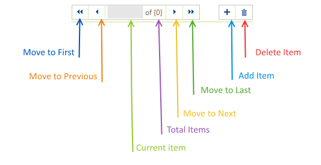

# Structure

__RadBindingNavigator__ extends [RadCommandBar]() control, so most of its ways for customization at runtime and design time will be valid here as well. __RadBindingNavigator__ displays two sets of buttons separated into two ''CommandBarStripElements'' according to the purpose of their commands:
* __Navigation__
* __Editing__

>caption Figure 1: RadBindingNavigator elements.

   
Adding a __RadBindingNavigator__ control to a form and binding it to a data source, such as a [BindingSource](http://msdn.microsoft.com/en-us/library/system.windows.forms.bindingsource%28v=vs.110%29.aspx), will automatically establish relationships between the buttons and the BindingSource methods. In the list below are represented all relationships.
        
* Move to first item - [MoveFirst](https://msdn.microsoft.com/en-us/library/ms158169(v=vs.110).aspx) 
* Move to previous item - [MovePrevious](https://msdn.microsoft.com/en-us/library/ms158172(v=vs.110).aspx)
* Move to next item - [MoveNext](https://msdn.microsoft.com/en-us/library/ms158171(v=vs.110).aspx)
* Move to last item - [MoveLast](https://msdn.microsoft.com/en-us/library/ms158170(v=vs.110).aspx)
* Add new item - [AddNew](https://msdn.microsoft.com/en-us/library/ms158154(v=vs.110).aspx)
* Delete item - [RemoveCurrent](https://msdn.microsoft.com/en-us/library/ms158184(v=vs.110).aspx)