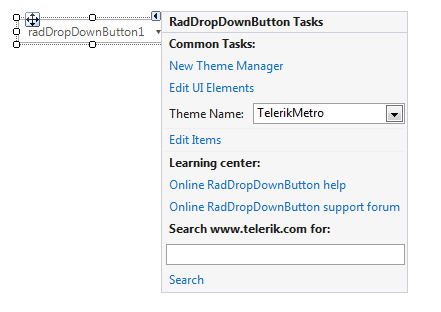
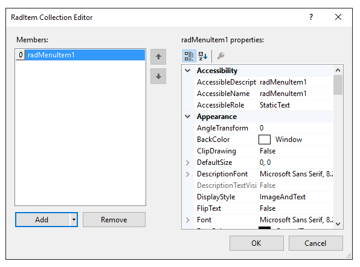

# Design Time

## Smart Tag

>caption Fig.1 Smart Tag

* __Common Tasks__

	* __New Theme Manager__: Adds a new __RadThemeManager__ component to the form.

	* __Edit UI elements__: Opens a dialog that displays the *Element Hierarchy Editor*. This editor lets you browse all the elements in the control.

	* __Theme Name__: Select a theme name from the drop down list of themes available for that control. Selecting a theme allows you to change all aspects of the controls visual style at one time.
	
* __Edit Items__: Opens the *RadItem Collection Editor*.

* __Learning Center__: Navigate to the Telerik help, code library projects or support forum.

* __Search__: Search the Telerik site for a given string.

## Adding Items at Design Time 

To add menu items at Design Time, click on the *Edit Items* property to launch the __RadElement Collection Editor__. Click the arrow next to the __Add__ button to add items to the menu. You can add a variety of items to the collection.

Once you have added a __RadMenuItem__ to the collection, it will appear in the list on the left side of the dialog. Click the __RadMenuItem__ to edit its properties in the corresponding property grid on the right of the dialog.

In the property grid you will find many of the standard control properties, including __Text__, to control the display text of the item and __ToolTipText__ that displays when the mouse hovers over an item. Each __RadMenuItem__ you add also contains an __Items__ collection of its own, allowing you to create menu hierarchies in the __RadDropDownButton__. You can also do the following with each item:

* Associate an image to an item using the __Image__ property or associate a standard __ImageList__ component to the __RadDropDownButton__ and use the __ImageIndex__ or __ImageKey__ properties for the item. 

* __PopupDirection__ determines the direction in which the sub items of a __RadMenuItem__ will be displayed and can be __Left__, __Right__, __Up__ or __Down__.

* Use __CheckOnClick__ to toggle a check mark next to a __RadMenuItem__. This property is appropriate to use when the item doesn't contain sub items.

# See Also

* [Element Hierarchy Editor]()

