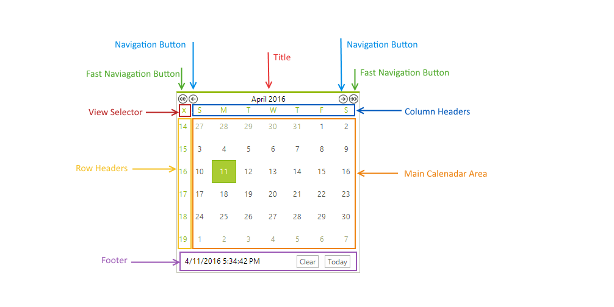

# Calendar Structure

## 

Most aspects of the calendar can be styled and the behavior customized to suit your purposes.

1. __Title:__ Displays the selected date range and navigation buttons. The appearance of both [title and the navigation buttons]() can be customized. 

1. __Navigation Buttons__: Allow you to move to the previous/next month or jump X steps forward/backward as defined by the __FastNavigationStep__ property. 

1. __Main Calendar Area:__ Renders the calendar views, whether single or multiple. This area includes the individual days, row/column selectors. 

1. __Row/Column Headers__ - when the __ShowRowHeaders__ and/or __ShowColumnHeaders__ properties are set to __true__, you can select a whole row/column of dates by clicking on the respective day/week button. To automatically display the day names and week numbers you need to also set the __AllowColumnHeaderSelectors__ properties to __true.__

1. __View Selector__: Allows the user to select all cells in the current month. If multiple months are being displayed at one time, there will be one view selector per month. The visibility and behavior of this element is controlled by the __ShowViewSelector__ and __AllowViewSelector__ properties.

1. __StatusBar (Footer):__ This is the area below the Main Calendar Area. It is often used for visual customization or for displaying additional information about the selected item. 

1. __Fast Navigation Popup:__ Displays a popup window with the months and years surrounding the selected date (not visible on the screenshot)
