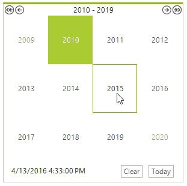

# Customizing Zoom Navigation

## 

This article will guide you through the process of creating a month-year picker. For this purpose, it is necessary to set the __HeaderNavigationMode__
        property to HeaderNavigationMode.*Zoom* and set the __ZoomLevel__ property to ZoomLevel.*Months*. 
        This will allow the user to select a specific __CalendarCellElement__ and navigate upwards/downwards in the __RadCalendar__ similar to Windows calendar. 

#### __[C#]__

{{region monthYearPicker}}
	
	            this.radCalendar1.HeaderNavigationMode = HeaderNavigationMode.Zoom;
	            this.radCalendar1.ZoomLevel = ZoomLevel.Months;
	
	            this.radCalendar1.ZoomChanging += new CalendarZoomChangingEventHandler(radCalendar1_ZoomChanging);
	
	{{endregion}}

#### __[VB.NET]__

{{region monthYearPicker}}
	
	    Private Sub radCalendar1_ZoomChanging(sender As Object, e As CalendarZoomChangingEventArgs)
	        If Me.RadCalendar1.ZoomLevel = ZoomLevel.Years AndAlso e.Direction = DrillDirection.Up Then
	            e.Cancel = True
	        End If
	        If Me.RadCalendar1.ZoomLevel = ZoomLevel.Months AndAlso e.Direction = DrillDirection.Down Then
	            e.Cancel = True
	        End If
	    End Sub
	    '#End Region
	
	    '#region iteratingSpecialSelected
	    Private Sub radButton1_Click(ByVal sender As Object, ByVal e As EventArgs)
	        For Each dateTime As DateTime In RadCalendar1.SelectedDates
	            RadListControl1.Items.Add(New RadListDataItem("Selected: " + dateTime.ToShortDateString()))
	        Next
	        For Each day As RadCalendarDay In RadCalendar1.SpecialDays
	            RadListControl1.Items.Add(New RadListDataItem("Special: " + day.[Date].ToShortDateString()))
	        Next
	    End Sub
	{{endregion}}

In addition, you should subscribe to the __ZoomChanging__ event and stop navigation from the currently selected month to its days
        representation and from a year to a range of years.

#### __[C#]__

{{region monthYearPickerEvent}}
	
	        void radCalendar1_ZoomChanging(object sender, CalendarZoomChangingEventArgs e)
	        {
	            if (this.radCalendar1.ZoomLevel == ZoomLevel.Years && e.Direction == DrillDirection.Up) 
	            {
	                e.Cancel = true;
	            }
	            if (this.radCalendar1.ZoomLevel == ZoomLevel.Months && e.Direction == DrillDirection.Down) 
	            {
	                e.Cancel = true;
	            }
	        }
	{{endregion}}

#### __[VB.NET]__

{{region monthYearPickerEvent}}
	
	    Private Sub radCalendar1_ZoomChanging(sender As Object, e As CalendarZoomChangingEventArgs)
	        If Me.RadCalendar1.ZoomLevel = ZoomLevel.Years AndAlso e.Direction = DrillDirection.Up Then
	            e.Cancel = True
	        End If
	        If Me.RadCalendar1.ZoomLevel = ZoomLevel.Months AndAlso e.Direction = DrillDirection.Down Then
	            e.Cancel = True
	        End If
	    End Sub
	    '#End Region
	
	    '#region iteratingSpecialSelected
	    Private Sub radButton1_Click(ByVal sender As Object, ByVal e As EventArgs)
	        For Each dateTime As DateTime In RadCalendar1.SelectedDates
	            RadListControl1.Items.Add(New RadListDataItem("Selected: " + dateTime.ToShortDateString()))
	        Next
	        For Each day As RadCalendarDay In RadCalendar1.SpecialDays
	            RadListControl1.Items.Add(New RadListDataItem("Special: " + day.[Date].ToShortDateString()))
	        Next
	    End Sub
	{{endregion}}

