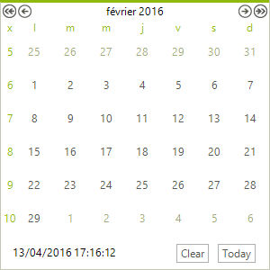

# Globalization Properties

## 

The __Culture__ property can be set using the drop down list in the Properties Window or set in code. The screenshot below shows the __Culture__ property set to "French (France)".

#### __[C#] Setting CultureInfo in code__

{{region globalization}}
	            radCalendar1.Culture = CultureInfo.GetCultureInfo("fr-FR");
	{{endregion}}

#### __[VB.NET] Setting CultureInfo in code__

{{region globalization}}
	        RadCalendar1.Culture = CultureInfo.GetCultureInfo("fr-FR")
	{{endregion}}

Additional properties that relate to globalization are:
<table><th><tr><td>

Property</td><td>

Description</td></tr></th><tr><td>

DayNameFormat
            	</td><td>

Specifies the display format for the days of the week on RadCalendar. Values for this property are <b>Full</b>, <b>Short</b>, <b>FirstLetter</b>, <b>FirstTwoLetters</b>, and <b>Shortest</b>.
    			</td></tr><tr><td>

Culture
            	</td><td>

Gets or sets the culture supported by this calendar.
    			</td></tr><tr><td>

CurrentCalendar
            	</td><td>

Gets the default System.Globalization.Calendar instance as specified by the default culture.
    			</td></tr><tr><td>

DayCellFormat
            	</td><td>

Gets or sets the formatting string that will be applied to the days in the calendar. The default value is "%d".
    			</td></tr><tr><td>

FirstDayOfWeek
            	</td><td>

Specifies the day to display as the first day of the week. Valid values are <b>Default</b>, <b>Sunday</b>, <b>Monday</b>, <b>Tuesday</b>, <b>Wednesday</b>, <b>Thursday</b>, <b>Friday</b> and <b>Saturday</b>.
    			</td></tr><tr><td>

TitleFormat
            	</td><td>

Gets or sets the format string that is applied to the calendar title. The default value is "MMMM yyyy".
    			</td></tr><tr><td>

CellToolTipFormat
            	</td><td>

Gets or sets the format string that is applied to the days cells tooltip. The default value is "dddd.MMMM dd, yyyy".
    			</td></tr><tr><td>

DateRangeSeparator
            	</td><td>

Gets or sets the separator string that will be put between start and end months in a multi view title. The default value is " - ".
    			</td></tr></table>
