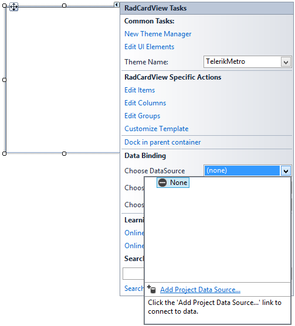
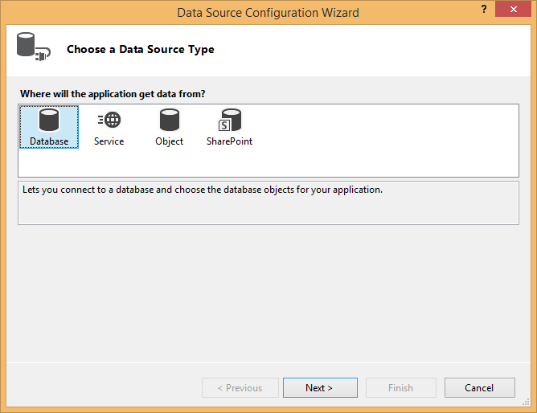
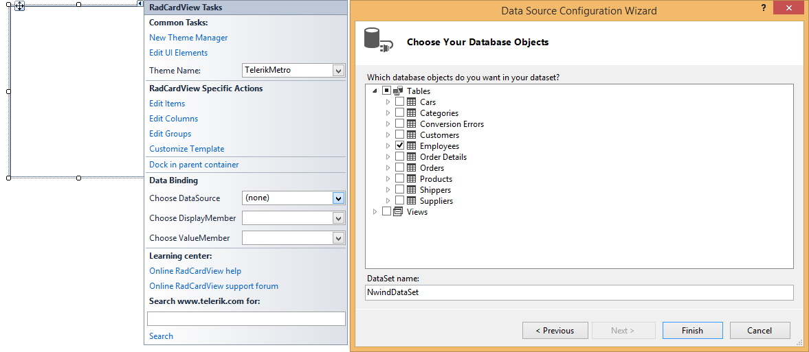
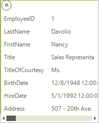

# Getting Started

The example below demonstrates setting up __RadCardView__ to display data form the *Northwind* database.

## Setting up the Form 

1. Create a new __Windows Application__ project.
            
1. Drop a __RadCardView__ control on the form.
            

## Connecting to Data

1. Open the __Smart Tag__ of the control and in the __Cooose DataSource__ drop down select *Add Project Data Source..*

1. In the __Data Source Configuration Wizard__, select the *Database* icon, and click *Next*.

1. In the __Choose a Database Model__ page of the wizard, select the *Dataset* icon and click *Next*.
            
1. In the __Choose Your Data Connection__ dialog, click on the *New Connection* button. This will display the Add Connection dialog.

1. In the __Change Data Source dialog__, select *Microsoft Access Data Base File* from the data source list.

1. Click *OK* to close the __Change Data Source__ dialog.

1. In the __Add Connection__ dialog, click on the *Browse* button. This step will display the __Select Microsoft Access Database File__ dialog.

1. In the __Select Microsoft Access Database File__ dialog, navigate to Telerik UI for WinForms installation directory and locate the `Nwind.mdb` file within the \Examples\QuickStart\Datasources directory. Select `Nwind.mdb` and click *OK* to close the __Select Microsoft Access Database File__ dialog.

1. Click *OK* to close __Add Connection__ dialog.

1. In __Choose Your Data Connection__ page of the wizard, click *Next*. This step will display a Microsoft Visual Studio dialog that prompts to ask if you want to copy the file to your project. Click *Yes* to close the dialog.   

1. In __Save the Connection String to the Application Configuration File__ page of the wizard, click the *Next* button. 

1. In __Choose Database Objects__ page of the dialog, select the *Employees* table

1. Now __RadCardView__ is bound to the *Employees* table from the *Northwind* database and should look like this screen shot below: 

1. Press __F5__ to run the application.

            
# See Also

* [Structure]()
* [Design Time]()