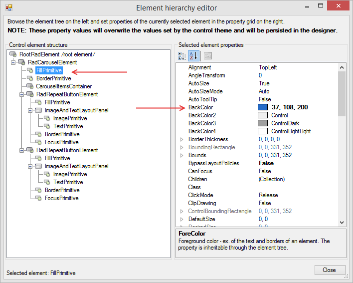
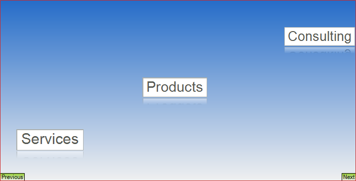

# Customizing at Design Time

You can customize the carousel elements with the [Element Hierarchy Editor](). Figure shows how you can use the editor to change the carousel background color.

>caption Figure 1: Change Carousel BackColor



# Customizing in the Code behind

The following snippet shows how you can change the back color of the navigation buttons. Figure 2 shows the result from the bellow code.

#### Change Navigation Buttons BackColor

{{source=..\SamplesCS\Carousel\CarouselGettingStarted.cs region=NavBackColor}}
{{source=..\SamplesVB\Carousel\CarouselGettingStarted.vb region=NavBackColor}}

````C#
radCarousel1.ButtonNext.ButtonFillElement.BackColor = ColorTranslator.FromHtml("#91c930");
radCarousel1.ButtonPrevious.ButtonFillElement.BackColor = ColorTranslator.FromHtml("#91c930");

````
````VB.NET
RadCarousel1.ButtonNext.ButtonFillElement.BackColor = ColorTranslator.FromHtml("#91c930")
RadCarousel1.ButtonPrevious.ButtonFillElement.BackColor = ColorTranslator.FromHtml("#91c930")

````

{{endregion}}


>caption Figure 2: Navigation Buttons BackColor Changed.




# See Also

 * [RadCarousel Properties]()
 * [Working with items]()
 * [Data Binding]()
 * [Carousel Path]()