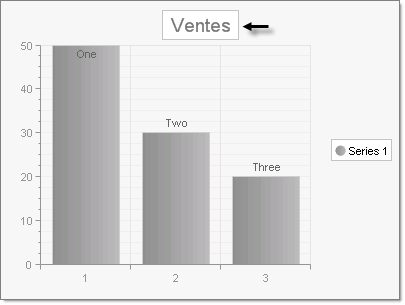
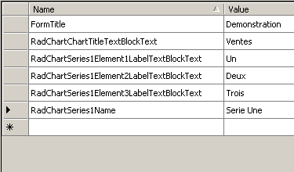

# Localization Example Using Local Resources, Implicit Expression


## 

This tutorial will demonstrate localizing the RadChart title, series name and chart series item labels. The example will use local resources and use implicit expressions to bind them. See [Multi-Language Support for RadChart](CA4DDE5C-F090-4070-B232-8DC96FFDC983) for an overview of localization options.

1. Create RadChart and add items 
 
	{{source=..\SamplesCS\Chart\LocalizationExample.cs region=createChart}} 
	{{source=..\SamplesVB\Chart\LocalizationExample.vb region=createChart}} 

	````C#
            RadChart radChart = new RadChart();
            radChart.PlotArea.XAxis.MaxValue = 3;
            radChart.PlotArea.XAxis.MinValue = 1;
            radChart.PlotArea.XAxis.Step = 1;
            Telerik.Charting.ChartSeries chartSeries = new Telerik.Charting.ChartSeries();
            chartSeries.Name = "Sales";
            chartSeries.Type = ChartSeriesType.Bar;
            radChart.ChartTitle.TextBlock.Text = "Sales";
            radChart.Series.Add(chartSeries);
            chartSeries.AddItem(50, "One");
            chartSeries.AddItem(30, "Two");
            chartSeries.AddItem(20, "Three");
            this.Controls.Add(radChart);
	````
	````VB.NET
        Dim radChart As New RadChart()
        radChart.PlotArea.XAxis.MaxValue = 3
        radChart.PlotArea.XAxis.MinValue = 1
        radChart.PlotArea.XAxis.[Step] = 1
        Dim chartSeries As New Telerik.Charting.ChartSeries()
        chartSeries.Name = "Sales"
        chartSeries.Type = ChartSeriesType.Bar
        radChart.ChartTitle.TextBlock.Text = "Sales"
        radChart.Series.Add(chartSeries)
        chartSeries.AddItem(50, "One")
        chartSeries.AddItem(30, "Two")
        chartSeries.AddItem(20, "Three")
        Me.Controls.Add(radChart)
        '
	````

	{{endregion}} 

 
1. In design mode of the Visual Studio IDE right-click the Project node in the Solution Explorer tree and select Add >> New Item. Select the Resource File template and give it a name, for example *Resource. *It will be renamed as *Resource.resx* in the project*.*

1. Double click Resource.resx in the Solution Explorer tree.
		

1. Add a new entry named "RadChart1ChartTitleTextBlockText" with value "Top Sales"

            
	>caption 

	

1. Set the radChart.ChartTitle.TextBlock.Text to the RadChart1ChartTitleTextBlockText key: 
          
	{{source=..\SamplesCS\Chart\LocalizationExample.cs region=settingTheTextBlockText}} 
	{{source=..\SamplesVB\Chart\LocalizationExample.vb region=settingTheTextBlockText}} 

	````C#
            radChart.ChartTitle.TextBlock.Text = SamplesCS.Chart.LocalizationResource.RadChartChartTitleTextBlockText;
	````
	````VB.NET
        radChart.ChartTitle.TextBlock.Text = Resource.RadChart1ChartTitleTextBlockText

        '
	````

	{{endregion}} 
 
1. In the Solution Explorer, add a new Resource File and name it using the culture code for French, "Resource.fr-FR.resx". 
		

1. Double click "Resource.fr-FR.resx". 
		

1. Enter "Ventes" for the "RadChart1ChartTitleTextBlockText" resource name.
            
	>caption 

	

1. Run the application. The chart title should still be "Sales". Stop the application. 
		

1. Now, for C# users in the beginning of the Program.Main method (located in Program.cs), set the CurrentUICulture to French. For VB.NET users set it before the code added in step 5 :
          
	{{source=..\SamplesCS\Chart\LocalizationExample.cs region=setLocalization}} 
	{{source=..\SamplesVB\Chart\LocalizationExample.vb region=setLocalization}} 
	
	````C#
            //this line goes in the Main method of the application, before the Application.Run method
            Thread.CurrentThread.CurrentUICulture = new CultureInfo("fr-FR");
	````
	````VB.NET
        'this line of code goes before the code added in step 5 (setting the chart title text), so it can be localized too
        Thread.CurrentThread.CurrentUICulture = New CultureInfo("fr-FR")
        '
	````

	{{endregion}} 

 
1. Run the application again.  The title should now be localized to "Ventes".
            
	>caption 

	

1. Stop the application. 
		

1. Now that the chart title is localized we turn to the series name and item labels. Add another resource key to the resource files that we made: RadChart1Series1Name. The ChartSeries tag will now look like the example below: 
         
	{{source=..\SamplesCS\Chart\LocalizationExample.cs region=setSeriesName}} 
	{{source=..\SamplesVB\Chart\LocalizationExample.vb region=setSeriesName}} 

	````C#
            radChart.Series[0].Name = SamplesCS.Chart.LocalizationResource.RadChartSeries1Name;
	````
	````VB.NET
        radChart.Series(0).Name = Resource.RadChart1Series1Name
        '
	````

	{{endregion}} 
 

1. To each item in the series add another resource key "RadChart1Series1Element1LabelTextBlockText". Name the resource keys "RadChart1Series1Element__1__LabelTextBlockText", "RadChart1Series1Element__2__LabelTextBlockText" and "RadChart1Series1Element__3__LabelTextBlockText" respectively:
          
	{{source=..\SamplesCS\Chart\LocalizationExample.cs region=addMoreItems}} 
	{{source=..\SamplesVB\Chart\LocalizationExample.vb region=addMoreItems}} 

	````C#
            chartSeries.Items[0].Label.TextBlock.Text = SamplesCS.Chart.LocalizationResource.RadChartSeries1Element1LabelTextBlockText;
            chartSeries.Items[1].Label.TextBlock.Text = SamplesCS.Chart.LocalizationResource.RadChartSeries1Element2LabelTextBlockText;
            chartSeries.Items[2].Label.TextBlock.Text = SamplesCS.Chart.LocalizationResource.RadChartSeries1Element3LabelTextBlockText;
	````
	````VB.NET
        chartSeries.Items(0).Label.TextBlock.Text = Resource.RadChart1Series1Element1LabelTextBlockText
        chartSeries.Items(1).Label.TextBlock.Text = Resource.RadChart1Series1Element2LabelTextBlockText
        chartSeries.Items(2).Label.TextBlock.Text = Resource.RadChart1Series1Element3LabelTextBlockText
        '
	````

	{{endregion}} 
 
1. In the Resource.resx file the keys and values should be set as it follows:
            
	>caption 

	

1. Copy these items to the Resource.fr-FR.resx file and provide the translated values as shown in the screen shot below.  You can delete the old entries and copy and paste from Resource.resx.
          
	>caption 

	

	>caution If you copy and paste, the designer may rename resource entries by appending a number.  You may need to rename these back so they match the values of the other resource file.
	>

1. Run the application. The chart title, series and item labels should all display translated values. The screen shot below shows the appearance of the completed chart.  Note: a skin has been applied to the chart to make the values easily visible:
          
	>caption 

	
