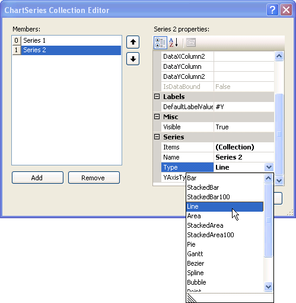

# Multiple Chart Types in a Single Chart


## 

RadChart allows you to combine several [chart types]() in a single chart. You can use the __ChartSeries__ Collection Editor at design-time to create the __ChartSeries__ and set the respective __ChartSeriesType__. You can also add chart series and set chart type programmatically.

To designate dissimilar [chart types]() in a single chart at design time, click on a series, then select the __Type__ property from the drop down list.


>caption 




To assign chart types to a series at run-time programmatically you can pass the __ChartSeriesType__ in the constructor or assign the __ChartSeriesType__ after the series is constructed.  The example below passes three chart series types to the constructor. 

{{source=..\SamplesCS\Chart\MultipleChartTypes.cs region=settingChartTypes}} 
{{source=..\SamplesVB\Chart\MultipleChartTypes.vb region=settingChartTypes}} 

````C#
Telerik.Charting.ChartSeries chartSeriesA = new Telerik.Charting.ChartSeries("Average Temperatures", ChartSeriesType.Bar);
Telerik.Charting.ChartSeries chartSeriesB = new Telerik.Charting.ChartSeries("Maximum Temperatures", ChartSeriesType.Line);
Telerik.Charting.ChartSeries chartSeriesC = new Telerik.Charting.ChartSeries("Minimum Temperatures", ChartSeriesType.Bubble);

````
````VB.NET
Dim chartSeriesA As New Telerik.Charting.ChartSeries("Average Temperatures", ChartSeriesType.Bar)
Dim chartSeriesB As New Telerik.Charting.ChartSeries("Maximum Temperatures", ChartSeriesType.Line)
Dim chartSeriesC As New Telerik.Charting.ChartSeries("Minimum Temperatures", ChartSeriesType.Bubble)

````

{{endregion}} 


Use the Axis.Range property to set minimum values, maximum values and step amount for each axis.  The screen shot below shows three chart series types in the same chart. See below for the full source.


>caption 


 
{{source=..\SamplesCS\Chart\MultipleChartTypes.cs region=differentChartSeries}} 
{{source=..\SamplesVB\Chart\MultipleChartTypes.vb region=differentChartSeries}} 

````C#
RadChart radChart = new RadChart();
radChart.PlotArea.Appearance.Dimensions.Margins.Right = Telerik.Charting.Styles.Unit.Percentage(10);
radChart.Legend.Appearance.Position.Auto = false;
radChart.Legend.Appearance.Position.X = 220;
radChart.Legend.Appearance.Position.Y = 50;
radChart.ChartTitle.Appearance.Position.AlignedPosition = Telerik.Charting.Styles.AlignedPositions.TopLeft;
radChart.ChartTitle.TextBlock.Text = "Weekly Forecast";
radChart.ChartTitle.TextBlock.Appearance.TextProperties.Font = new System.Drawing.Font("Verdana", 9, System.Drawing.FontStyle.Bold);
radChart.PlotArea.XAxis.AutoScale = false;
radChart.PlotArea.XAxis.AddRange(1, 7, 1);
radChart.PlotArea.XAxis[0].TextBlock.Text = "Mon";
radChart.PlotArea.XAxis[1].TextBlock.Text = "Tue";
radChart.PlotArea.XAxis[2].TextBlock.Text = "Wed";
radChart.PlotArea.XAxis[3].TextBlock.Text = "Thu";
radChart.PlotArea.XAxis[4].TextBlock.Text = "Fri";
radChart.PlotArea.XAxis[5].TextBlock.Text = "Sat";
radChart.PlotArea.XAxis[6].TextBlock.Text = "Sun";
radChart.PlotArea.XAxis.IsZeroBased = false;
radChart.PlotArea.YAxis.AxisMode = ChartYAxisMode.Extended;
radChart.PlotArea.YAxis.AxisLabel.TextBlock.Text = "Temperature C";
radChart.PlotArea.YAxis.Appearance.Width = 3;
// Create the series and assign the ChartSeriesType
Telerik.Charting.ChartSeries chartSeries = new Telerik.Charting.ChartSeries("Average Temperatures", ChartSeriesType.Bar);
chartSeries.Appearance.TextAppearance.TextProperties.Font = new System.Drawing.Font("Verdana", 9, System.Drawing.FontStyle.Bold);
chartSeries.Appearance.FillStyle.MainColor = System.Drawing.Color.Honeydew;
chartSeries.Appearance.FillStyle.SecondColor = System.Drawing.Color.Green;
// Define the items in the series
chartSeries.AddItem(5);
chartSeries.AddItem(1);
chartSeries.AddItem(-1);
chartSeries.AddItem(-5);
chartSeries.AddItem(-7);
chartSeries.AddItem(-3);
chartSeries.AddItem(-1);
// Create the series and assign the ChartSeriesType
Telerik.Charting.ChartSeries chartSeries2 = new Telerik.Charting.ChartSeries("Maximum Temperatures", ChartSeriesType.Line);
chartSeries2.Appearance.LabelAppearance.Visible = false;
chartSeries2.Appearance.LineSeriesAppearance.Color = System.Drawing.Color.Red;
// Define the items in the series
chartSeries2.AddItem(11);
chartSeries2.AddItem(4);
chartSeries2.AddItem(0);
chartSeries2.AddItem(-4);
chartSeries2.AddItem(-7);
chartSeries2.AddItem(0);
chartSeries2.AddItem(5);
// visually enhance the data points
chartSeries2.Appearance.PointMark.Dimensions.Width = 5;
chartSeries2.Appearance.PointMark.Dimensions.Height = 5;
chartSeries2.Appearance.PointMark.FillStyle.MainColor = System.Drawing.Color.Black;
chartSeries2.Appearance.PointMark.Visible = true;
// Create the series and assign the ChartSeriesType
Telerik.Charting.ChartSeries chartSeries3 = new Telerik.Charting.ChartSeries("Minimum Temperatures", ChartSeriesType.Bubble);
chartSeries3.Appearance.LabelAppearance.Visible = false;
chartSeries3.Appearance.FillStyle.MainColor = System.Drawing.Color.Blue;
chartSeries3.Appearance.FillStyle.SecondColor = System.Drawing.Color.Aqua;
// Define the items in the series
chartSeries3.AddItem(1);
chartSeries3.AddItem(0);
chartSeries3.AddItem(-5);
chartSeries3.AddItem(-7);
chartSeries3.AddItem(-11);
chartSeries3.AddItem(-8);
chartSeries3.AddItem(-6);
// visually enhance the data points
chartSeries3.Appearance.PointMark.Dimensions.Width = 5;
chartSeries3.Appearance.PointMark.Dimensions.Height = 5;
chartSeries3.Appearance.PointMark.FillStyle.MainColor = System.Drawing.Color.Black;
chartSeries3.Appearance.PointMark.Visible = true;
// Add the series to the chart, chart to page.
radChart.Series.Add(chartSeries);
radChart.Series.Add(chartSeries2);
radChart.Series.Add(chartSeries3);
this.Controls.Add(radChart);

````
````VB.NET
Dim radChart As New RadChart()
radChart.PlotArea.Appearance.Dimensions.Margins.Right = Telerik.Charting.Styles.Unit.Percentage(10)
radChart.Legend.Appearance.Position.Auto = False
radChart.Legend.Appearance.Position.X = 220
radChart.Legend.Appearance.Position.Y = 50
radChart.ChartTitle.Appearance.Position.AlignedPosition = Telerik.Charting.Styles.AlignedPositions.TopLeft
radChart.ChartTitle.TextBlock.Text = "Weekly Forecast"
radChart.ChartTitle.TextBlock.Appearance.TextProperties.Font = New System.Drawing.Font("Verdana", 9, System.Drawing.FontStyle.Bold)
radChart.PlotArea.XAxis.AutoScale = False
radChart.PlotArea.XAxis.AddRange(1, 7, 1)
radChart.PlotArea.XAxis(0).TextBlock.Text = "Mon"
radChart.PlotArea.XAxis(1).TextBlock.Text = "Tue"
radChart.PlotArea.XAxis(2).TextBlock.Text = "Wed"
radChart.PlotArea.XAxis(3).TextBlock.Text = "Thu"
radChart.PlotArea.XAxis(4).TextBlock.Text = "Fri"
radChart.PlotArea.XAxis(5).TextBlock.Text = "Sat"
radChart.PlotArea.XAxis(6).TextBlock.Text = "Sun"
radChart.PlotArea.XAxis.IsZeroBased = False
radChart.PlotArea.YAxis.AxisMode = ChartYAxisMode.Extended
radChart.PlotArea.YAxis.AxisLabel.TextBlock.Text = "Temperature C"
radChart.PlotArea.YAxis.Appearance.Width = 3
' Create the series and assign the ChartSeriesType
Dim chartSeries As New Telerik.Charting.ChartSeries("Average Temperatures", ChartSeriesType.Bar)
chartSeries.Appearance.TextAppearance.TextProperties.Font = New System.Drawing.Font("Verdana", 9, System.Drawing.FontStyle.Bold)
chartSeries.Appearance.FillStyle.MainColor = System.Drawing.Color.Honeydew
chartSeries.Appearance.FillStyle.SecondColor = System.Drawing.Color.Green
' Define the items in the series
chartSeries.AddItem(5)
chartSeries.AddItem(1)
chartSeries.AddItem(-1)
chartSeries.AddItem(-5)
chartSeries.AddItem(-7)
chartSeries.AddItem(-3)
chartSeries.AddItem(-1)
' Create the series and assign the ChartSeriesType
Dim chartSeries2 As New Telerik.Charting.ChartSeries("Maximum Temperatures", ChartSeriesType.Line)
chartSeries2.Appearance.LabelAppearance.Visible = False
chartSeries2.Appearance.LineSeriesAppearance.Color = System.Drawing.Color.Red
' Define the items in the series
chartSeries2.AddItem(11)
chartSeries2.AddItem(4)
chartSeries2.AddItem(0)
chartSeries2.AddItem(-4)
chartSeries2.AddItem(-7)
chartSeries2.AddItem(0)
chartSeries2.AddItem(5)
' visually enhance the data points
chartSeries2.Appearance.PointMark.Dimensions.Width = 5
chartSeries2.Appearance.PointMark.Dimensions.Height = 5
chartSeries2.Appearance.PointMark.FillStyle.MainColor = System.Drawing.Color.Black
chartSeries2.Appearance.PointMark.Visible = True
' Create the series and assign the ChartSeriesType
Dim chartSeries3 As New Telerik.Charting.ChartSeries("Minimum Temperatures", ChartSeriesType.Bubble)
chartSeries3.Appearance.LabelAppearance.Visible = False
chartSeries3.Appearance.FillStyle.MainColor = System.Drawing.Color.Blue
chartSeries3.Appearance.FillStyle.SecondColor = System.Drawing.Color.Aqua
' Define the items in the series           
chartSeries3.AddItem(1)
chartSeries3.AddItem(0)
chartSeries3.AddItem(-5)
chartSeries3.AddItem(-7)
chartSeries3.AddItem(-11)
chartSeries3.AddItem(-8)
chartSeries3.AddItem(-6)
' visually enhance the data points
chartSeries3.Appearance.PointMark.Dimensions.Width = 5
chartSeries3.Appearance.PointMark.Dimensions.Height = 5
chartSeries3.Appearance.PointMark.FillStyle.MainColor = System.Drawing.Color.Black
chartSeries3.Appearance.PointMark.Visible = True
' Add the series to the chart, chart to page.
radChart.Series.Add(chartSeries)
radChart.Series.Add(chartSeries2)
radChart.Series.Add(chartSeries3)
Me.Controls.Add(radChart)

````

{{endregion}} 


