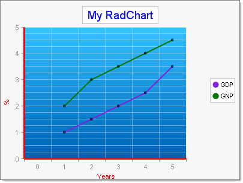

# Creating RadChart Programmatically - more complex example


## 


>caption 



The figure above shows a more complex chart than the [minimal example of programmatically created RadChart]().  This example demonstrates how to:

* Create the chart, define the chart title and the title's appearance.

* Define two different chart series, how to hide the series labels and tailor the series appearance.

* Add multiple chart series items with data.

* How to display point marks to highlight the data points.

* Fill the plot area background with a gradient color.

* Set axis line and label appearance.


#### Extended example 

{{source=..\SamplesCS\Chart\CreatingRadChartProgrammaticaly2.cs region=extendedExample}} 
{{source=..\SamplesVB\Chart\CreatingRadChartProgrammaticaly2.vb region=extendedExample}} 

````C#
// Define chart and title
RadChart radChart = new RadChart();
radChart.ChartTitle.TextBlock.Text = "My RadChart";
radChart.ChartTitle.TextBlock.Appearance.TextProperties.Color = System.Drawing.Color.Blue;
// Define chart series
Telerik.Charting.ChartSeries chartSeries = new Telerik.Charting.ChartSeries();
chartSeries.Appearance.LabelAppearance.Visible = false;
chartSeries.Name = "GDP";
chartSeries.Type = ChartSeriesType.Line;
chartSeries.Appearance.LineSeriesAppearance.Color = System.Drawing.Color.BlueViolet; 
            
// Define the items in the series
chartSeries.AddItem(1);
chartSeries.AddItem(1.5);
chartSeries.AddItem(2.0);
chartSeries.AddItem(2.5);
chartSeries.AddItem(3.5);
// visually enhance the data points
chartSeries.Appearance.PointMark.Dimensions.Width = 5;
chartSeries.Appearance.PointMark.Dimensions.Height = 5;
chartSeries.Appearance.PointMark.FillStyle.MainColor = System.Drawing.Color.Black;
chartSeries.Appearance.PointMark.Visible = true;
// Define chart series
Telerik.Charting.ChartSeries chartSeries2 = new Telerik.Charting.ChartSeries();
chartSeries2.Appearance.LabelAppearance.Visible = false;
chartSeries2.Name = "GNP";
chartSeries2.Type = ChartSeriesType.Line;
chartSeries2.Appearance.LineSeriesAppearance.Color = System.Drawing.Color.Green; 
// Define the items in the series
chartSeries2.AddItem(2);
chartSeries2.AddItem(3);
chartSeries2.AddItem(3.5);
chartSeries2.AddItem(4);
chartSeries2.AddItem(4.5);
// visually enhance the data points
chartSeries2.Appearance.PointMark.Dimensions.Width = 5;
chartSeries2.Appearance.PointMark.Dimensions.Height = 5;
chartSeries2.Appearance.PointMark.FillStyle.MainColor = System.Drawing.Color.Black;
chartSeries2.Appearance.PointMark.Visible = true;
// set the plot area gradient background fill
radChart.PlotArea.Appearance.FillStyle.FillType = Telerik.Charting.Styles.FillType.Gradient; 
radChart.PlotArea.Appearance.FillStyle.MainColor = System.Drawing.Color.FromArgb(65, 201, 254);
radChart.PlotArea.Appearance.FillStyle.SecondColor = System.Drawing.Color.FromArgb(0, 107, 186);
// Set text and line for X axis
radChart.PlotArea.XAxis.AxisLabel.TextBlock.Text = "Years";
radChart.PlotArea.XAxis.AxisLabel.TextBlock.Appearance.TextProperties.Color = System.Drawing.Color.Red; 
radChart.PlotArea.XAxis.Appearance.Width = 3;
radChart.PlotArea.XAxis.Appearance.Color = System.Drawing.Color.Red;
// Set text and line for Y axis
radChart.PlotArea.YAxis.AxisLabel.TextBlock.Text = "%";
radChart.PlotArea.YAxis.AxisLabel.TextBlock.Appearance.TextProperties.Color = System.Drawing.Color.Red;
radChart.PlotArea.YAxis.Appearance.Width = 3;
radChart.PlotArea.YAxis.Appearance.Color = System.Drawing.Color.Red; 
// Add the series to the chart, chart to page.
radChart.Series.Add(chartSeries);
radChart.Series.Add(chartSeries2);
this.Controls.Add(radChart);

````
````VB.NET
' Define chart and title
Dim radChart As New RadChart()
radChart.ChartTitle.TextBlock.Text = "My RadChart"
radChart.ChartTitle.TextBlock.Appearance.TextProperties.Color = System.Drawing.Color.Blue
' Define chart series
Dim chartSeries As New Telerik.Charting.ChartSeries()
chartSeries.Appearance.LabelAppearance.Visible = False
chartSeries.Name = "GDP"
chartSeries.Type = ChartSeriesType.Line
chartSeries.Appearance.LineSeriesAppearance.Color = System.Drawing.Color.BlueViolet
' Define the items in the series
chartSeries.AddItem(1)
chartSeries.AddItem(1.5)
chartSeries.AddItem(2)
chartSeries.AddItem(2.5)
chartSeries.AddItem(3.5)
' visually enhance the data points
chartSeries.Appearance.PointMark.Dimensions.Width = 5
chartSeries.Appearance.PointMark.Dimensions.Height = 5
chartSeries.Appearance.PointMark.FillStyle.MainColor = System.Drawing.Color.Black
chartSeries.Appearance.PointMark.Visible = True
' Define chart series
Dim chartSeries2 As New Telerik.Charting.ChartSeries()
chartSeries2.Appearance.LabelAppearance.Visible = False
chartSeries2.Name = "GNP"
chartSeries2.Type = ChartSeriesType.Line
chartSeries2.Appearance.LineSeriesAppearance.Color = System.Drawing.Color.Green
' Define the items in the series
chartSeries2.AddItem(2)
chartSeries2.AddItem(3)
chartSeries2.AddItem(3.5)
chartSeries2.AddItem(4)
chartSeries2.AddItem(4.5)
' visually enhance the data points
chartSeries2.Appearance.PointMark.Dimensions.Width = 5
chartSeries2.Appearance.PointMark.Dimensions.Height = 5
chartSeries2.Appearance.PointMark.FillStyle.MainColor = System.Drawing.Color.Black
chartSeries2.Appearance.PointMark.Visible = True
' set the plot area gradient background fill
radChart.PlotArea.Appearance.FillStyle.FillType = Telerik.Charting.Styles.FillType.Gradient
radChart.PlotArea.Appearance.FillStyle.MainColor = System.Drawing.Color.FromArgb(65, 201, 254)
radChart.PlotArea.Appearance.FillStyle.SecondColor = System.Drawing.Color.FromArgb(0, 107, 186)
' Set text and line for X axis
radChart.PlotArea.XAxis.AxisLabel.TextBlock.Text = "Years"
radChart.PlotArea.XAxis.AxisLabel.TextBlock.Appearance.TextProperties.Color = System.Drawing.Color.Red
radChart.PlotArea.XAxis.Appearance.Width = 3
radChart.PlotArea.XAxis.Appearance.Color = System.Drawing.Color.Red
' Set text and line for Y axis
radChart.PlotArea.YAxis.AxisLabel.TextBlock.Text = "%"
radChart.PlotArea.YAxis.AxisLabel.TextBlock.Appearance.TextProperties.Color = System.Drawing.Color.Red
radChart.PlotArea.YAxis.Appearance.Width = 3
radChart.PlotArea.YAxis.Appearance.Color = System.Drawing.Color.Red
' Add the series to the chart, chart to page.
radChart.Series.Add(chartSeries)
radChart.Series.Add(chartSeries2)
Me.Controls.Add(radChart)

````

{{endregion}} 


