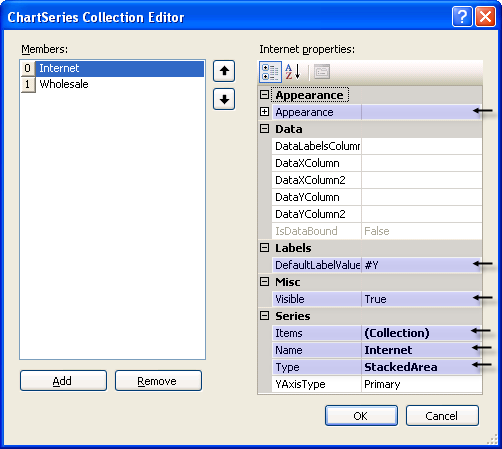

# Series Overview

## 

Series refers to a series of data points displayed in the chart. The RadChart Series object is a collection of [ChartSeriesItem]() objects.  The number of series used depends on the type of chart.  A Pie chart type only uses a single series. "Stacked" charts like the Stacked Area chart use several series.

Each ChartSeries object contains a collection of __ChartSeriesItem__ objects that contain the actual data points displayed on the chart. You can [add data to a series programmatically]() at run time, at [design time in the Properties Window of Visual Studio](), [declaratively in the ASP.NET HTML markup](30AD2813-E341-45AA-8E72-1070A6EA895B), or [by binding to a data source](). 

Some key properties for the __ChartSeries__ are: 

* __Appearance__: This property contains the common appearance related properties such as __Border__, __Corners__, __FillStyle__ and __TextAppearance__.  In addition there are [series specific properties]() including __LabelAppearance__, __LineSeriesAppearance__, __LegendDisplayMode__, __BubbleSize__ and __PointMark__.   

* [DefaultLabelValue](): Specifies a format for label values.  This allows you to display data points as numeric amounts, percentages, totals or any format described in this MSDN article [Standard Numeric Format Strings](http://msdn2.microsoft.com/en-us/library/dwhawy9k.aspx)

* [Items](): The collection of ChartSeriesItem objects that contain data points. 

        

* __Name__: By default this name is displayed in the legend for the series. 

* [Types](): Use this property to select the chart type.  Valid values are [Bar](), [StackedBar](), [StackedBar100](), [Line](), [Area](), [StackedArea](), [StackedArea100](), [Pie](), [Gantt](), [Bezier](), [Spline](), [Bubble](), [Point](), [SplineArea](), [StackedSplineArea]() and [StackedSplineArea100](). 

* __Visible__: Turn this property off to hide the series.

DataRelatedPropertiesSeries
