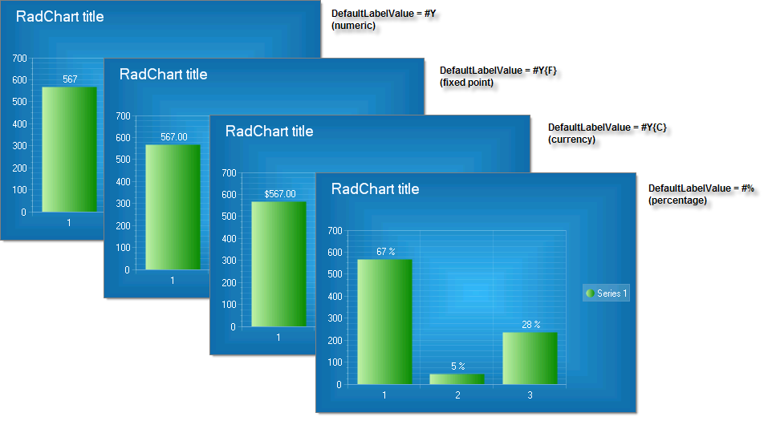

# DefaultLabelValue

## 

__DefaultLabelValue__ specifies a format for label values that will be displayed automatically if you do not specifically assign text to a chart series item.

* Use "#Y" or "#X" to display numbers from the X or Y axis respectively 

* Use "#%" for a percentage of the total sum (of all items). 

* Use "#SUM" to display the total of all items.  

* "#STSUM" displays the sum of a stacked series. 

* "#SERIES" displays the series name. 

* "#ITEM" displays the item name. 

* You can also use the formatting described in this MSDN article [Standard Numeric Format Strings](http://msdn2.microsoft.com/en-us/library/dwhawy9k.aspx). Use curly brackets to contain the standard numeric formats.  For example, you can display Y values as currency by setting __DefaultLabelValue__ to "#Y{C}". See examples in the figure below.
>caption 

