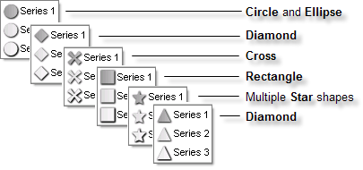

# Legends

Legends are symbols and text used to provide additional information about the chart.  In a multiple series chart the legend typically describes each series to improve readability.  By default RadChart includes the color and name of each chart series in the legend. You can also define your own legend and control the style for the legend or each item in the legend using the RadChart __Legend__ property. __Legend__ holds properties for: 

* __Visible__ : If a legend is not relevant to your chart you can set this false to hide the legend. 

* __Appearance__ : This property controls the visual style of the legend as a whole including __Dimensions__, __Position__, __FillStyle__, __ItemAppearance__, __ItemMarkerAppearance__, __ItemTextAppearance__, __RotationAngle__ and __Shadow__. 

* __Items__: A collection containing the individual legend text and symbols for each series.  Add to this collection to create your own custom legends. 

* __Marker__: A visual marker for the legend as a whole. Use the marker __Appearance__ property to control properties like __FillStyle__, __Dimensions__ and __Position__ . To assign an image to the marker use the marker Appearance.FillStyle property to set __FillType__ to __Image__and FillSettings.BackgroundImage to the path of the image. 

* __TextBlock__ : Use TextBlock to control the default text and appearance.

## Formatting Legends

Use the legend Appearance __ItemTextAppearance__ property to tailor the look of all legend item text at one time and the __ItemMarkerAppearance__ to format all of the legend markers.  Particularly note the __CompositionType__ property that handles the display order of text vs. images where valid values are __ColumnImageText__, __ColumnTextImage__, __RowImageText__(the default) and __RowTextImage__. "Column" values show the text and image one above the other.  "Row" shows text and image side-by-side.

Use the __ItemMarkerAppearance Figure__ property to select from a set of predefined marker shapes.
>caption 

Use the Legend.Appearance.Position property to control where the legend should appear on the chart surface. The __AlignedPosition__ sub property automatically places the legend in a predefined position. Or set the __Auto__ property false and manually set the __X__ and __Y__ properties to place the legend in any exact position. 
>caption 

Use the Legend.Appearance.Dimensions property to control the legend height and width.  By default the __AutoSize__ sub property is true and dimensioning is handled for you.  Set __AutoSize__ off to manually handle __Width__, __Height__, __Margins__ and __Paddings__. 

## Adding Custom Legends

In the collection editor for the Legend __Items__ property add one or more items. Use the __Marker__ property to add images or colored shapes next to the text.  Use the __TextBlock__ property to add the text description for the legend item. You can also define image maps using the __ActiveRegion__ property of the legend or legend items.

To add images to the legend you can set the Marker.Appearance.FillStyle.FillType to __Image__ and the Marker.Appearance.FillStyle.FillSettings.BackgroundImage to the path of an image to display.  In the example below two legend items are added to the collection where the __BackgroundImage__ contains image paths for two flags and where the TextBlock.Text properties contain corresponding descriptions. In addition the Legend.Appearance.Shadow property has __Blur__ = 5 and __Distance__ = 2.

