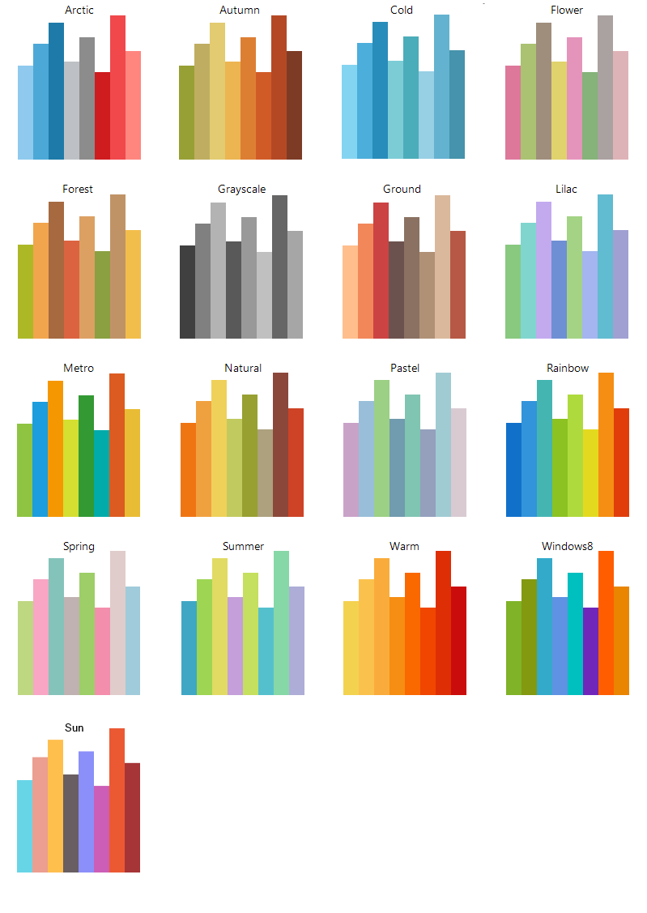
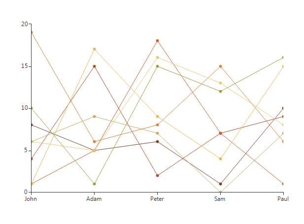
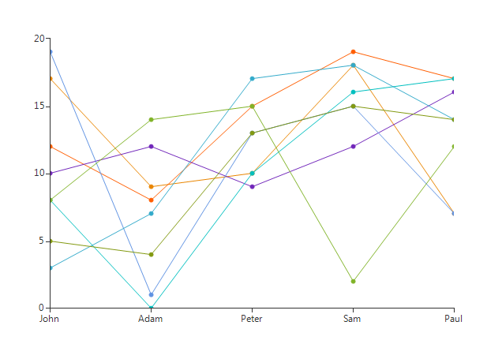
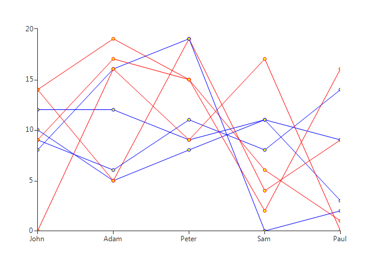

# Palettes

## 

Palettes are a quick and easy way to define a skin for your chart view. A palette is a collection of
        	several palette entries and each palette entry defines up to four colors – two fills and two strokes.
        	Currently, only the Fill and Stroke properties are in use, the AdditionalFill and AdditionalStroke 
        	are not taken into consideration when applying a palette.
        

To apply one of these predefined palettes all you have to do is execute the following line of code:

#### __[C#]__

{{region palette}}
	                this.radChartView1.Area.View.Palette = KnownPalette.Metro;
	{{endregion}}

#### __[VB.NET]__

{{region palette}}
	        Me.RadChartView1.Area.View.Palette = KnownPalette.Metro
	        '#End Region
	
	        '#Region "setCustomPalette"
	        Me.RadChartView1.Area.View.Palette = New CustomPalette()
	        '#End Region
	
	        InitializeComponent()
	    End Sub
	
	    Protected Overrides Sub OnShown(e As EventArgs)
	        MyBase.OnShown(e)
	
	        Dim r As New Random()
	        For i As Integer = 0 To 7
	            Dim table As New DataTable()
	            table.Columns.Add("Value", GetType(Double))
	            table.Columns.Add("Name", GetType(String))
	            table.Rows.Add(r.[Next](20), "John")
	            table.Rows.Add(r.[Next](20), "Adam")
	            table.Rows.Add(r.[Next](20), "Peter")
	            table.Rows.Add(r.[Next](20), "Sam")
	            table.Rows.Add(r.[Next](20), "Paul")
	
	            Dim lineSeria As New LineSeries()
	            RadChartView1.Series.Add(lineSeria)
	
	            lineSeria.ValueMember = "Value"
	            lineSeria.CategoryMember = "Name"
	            lineSeria.DataSource = table
	
	            '#Region "sample"
	            lineSeria.Palette = KnownPalette.Flower.GlobalEntries(0)
	            lineSeria.Palette = New PaletteEntry(Color.Yellow, Color.Red)
	            '#End Region
	
	        Next
	
	
	    End Sub
	
	#Region "customPalette"
	    Public Class CustomPalette
	        Inherits ChartPalette
	        Public Sub New()
	            Me.GlobalEntries.Add(Color.Yellow, Color.Red)
	            Me.GlobalEntries.Add(Color.Yellow, Color.Blue)
	        End Sub
	    End Class
	#End Region
	End Class

Here is how two ot the palettes look like in action:

* Autumn:

* Windows8:

The predefined palettes consist of 8 palette entries which are applied to the series in a cyclic order.
        	The first series is drawn with the colors from the first palette entry the second series is drawn with the
        	colors form the second palette entry… the ninth series is drawn with the colors form the first palette entry 
        	and so on. If you would like to apply a palette entry specifically to a series you can do so using either one 
        	of the following line of code:
        

#### __[C#]__

{{region sample}}
	                lineSeria.Palette = KnownPalette.Flower.GlobalEntries[0];
	                lineSeria.Palette = new PaletteEntry(Color.Yellow, Color.Red);
	{{endregion}}

#### __[VB.NET]__

{{region sample}}
	            lineSeria.Palette = KnownPalette.Flower.GlobalEntries(0)
	            lineSeria.Palette = New PaletteEntry(Color.Yellow, Color.Red)
	            '#End Region
	
	        Next
	
	
	    End Sub
	
	#Region "customPalette"
	    Public Class CustomPalette
	        Inherits ChartPalette
	        Public Sub New()
	            Me.GlobalEntries.Add(Color.Yellow, Color.Red)
	            Me.GlobalEntries.Add(Color.Yellow, Color.Blue)
	        End Sub
	    End Class
	#End Region
	End Class

Predefined palettes cannot be edited , however, you can define your own palettes by inheriting 
      	from ChartPalette and creating a collection of palette entries. Here is an example:
      

#### __[C#]__

{{region customPalette}}
	    public class CustomPalette : ChartPalette
	    {
	        public CustomPalette()
	        {
	            this.GlobalEntries.Add(Color.Yellow, Color.Red);
	            this.GlobalEntries.Add(Color.Yellow, Color.Blue);
	        }
	    }
	{{endregion}}

#### __[VB.NET]__

{{region customPalette}}
	    Public Class CustomPalette
	        Inherits ChartPalette
	        Public Sub New()
	            Me.GlobalEntries.Add(Color.Yellow, Color.Red)
	            Me.GlobalEntries.Add(Color.Yellow, Color.Blue)
	        End Sub
	    End Class
	#End Region
	End Class

and here is how to set the custom palette:

#### __[C#]__

{{region setCustomPalette}}
	           this.radChartView1.Area.View.Palette = new CustomPalette();
	{{endregion}}

#### __[VB.NET]__

{{region setCustomPalette}}
	        Me.RadChartView1.Area.View.Palette = New CustomPalette()
	        '#End Region
	
	        InitializeComponent()
	    End Sub
	
	    Protected Overrides Sub OnShown(e As EventArgs)
	        MyBase.OnShown(e)
	
	        Dim r As New Random()
	        For i As Integer = 0 To 7
	            Dim table As New DataTable()
	            table.Columns.Add("Value", GetType(Double))
	            table.Columns.Add("Name", GetType(String))
	            table.Rows.Add(r.[Next](20), "John")
	            table.Rows.Add(r.[Next](20), "Adam")
	            table.Rows.Add(r.[Next](20), "Peter")
	            table.Rows.Add(r.[Next](20), "Sam")
	            table.Rows.Add(r.[Next](20), "Paul")
	
	            Dim lineSeria As New LineSeries()
	            RadChartView1.Series.Add(lineSeria)
	
	            lineSeria.ValueMember = "Value"
	            lineSeria.CategoryMember = "Name"
	            lineSeria.DataSource = table
	
	            '#Region "sample"
	            lineSeria.Palette = KnownPalette.Flower.GlobalEntries(0)
	            lineSeria.Palette = New PaletteEntry(Color.Yellow, Color.Red)
	            '#End Region
	
	        Next
	
	
	    End Sub
	
	#Region "customPalette"
	    Public Class CustomPalette
	        Inherits ChartPalette
	        Public Sub New()
	            Me.GlobalEntries.Add(Color.Yellow, Color.Red)
	            Me.GlobalEntries.Add(Color.Yellow, Color.Blue)
	        End Sub
	    End Class
	#End Region
	End Class

