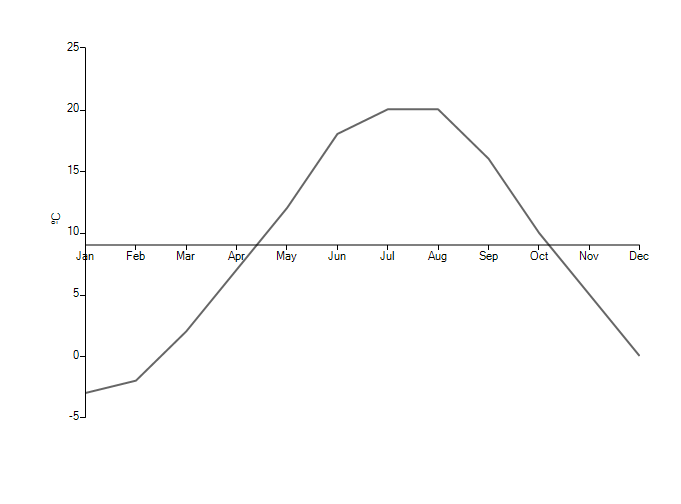
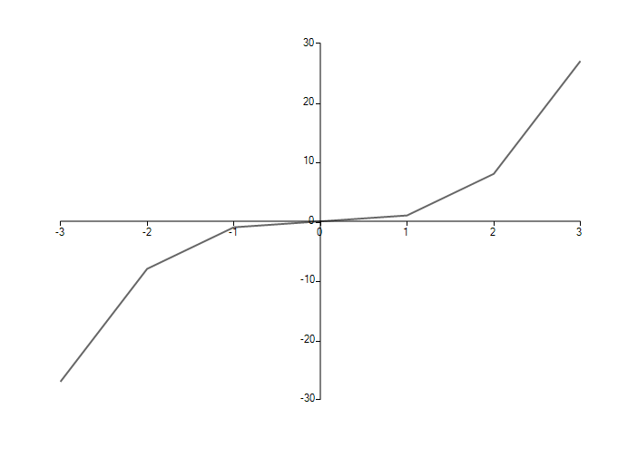

# Axis Alignment


The __StartPositionAxis__ and the __StartPositionValue__ properties of the abstract __CartesianAxis__ class provide a functionality for fine positioning of the axes of a __RadChartView__.
      

## 

* __StartPositionAxis__– defines the axis along which the current axis will be aligned.
            

* __StartPositionValue__– defines the location where the current axis should be positioned.
            

## One Axis Offset

This example sets offset of the horizontal axis along the vertical axis. 

{{source=..\SamplesCS\ChartView\Axes\AxisAlignmentForm.cs region=one-axis-offset}} 
{{source=..\SamplesVB\ChartView\Axes\AxisAlignmentForm.vb region=one-axis-offset}} 

````C#
LineSeries tempSeries = new LineSeries();
tempSeries.DataPoints.Add(new CategoricalDataPoint(-3, "Jan"));
tempSeries.DataPoints.Add(new CategoricalDataPoint(-2, "Feb"));
tempSeries.DataPoints.Add(new CategoricalDataPoint(2, "Mar"));
tempSeries.DataPoints.Add(new CategoricalDataPoint(7, "Apr"));
tempSeries.DataPoints.Add(new CategoricalDataPoint(12, "May"));
tempSeries.DataPoints.Add(new CategoricalDataPoint(18, "Jun"));
tempSeries.DataPoints.Add(new CategoricalDataPoint(20, "Jul"));
tempSeries.DataPoints.Add(new CategoricalDataPoint(20, "Aug"));
tempSeries.DataPoints.Add(new CategoricalDataPoint(16, "Sep"));
tempSeries.DataPoints.Add(new CategoricalDataPoint(10, "Oct"));
tempSeries.DataPoints.Add(new CategoricalDataPoint(5, "Nov"));
tempSeries.DataPoints.Add(new CategoricalDataPoint(0, "Dec"));
radChartView1.Series.Add(tempSeries);
CategoricalAxis tempHorizontalAxis = tempSeries.HorizontalAxis as CategoricalAxis;
tempHorizontalAxis.StartPositionAxis = tempSeries.VerticalAxis;
tempHorizontalAxis.StartPositionValue = 9;
tempHorizontalAxis.Title = "New York";
LinearAxis tempVerticalAxis = tempSeries.VerticalAxis as LinearAxis;
tempVerticalAxis.Title = " ºC";

````
````VB.NET
Dim tempSeries As New LineSeries()
tempSeries.DataPoints.Add(New CategoricalDataPoint(-3, "Jan"))
tempSeries.DataPoints.Add(New CategoricalDataPoint(-2, "Feb"))
tempSeries.DataPoints.Add(New CategoricalDataPoint(2, "Mar"))
tempSeries.DataPoints.Add(New CategoricalDataPoint(7, "Apr"))
tempSeries.DataPoints.Add(New CategoricalDataPoint(12, "May"))
tempSeries.DataPoints.Add(New CategoricalDataPoint(18, "Jun"))
tempSeries.DataPoints.Add(New CategoricalDataPoint(20, "Jul"))
tempSeries.DataPoints.Add(New CategoricalDataPoint(20, "Aug"))
tempSeries.DataPoints.Add(New CategoricalDataPoint(16, "Sep"))
tempSeries.DataPoints.Add(New CategoricalDataPoint(10, "Oct"))
tempSeries.DataPoints.Add(New CategoricalDataPoint(5, "Nov"))
tempSeries.DataPoints.Add(New CategoricalDataPoint(0, "Dec"))
RadChartView1.Series.Add(tempSeries)
Dim tempHorizontalAxis As CategoricalAxis = TryCast(tempSeries.HorizontalAxis, CategoricalAxis)
tempHorizontalAxis.StartPositionAxis = tempSeries.VerticalAxis
tempHorizontalAxis.StartPositionValue = 9
Dim tempVerticalAxis As LinearAxis = TryCast(tempSeries.VerticalAxis, LinearAxis)
tempVerticalAxis.Title = " ºC"

````

{{endregion}} 




## Two Axes Offset

This example sets offset offset of the two axes of the __RadChartView__. 

{{source=..\SamplesCS\ChartView\Axes\AxisAlignmentForm.cs region=two-axes-offset}} 
{{source=..\SamplesVB\ChartView\Axes\AxisAlignmentForm.vb region=two-axes-offset}} 

````C#
LineSeries cubicSeries = new LineSeries();
cubicSeries.DataPoints.Add(new CategoricalDataPoint(-27, -3));
cubicSeries.DataPoints.Add(new CategoricalDataPoint(-8, -2));
cubicSeries.DataPoints.Add(new CategoricalDataPoint(-1, -1));
cubicSeries.DataPoints.Add(new CategoricalDataPoint(0, 0));
cubicSeries.DataPoints.Add(new CategoricalDataPoint(1, 1));
cubicSeries.DataPoints.Add(new CategoricalDataPoint(8, 2));
cubicSeries.DataPoints.Add(new CategoricalDataPoint(27, 3));
radChartView1.Series.Add(cubicSeries);
CategoricalAxis cubicHorizontalAxis = cubicSeries.HorizontalAxis as CategoricalAxis;
cubicHorizontalAxis.StartPositionAxis = cubicSeries.VerticalAxis;
cubicHorizontalAxis.StartPositionValue = 0;
LinearAxis cubicVerticalAxis = cubicSeries.VerticalAxis as LinearAxis;
cubicVerticalAxis.StartPositionAxis = cubicSeries.HorizontalAxis;
cubicVerticalAxis.StartPositionValue = 0;

````
````VB.NET
Dim cubicSeries As New LineSeries()
cubicSeries.DataPoints.Add(New CategoricalDataPoint(-27, -3))
cubicSeries.DataPoints.Add(New CategoricalDataPoint(-8, -2))
cubicSeries.DataPoints.Add(New CategoricalDataPoint(-1, -1))
cubicSeries.DataPoints.Add(New CategoricalDataPoint(0, 0))
cubicSeries.DataPoints.Add(New CategoricalDataPoint(1, 1))
cubicSeries.DataPoints.Add(New CategoricalDataPoint(8, 2))
cubicSeries.DataPoints.Add(New CategoricalDataPoint(27, 3))
RadChartView1.Series.Add(cubicSeries)
Dim cubicHorizontalAxis As CategoricalAxis = TryCast(cubicSeries.HorizontalAxis, CategoricalAxis)
cubicHorizontalAxis.StartPositionAxis = cubicSeries.VerticalAxis
cubicHorizontalAxis.StartPositionValue = 0
Dim cubicVerticalAxis As LinearAxis = TryCast(cubicSeries.VerticalAxis, LinearAxis)
cubicVerticalAxis.StartPositionAxis = cubicSeries.HorizontalAxis
cubicVerticalAxis.StartPositionValue = 0

````

{{endregion}} 



