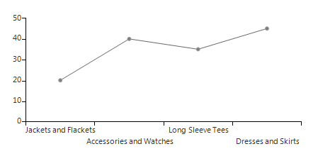

# Categorical


## 

RadChartView uses Categorical axes to plot data that contains categorical values. The axis is valid only in the context of Cartesian Area type. If the incoming data does not specify a category, the categorical axis will assign each point a default category determined by the position of the data point in its DataPoints collection. Here are the properties of CategoricalAxis:
        

* __GapLength__  – gets or sets the gap (in the range [0, 1]) to be applied when calculating each plotted Cartesian series position.
            

* __PlotMode__ – determines the AxisPlotMode used to by the axis to plot the data. Possible values are BetweenTicks, OnTicks, OnTicksPadded. BetweenTicks plots points in the middle of the range, defined by two ticks. OnTicks plots the points over each tick. OnTicksPadded plots points over each tick with half a step padding applied on both ends of the axis.
            

* __MajorTickInterval__ – defines the step at which ticks are positioned. The value indicates that the first of n axis ticks is visible, where n is the value of the property.
            

* __HorizontalLocation__ – the property determines the horizontal location of the axis in relation to the plot area. Possible values are Top and Bottom, where Top displays the axis above the area and Bottom displays the axis below the area. The default value is Bottom.
            

* __VerticalLocation__ – the property determines the vertical location of the axis in relationto the plot area. Possible values are Left and Right, where Left displays the axis on the left of the area and Right displays the axis on the right of the area. The default value is Left.
            

* __ClipLabels__ – this property controls whether labels will be clipped to the size of the axes (width/height). 

{{source=..\SamplesCS\ChartView\Axes\CategoricalAxisForm.cs region=catAxis}} 
{{source=..\SamplesVB\ChartView\Axes\CategoricalAxisForm.vb region=catAxis}} 

````C#
LineSeries series = new LineSeries();
series.DataPoints.Add(new CategoricalDataPoint(20, "Jackets and Flackets"));
series.DataPoints.Add(new CategoricalDataPoint(40, "Accessories and Watches"));
series.DataPoints.Add(new CategoricalDataPoint(35, "Long Sleeve Tees"));
series.DataPoints.Add(new CategoricalDataPoint(45, "Dresses and Skirts"));
radChartView1.Series.Add(series);
CategoricalAxis horizontalAxis = series.HorizontalAxis as CategoricalAxis;
if (horizontalAxis != null)
{
    horizontalAxis.PlotMode = AxisPlotMode.BetweenTicks;
    horizontalAxis.LabelFitMode = AxisLabelFitMode.MultiLine;
}

````
````VB.NET
Dim series As New LineSeries()
series.DataPoints.Add(New CategoricalDataPoint(20, "Jackets and Flackets"))
series.DataPoints.Add(New CategoricalDataPoint(40, "Accessories and Watches"))
series.DataPoints.Add(New CategoricalDataPoint(35, "Long Sleeve Tees"))
series.DataPoints.Add(New CategoricalDataPoint(45, "Dresses and Skirts"))
RadChartView1.Series.Add(series)
Dim horizontalAxis As CategoricalAxis = TryCast(series.HorizontalAxis, CategoricalAxis)
If horizontalAxis IsNot Nothing Then
    horizontalAxis.PlotMode = AxisPlotMode.BetweenTicks
    horizontalAxis.LabelFitMode = AxisLabelFitMode.MultiLine
End If

````

{{endregion}} 



