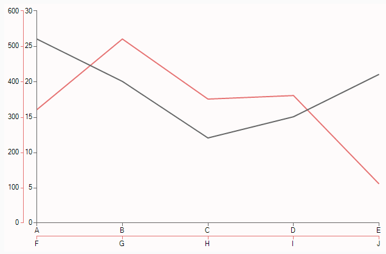
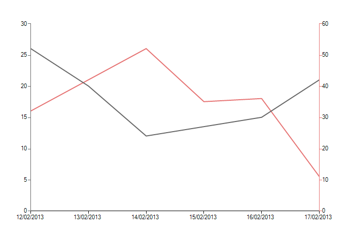

# Multiple axes

<table><th><tr><td>

RELATED VIDEOS</td><td></td></tr></th><tr><td>

[Multi-Axes Support in RadChartView](http://tv.telerik.com/watch/radcontrols-for-winforms/multi-axes-support-in-radchartview)

The Multi-Axes feature of RadChartView introduces a whole new realm of data visualization possibilities. 
              Now you can visualize data from multiple sources plotted against a common axis all in the same chart. 
              This allows you to make better decisions with the data, identify patterns and relationships, or simply 
              save form real estate in your application by combining multiple charts into one.
            </td><td></td></tr></table>

RadChartView allows you to easily set up a chart with multiple axes. There are three types of multi axes charts one can create:
      

* The first is a chart where two or more series share one axis and have different second axes.
          

* The second is a chart where each series has its own pair of axes, the series only share the chart view where they are plotted.
          

* The third one is simply a mix of the previous two.
          

When in multi axis mode RadChartView will automatically synchronize the color of the axes with the color of the series.

There are several things to consider when setting up a multi axis chart. Each series must have one axis of type First and one of type Second. 
        You have to assign axes to the series before adding them to RadChartView, otherwise default axes will be assigned to the series.
      

## One common axis

The following example shows how to create a chart with two series sharing their categorical axis. The most common use case for this type of 
          chart is when you have to plot data of different dimensions.
        

#### __[C#] __

{{region SetupOneCommonAxis}}
	
	            DateTimeContinuousAxis horizontalAxis = new DateTimeContinuousAxis();
	            horizontalAxis.MajorStepUnit = Telerik.Charting.TimeInterval.Day;
	            horizontalAxis.MajorStep = 1;
	            horizontalAxis.LabelFormat = "{0:dd/MM/yyyy}";
	            LinearAxis verticalAxis1 = new LinearAxis();
	            verticalAxis1.AxisType = AxisType.Second;
	            LinearAxis verticalAxis2 = new LinearAxis();
	            verticalAxis2.AxisType = AxisType.Second;
	            verticalAxis2.HorizontalLocation = AxisHorizontalLocation.Right;
	
	            LineSeries line1 = new LineSeries();
	            line1.HorizontalAxis = horizontalAxis;
	            line1.VerticalAxis = verticalAxis1;
	
	            LineSeries line2 = new LineSeries();
	            line2.HorizontalAxis = horizontalAxis;
	            line2.VerticalAxis = verticalAxis2;
	
	            line1.DataPoints.Add(new CategoricalDataPoint(26d, DateTime.Now.AddDays(-6)));
	            line1.DataPoints.Add(new CategoricalDataPoint(20d, DateTime.Now.AddDays(-5)));
	            line1.DataPoints.Add(new CategoricalDataPoint(12d, DateTime.Now.AddDays(-4)));
	            line1.DataPoints.Add(new CategoricalDataPoint(15d, DateTime.Now.AddDays(-2)));
	            line1.DataPoints.Add(new CategoricalDataPoint(21d, DateTime.Now.AddDays(-1)));
	
	            line2.DataPoints.Add(new CategoricalDataPoint(32d, DateTime.Now.AddDays(-6)));
	            line2.DataPoints.Add(new CategoricalDataPoint(52d, DateTime.Now.AddDays(-4)));
	            line2.DataPoints.Add(new CategoricalDataPoint(35d, DateTime.Now.AddDays(-3)));
	            line2.DataPoints.Add(new CategoricalDataPoint(36d, DateTime.Now.AddDays(-2)));
	            line2.DataPoints.Add(new CategoricalDataPoint(11d, DateTime.Now.AddDays(-1)));
	
	            this.radChartView1.Series.Add(line1);
	            this.radChartView1.Series.Add(line2);
	
	{{endregion}}

#### __[VB.NET] __

{{region SetupOneCommonAxis}}
	
	        Dim horizontalAxis As New DateTimeContinuousAxis()
	        horizontalAxis.MajorStepUnit = Telerik.Charting.TimeInterval.Day
	        horizontalAxis.MajorStep = 1
	        horizontalAxis.LabelFormat = "{0:dd/MM/yyyy}"
	        Dim verticalAxis1 As New LinearAxis()
	        verticalAxis1.AxisType = AxisType.Second
	        Dim verticalAxis2 As New LinearAxis()
	        verticalAxis2.AxisType = AxisType.Second
	        verticalAxis2.HorizontalLocation = AxisHorizontalLocation.Right
	
	        Dim line1 As New LineSeries()
	        line1.HorizontalAxis = horizontalAxis
	        line1.VerticalAxis = verticalAxis1
	
	        Dim line2 As New LineSeries()
	        line2.HorizontalAxis = horizontalAxis
	        line2.VerticalAxis = verticalAxis2
	
	        line1.DataPoints.Add(New CategoricalDataPoint(26.0, DateTime.Now.AddDays(-6)))
	        line1.DataPoints.Add(New CategoricalDataPoint(20.0, DateTime.Now.AddDays(-5)))
	        line1.DataPoints.Add(New CategoricalDataPoint(12.0, DateTime.Now.AddDays(-4)))
	        line1.DataPoints.Add(New CategoricalDataPoint(15.0, DateTime.Now.AddDays(-2)))
	        line1.DataPoints.Add(New CategoricalDataPoint(21.0, DateTime.Now.AddDays(-1)))
	
	        line2.DataPoints.Add(New CategoricalDataPoint(32.0, DateTime.Now.AddDays(-6)))
	        line2.DataPoints.Add(New CategoricalDataPoint(52.0, DateTime.Now.AddDays(-4)))
	        line2.DataPoints.Add(New CategoricalDataPoint(35.0, DateTime.Now.AddDays(-3)))
	        line2.DataPoints.Add(New CategoricalDataPoint(36.0, DateTime.Now.AddDays(-2)))
	        line2.DataPoints.Add(New CategoricalDataPoint(11.0, DateTime.Now.AddDays(-1)))
	
	        Me.radChartView1.Series.Add(line1)
	        Me.radChartView1.Series.Add(line2)
	
	{{endregion}}

## Each series with own axes

If you need series to have different axes but still plot them on one chart view you can assign the axes to the series and add them to the chart view
        

#### __[C#] __

{{region SetupTwoSeriesFourAxes}}
	
	            CategoricalAxis horizontalAxis1 = new CategoricalAxis();
	            CategoricalAxis horizontalAxis2 = new CategoricalAxis();
	            horizontalAxis2.VerticalLocation = AxisVerticalLocation.Top;
	            LinearAxis verticalAxis1 = new LinearAxis();
	            verticalAxis1.AxisType = AxisType.Second;
	            LinearAxis verticalAxis2 = new LinearAxis();
	            verticalAxis2.AxisType = AxisType.Second;
	            verticalAxis2.HorizontalLocation = AxisHorizontalLocation.Right;
	
	            LineSeries line1 = new LineSeries();
	            line1.HorizontalAxis = horizontalAxis1;
	            line1.VerticalAxis = verticalAxis1;
	
	            LineSeries line2 = new LineSeries();
	            line2.HorizontalAxis = horizontalAxis2;
	            line2.VerticalAxis = verticalAxis2;
	
	            line1.DataPoints.Add(new CategoricalDataPoint(26d, "A"));
	            line1.DataPoints.Add(new CategoricalDataPoint(20d, "B"));
	            line1.DataPoints.Add(new CategoricalDataPoint(12d, "C"));
	            line1.DataPoints.Add(new CategoricalDataPoint(15d, "D"));
	            line1.DataPoints.Add(new CategoricalDataPoint(21d, "E"));
	
	            line2.DataPoints.Add(new CategoricalDataPoint(320d, "F"));
	            line2.DataPoints.Add(new CategoricalDataPoint(520d, "G"));
	            line2.DataPoints.Add(new CategoricalDataPoint(350d, "H"));
	            line2.DataPoints.Add(new CategoricalDataPoint(360d, "I"));
	            line2.DataPoints.Add(new CategoricalDataPoint(110d, "J"));
	
	            this.radChartView1.Series.Add(line1);
	            this.radChartView1.Series.Add(line2);
	
	{{endregion}}

#### __[VB.NET] __

{{region SetupTwoSeriesFourAxes}}
	
	        Dim horizontalAxis1 As New CategoricalAxis()
	        Dim horizontalAxis2 As New CategoricalAxis()
	        horizontalAxis2.VerticalLocation = AxisVerticalLocation.Top
	        Dim verticalAxis1 As New LinearAxis()
	        verticalAxis1.AxisType = AxisType.Second
	        Dim verticalAxis2 As New LinearAxis()
	        verticalAxis2.AxisType = AxisType.Second
	        verticalAxis2.HorizontalLocation = AxisHorizontalLocation.Right
	
	        Dim line1 As New LineSeries()
	        line1.HorizontalAxis = horizontalAxis1
	        line1.VerticalAxis = verticalAxis1
	
	        Dim line2 As New LineSeries()
	        line2.HorizontalAxis = horizontalAxis2
	        line2.VerticalAxis = verticalAxis2
	
	        line1.DataPoints.Add(New CategoricalDataPoint(26.0, "A"))
	        line1.DataPoints.Add(New CategoricalDataPoint(20.0, "B"))
	        line1.DataPoints.Add(New CategoricalDataPoint(12.0, "C"))
	        line1.DataPoints.Add(New CategoricalDataPoint(15.0, "D"))
	        line1.DataPoints.Add(New CategoricalDataPoint(21.0, "E"))
	
	        line2.DataPoints.Add(New CategoricalDataPoint(320.0, "F"))
	        line2.DataPoints.Add(New CategoricalDataPoint(520.0, "G"))
	        line2.DataPoints.Add(New CategoricalDataPoint(350.0, "H"))
	        line2.DataPoints.Add(New CategoricalDataPoint(360.0, "I"))
	        line2.DataPoints.Add(New CategoricalDataPoint(110.0, "J"))
	
	        Me.radChartView1.Series.Add(line1)
	        Me.radChartView1.Series.Add(line2)
	
	{{endregion}}

## Mixed multi axes

Mixing the above two modes:

#### __[C#] __

{{region SetupMixed}}
	
	            CategoricalAxis horizontalAxis1 = new CategoricalAxis();
	            CategoricalAxis horizontalAxis2 = new CategoricalAxis();
	            LinearAxis verticalAxis1 = new LinearAxis();
	            verticalAxis1.AxisType = AxisType.Second;
	            LinearAxis verticalAxis2 = new LinearAxis();
	            verticalAxis2.AxisType = AxisType.Second;
	            LinearAxis verticalAxis3 = new LinearAxis();
	            verticalAxis3.AxisType = AxisType.Second;
	
	            LineSeries line1 = new LineSeries();
	            line1.HorizontalAxis = horizontalAxis1;
	            line1.VerticalAxis = verticalAxis1;
	
	            LineSeries line2 = new LineSeries();
	            line2.HorizontalAxis = horizontalAxis2;
	            line2.VerticalAxis = verticalAxis2;
	
	            LineSeries line3 = new LineSeries();
	            line3.HorizontalAxis = horizontalAxis1;
	            line3.VerticalAxis = verticalAxis1;
	
	            line1.DataPoints.Add(new CategoricalDataPoint(26d, "A"));
	            line1.DataPoints.Add(new CategoricalDataPoint(20d, "B"));
	            line1.DataPoints.Add(new CategoricalDataPoint(12d, "C"));
	            line1.DataPoints.Add(new CategoricalDataPoint(15d, "D"));
	            line1.DataPoints.Add(new CategoricalDataPoint(21d, "E"));
	
	            line2.DataPoints.Add(new CategoricalDataPoint(820d, "F"));
	            line2.DataPoints.Add(new CategoricalDataPoint(520d, "G"));
	            line2.DataPoints.Add(new CategoricalDataPoint(350d, "H"));
	            line2.DataPoints.Add(new CategoricalDataPoint(360d, "I"));
	            line2.DataPoints.Add(new CategoricalDataPoint(710d, "J"));
	
	            line3.DataPoints.Add(new CategoricalDataPoint(56d, "A"));
	            line3.DataPoints.Add(new CategoricalDataPoint(23d, "B"));
	            line3.DataPoints.Add(new CategoricalDataPoint(54d, "C"));
	            line3.DataPoints.Add(new CategoricalDataPoint(44d, "D"));
	            line3.DataPoints.Add(new CategoricalDataPoint(22d, "E"));
	
	            this.radChartView1.Series.Add(line1);
	            this.radChartView1.Series.Add(line2);
	            this.radChartView1.Series.Add(line3);
	
	{{endregion}}

#### __[VB.NET] __

{{region SetupMixed}}
	
	        Dim horizontalAxis1 As New CategoricalAxis()
	        Dim horizontalAxis2 As New CategoricalAxis()
	        Dim verticalAxis1 As New LinearAxis()
	        verticalAxis1.AxisType = AxisType.Second
	        Dim verticalAxis2 As New LinearAxis()
	        verticalAxis2.AxisType = AxisType.Second
	        Dim verticalAxis3 As New LinearAxis()
	        verticalAxis3.AxisType = AxisType.Second
	
	        Dim line1 As New LineSeries()
	        line1.HorizontalAxis = horizontalAxis1
	        line1.VerticalAxis = verticalAxis1
	
	        Dim line2 As New LineSeries()
	        line2.HorizontalAxis = horizontalAxis2
	        line2.VerticalAxis = verticalAxis2
	
	        Dim line3 As New LineSeries()
	        line3.HorizontalAxis = horizontalAxis1
	        line3.VerticalAxis = verticalAxis1
	
	        line1.DataPoints.Add(New CategoricalDataPoint(26.0, "A"))
	        line1.DataPoints.Add(New CategoricalDataPoint(20.0, "B"))
	        line1.DataPoints.Add(New CategoricalDataPoint(12.0, "C"))
	        line1.DataPoints.Add(New CategoricalDataPoint(15.0, "D"))
	        line1.DataPoints.Add(New CategoricalDataPoint(21.0, "E"))
	
	        line2.DataPoints.Add(New CategoricalDataPoint(820.0, "F"))
	        line2.DataPoints.Add(New CategoricalDataPoint(520.0, "G"))
	        line2.DataPoints.Add(New CategoricalDataPoint(350.0, "H"))
	        line2.DataPoints.Add(New CategoricalDataPoint(360.0, "I"))
	        line2.DataPoints.Add(New CategoricalDataPoint(710.0, "J"))
	
	        line3.DataPoints.Add(New CategoricalDataPoint(56.0, "A"))
	        line3.DataPoints.Add(New CategoricalDataPoint(23.0, "B"))
	        line3.DataPoints.Add(New CategoricalDataPoint(54.0, "C"))
	        line3.DataPoints.Add(New CategoricalDataPoint(44.0, "D"))
	        line3.DataPoints.Add(New CategoricalDataPoint(22.0, "E"))
	
	        Me.radChartView1.Series.Add(line1)
	        Me.radChartView1.Series.Add(line2)
	        Me.radChartView1.Series.Add(line3)
	
	{{endregion}}

