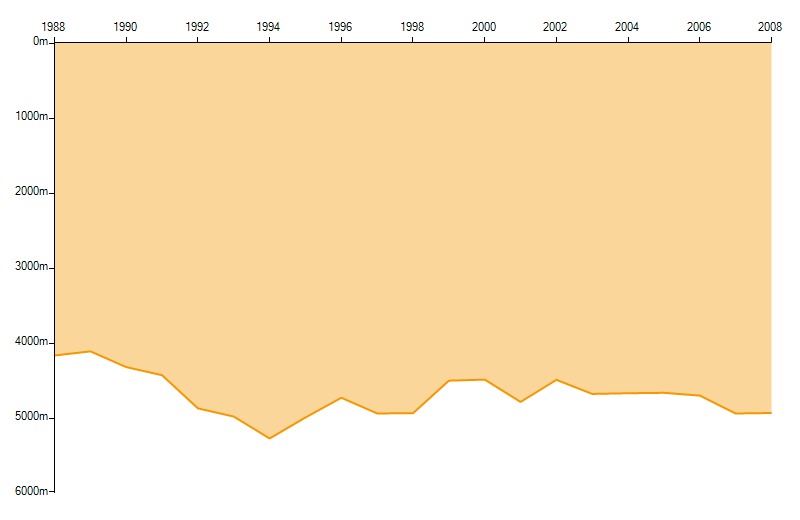

# Inverse Axis


The __isInverse__ property of the abstract __LineAxis__ class determines whether an axis
        of a __RadChartView__ will be reversed. In certain areas in engineering or physics it is a standard for some data representation an axis to 
        be inverse. 
      

## Vertical Axis Inversion

This example will demosntrate the depths of crude oil wells in the period between 1988 and 2008.#_[C#] _

	


{{source=..\SamplesCS\ChartView\Axes\InverseAxisForm.cs region=inverse-axis}} 
{{source=..\SamplesVB\ChartView\Axes\InverseAxisForm.vb region=inverse-axis}} 

````C#
            DataTable tableDryHoles = new DataTable("CrudeOil");
            tableDryHoles.Columns.Add("Time", typeof(DateTime));
            tableDryHoles.Columns.Add("Depth", typeof(double));
            Color dryHoleColor = Color.FromArgb(245, 151, 0);

            Dictionary<DateTime, double> data = new Dictionary<DateTime, double>();
            data[new DateTime(1988, 06, 30)] = 4171.0;
            data[new DateTime(1989, 06, 30)] = 4116.0;
            data[new DateTime(1990, 06, 30)] = 4326.0;
            data[new DateTime(1991, 06, 30)] = 4434.0;
            data[new DateTime(1992, 06, 30)] = 4877.0;
            data[new DateTime(1993, 06, 30)] = 4986.0;
            data[new DateTime(1994, 06, 30)] = 5278.0;
            data[new DateTime(1995, 06, 30)] = 4998.0;
            data[new DateTime(1996, 06, 30)] = 4735.0;
            data[new DateTime(1997, 06, 30)] = 4944.0;
            data[new DateTime(1998, 06, 30)] = 4941.0;
            data[new DateTime(1999, 06, 30)] = 4507.0;
            data[new DateTime(2000, 06, 30)] = 4493.0;
            data[new DateTime(2001, 06, 30)] = 4791.0;
            data[new DateTime(2002, 06, 30)] = 4496.0;
            data[new DateTime(2003, 06, 30)] = 4684.0;
            data[new DateTime(2004, 06, 30)] = 4675.0;
            data[new DateTime(2005, 06, 30)] = 4669.0;
            data[new DateTime(2006, 06, 30)] = 4706.0;
            data[new DateTime(2007, 06, 30)] = 4945.0;
            data[new DateTime(2008, 06, 30)] = 4938.0;

            foreach (KeyValuePair<DateTime, double> hole in data)
            {
                tableDryHoles.Rows.Add(hole.Key, hole.Value);
            }

            LinearAxis verticalAxis = new LinearAxis();
            verticalAxis.AxisType = AxisType.Second;
            verticalAxis.LabelFormat = "{0}m";
            verticalAxis.IsInverse = true;

            DateTimeContinuousAxis horizontalAxis = new DateTimeContinuousAxis();
            horizontalAxis.LabelFormat = "{0:yyyy}";
            horizontalAxis.VerticalLocation = AxisVerticalLocation.Top;
            horizontalAxis.MajorStep = 2;
            horizontalAxis.MajorStepUnit = Telerik.Charting.TimeInterval.Year;

            AreaSeries dryHoles = new AreaSeries();
            dryHoles.BackColor = Color.FromArgb(100, dryHoleColor);
            dryHoles.BorderColor = dryHoleColor;
            dryHoles.DataMember = "CrudeOil";
            dryHoles.ValueMember = "Depth";
            dryHoles.CategoryMember = "Time";
            dryHoles.VerticalAxis = verticalAxis;
            dryHoles.HorizontalAxis = horizontalAxis;

            this.radChartView1.DataSource = tableDryHoles;
            this.radChartView1.Series.Add(dryHoles);
````
````VB.NET
        Dim tableDryHoles As New DataTable("CrudeOil")
        tableDryHoles.Columns.Add("Time", GetType(DateTime))
        tableDryHoles.Columns.Add("Depth", GetType(Double))
        Dim dryHoleColor As Color = Color.FromArgb(245, 151, 0)

        Dim data As New Dictionary(Of DateTime, Double)()
        data(New DateTime(1988, 6, 30)) = 4171.0
        data(New DateTime(1989, 6, 30)) = 4116.0
        data(New DateTime(1990, 6, 30)) = 4326.0
        data(New DateTime(1991, 6, 30)) = 4434.0
        data(New DateTime(1992, 6, 30)) = 4877.0
        data(New DateTime(1993, 6, 30)) = 4986.0
        data(New DateTime(1994, 6, 30)) = 5278.0
        data(New DateTime(1995, 6, 30)) = 4998.0
        data(New DateTime(1996, 6, 30)) = 4735.0
        data(New DateTime(1997, 6, 30)) = 4944.0
        data(New DateTime(1998, 6, 30)) = 4941.0
        data(New DateTime(1999, 6, 30)) = 4507.0
        data(New DateTime(2000, 6, 30)) = 4493.0
        data(New DateTime(2001, 6, 30)) = 4791.0
        data(New DateTime(2002, 6, 30)) = 4496.0
        data(New DateTime(2003, 6, 30)) = 4684.0
        data(New DateTime(2004, 6, 30)) = 4675.0
        data(New DateTime(2005, 6, 30)) = 4669.0
        data(New DateTime(2006, 6, 30)) = 4706.0
        data(New DateTime(2007, 6, 30)) = 4945.0
        data(New DateTime(2008, 6, 30)) = 4938.0

        For Each hole As KeyValuePair(Of DateTime, Double) In data
            tableDryHoles.Rows.Add(hole.Key, hole.Value)
        Next

        Dim verticalAxis As New LinearAxis()
        verticalAxis.AxisType = AxisType.Second
        verticalAxis.LabelFormat = "{0}m"
        verticalAxis.IsInverse = True

        Dim horizontalAxis As New DateTimeContinuousAxis()
        horizontalAxis.LabelFormat = "{0:yyyy}"
        horizontalAxis.VerticalLocation = AxisVerticalLocation.Top
        horizontalAxis.MajorStep = 2
        horizontalAxis.MajorStepUnit = Telerik.Charting.TimeInterval.Year

        Dim dryHoles As New AreaSeries()
        dryHoles.BackColor = Color.FromArgb(100, dryHoleColor)
        dryHoles.BorderColor = dryHoleColor
        dryHoles.DataMember = "CrudeOil"
        dryHoles.ValueMember = "Depth"
        dryHoles.CategoryMember = "Time"
        dryHoles.VerticalAxis = verticalAxis
        dryHoles.HorizontalAxis = horizontalAxis

        Me.RadChartView1.DataSource = tableDryHoles
        Me.RadChartView1.Series.Add(dryHoles)
        '
````

{{endregion}} 


