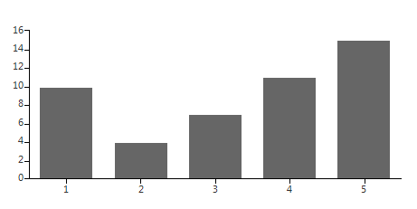

# Plot Mode


## 

The PlotMode property appears only in the Categorical, DateTimeCategorical and DateTimeContinuous axes. It defines the AxisPlotMode used by the axis to plot the data. Possible values are BetweenTicks, OnTicks, OnTicksPadded, where:
        

* __BetweenTicks__  plots points in the middle of the range, defined by two ticks.
            

* __OnTicks__  plots the points over each tick.
            

* __OnTicksPadded__ plots points over each tick with half a step padding applied on both ends of the axis.
            

The following example creates a CategoricalAxis and assigns it to a BarSeries before the series is added to the RadChartView. If the HorizontalAxis property of the series is assigned at the moment of inserting it in the Series collection, the chart will use the axis determined by the property. Alternatively, if the property is null, the chart will create and assign a default axis. The following snippet sets the PlotMode of the horizontalAxis to BetweenTicks and the GapLength to 0.3. Mode information on the GapLength can be found under the [Series Types / BarSeries article.]() 


{{source=..\SamplesCS\ChartView\Axes\PlotModeForm.cs region=axis}} 
{{source=..\SamplesVB\ChartView\Axes\PlotModeForm.vb region=axis}} 

````C#
            CategoricalAxis horizontalAxis = new CategoricalAxis();
            horizontalAxis.PlotMode = AxisPlotMode.BetweenTicks;
            horizontalAxis.GapLength = 0.3;

            BarSeries series = new BarSeries();
            series.HorizontalAxis = horizontalAxis;
            series.DataPoints.Add(new CategoricalDataPoint(10, "1"));
            series.DataPoints.Add(new CategoricalDataPoint(4, "2"));
            series.DataPoints.Add(new CategoricalDataPoint(7, "3"));
            series.DataPoints.Add(new CategoricalDataPoint(11, "4"));
            series.DataPoints.Add(new CategoricalDataPoint(15, "5"));
            this.radChartView1.Series.Add(series);
````
````VB.NET
        Dim horizontalAxis As New CategoricalAxis()
        horizontalAxis.PlotMode = AxisPlotMode.BetweenTicks
        horizontalAxis.GapLength = 0.3

        Dim series As New BarSeries()
        series.HorizontalAxis = horizontalAxis
        series.DataPoints.Add(New CategoricalDataPoint(10, "1"))
        series.DataPoints.Add(New CategoricalDataPoint(4, "2"))
        series.DataPoints.Add(New CategoricalDataPoint(7, "3"))
        series.DataPoints.Add(New CategoricalDataPoint(11, "4"))
        series.DataPoints.Add(New CategoricalDataPoint(15, "5"))
        Me.RadChartView1.Series.Add(series)
        '
````

{{endregion}} 


You can always change the PlotMode property, even if the CategoricalAxis was auto-generated, using the Get() method of the Axes collection. The following snippet changes the PlotMode to OnTicks: 

{{source=..\SamplesCS\ChartView\Axes\PlotModeForm.cs region=axis2}} 
{{source=..\SamplesVB\ChartView\Axes\PlotModeForm.vb region=axis2}} 

````C#
            CategoricalAxis axis = radChartView1.Axes.Get<CategoricalAxis>(0);
            axis.PlotMode = AxisPlotMode.OnTicksPadded;
````
````VB.NET
        Dim axis As CategoricalAxis = RadChartView1.Axes.[Get](Of CategoricalAxis)(0)
        axis.PlotMode = AxisPlotMode.OnTicksPadded
        '
````

{{endregion}} 


Using the aforementioned approach you can set the PlotMode property to OnTicksPadded: 

{{source=..\SamplesCS\ChartView\Axes\PlotModeForm.cs region=axis3}} 
{{source=..\SamplesVB\ChartView\Axes\PlotModeForm.vb region=axis3}} 

````C#
            axis.PlotMode = AxisPlotMode.OnTicksPadded;
````
````VB.NET
        axis.PlotMode = AxisPlotMode.OnTicksPadded
        '
````

{{endregion}} 



