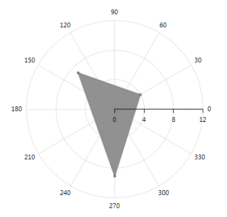

# Polar


## 

The PolarAxis is special axis rendered as a fixed line in a system of polar coordinates where polar angle, θ, is measured anticlockwise. The axis is created automatically when the Polar or Radar series are added to RadChartView. Its MajorStep, Minimum and Maximum properties define its major settings – tick step, minimum and maximum value. Below is a list of PolarAxis properties:
        

* __Minimum__  – gets or sets the user-defined minimum of the axis. By default the axis calculates the minimum, depending on the minimum of the plotted data points. You can reset this property by setting it to Double.NegativeInfinity to restore the default behavior.
            

* __Maximum__  – gets or sets the user-defined maximum of the axis. By default the axis calculates the maximum, depending on the maximum of the plotted data points. You can reset this property by setting it to Double.PositiveInfinity to restore the default behavior.
            

* __MajorStep__  – the property determines the major step between each axis tick. By default the axis calculates the major step, depending on the plotted data points. You can reset this property by setting it to 0 to restore the default behavior.
            

Additionally, LinearAxis inherits all properties of the Axis class.
        

Polar axis is created by default when you add Polar or Radar series to the Polar Area of RadChartView. Here is how to set the MajorStep and Maximum properties of a Polar axis:
 

{{source=..\SamplesCS\ChartView\Axes\PolarAxisForm.cs region=axis}} 
{{source=..\SamplesVB\ChartView\Axes\PolarAxisForm.vb region=axis}} 

````C#
            PolarAreaSeries series = new PolarAreaSeries();

            PolarDataPoint pt = new PolarDataPoint();
            pt.Angle = 30;
            pt.Value = 4;
            series.DataPoints.Add(pt);

            pt = new PolarDataPoint();
            pt.Angle = 135;
            pt.Value = 7;
            series.DataPoints.Add(pt);

            pt = new PolarDataPoint();
            pt.Angle = 270;
            pt.Value = 9;
            series.DataPoints.Add(pt);

            radChartView1.AreaType = ChartAreaType.Polar;
            radChartView1.Series.Add(series);

            PolarAxis axis = radChartView1.Axes.Get<PolarAxis>(0);
            axis.MajorStep = 4;
            axis.Maximum = 12;
````
````VB.NET
        Dim series As New PolarAreaSeries()

        Dim pt As New PolarDataPoint()
        pt.Angle = 30
        pt.Value = 4
        series.DataPoints.Add(pt)

        pt = New PolarDataPoint()
        pt.Angle = 135
        pt.Value = 7
        series.DataPoints.Add(pt)

        pt = New PolarDataPoint()
        pt.Angle = 270
        pt.Value = 9
        series.DataPoints.Add(pt)

        RadChartView1.AreaType = ChartAreaType.Polar
        RadChartView1.Series.Add(series)

        Dim axis As PolarAxis = RadChartView1.Axes.[Get](Of PolarAxis)(0)
        axis.MajorStep = 4
        axis.Maximum = 12
        '
````

{{endregion}} 


