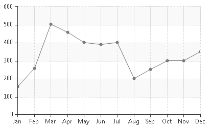
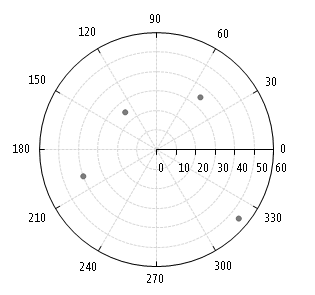

# Chart Grid


RadChartView areas, which support axes, can render a grid that facilitate the process of determining the values of points afar from the axes. Since Pie area does not use axes, the grid is valid only the context of Cartesian and Polar areas. Here is how to set up the grid of both areas:
      

## Cartesian Grid  

{{source=..\SamplesCS\ChartView\ChartGrid.cs region=cartesian}} 
{{source=..\SamplesVB\ChartView\ChartGrid.vb region=cartesian}} 

````C#
            //add sample data
            LineSeries series = new LineSeries();
            series.DataPoints.Add(new CategoricalDataPoint(500, "Jan"));
            series.DataPoints.Add(new CategoricalDataPoint(300, "Apr"));
            series.DataPoints.Add(new CategoricalDataPoint(400, "Jul"));
            series.DataPoints.Add(new CategoricalDataPoint(250, "Oct"));
            this.radChartView1.Series.Add(series);
            
            //setup the Cartesian Grid
            CartesianArea area = this.radChartView1.GetArea<CartesianArea>();
            area.ShowGrid = true;
            CartesianGrid grid = area.GetGrid<CartesianGrid>();
            grid.DrawHorizontalFills = true;
            grid.BorderDashStyle = System.Drawing.Drawing2D.DashStyle.DashDot;
````
````VB.NET
        Me.RadChartView1.AreaType = ChartAreaType.Cartesian
        Dim area As CartesianArea = Me.RadChartView1.GetArea(Of CartesianArea)()
        Dim grid As CartesianGrid = area.GetGrid(Of CartesianGrid)()
        area.ShowGrid = True
        grid.DrawHorizontalFills = True
        grid.BorderDashStyle = System.Drawing.Drawing2D.DashStyle.DashDot

        Dim series As New LineSeries()
        series.DataPoints.Add(New CategoricalDataPoint(500, "Jan"))
        series.DataPoints.Add(New CategoricalDataPoint(300, "Apr"))
        series.DataPoints.Add(New CategoricalDataPoint(400, "Jul"))
        series.DataPoints.Add(New CategoricalDataPoint(250, "Oct"))
        Me.RadChartView1.Series.Add(series)
        '
````

{{endregion}} 




The essential properties of CartesianGrid are the following:

* __ForeColor__ – the property determines the color of the lines that separate grid sectors;

* __BorderDashStyle__ – the property indicates the style of the borders. Possible values are Solid, Dash, Dot, DashDot, DashDotDot, Custom;

* __DrawHorizontalStripes__ – the property determines whether the horizontal borders of the grid will be rendered;

* __DrawVerticalStripes__ – the property determines whether the vertical borders of the grid will be rendered; 

* __DrawHorizontalFills__ – the property indicates whether the fills of the horizontal sectors will be drawn;

* __DrawVerticalFills__ – the property indicates whether the fills of the vertical sectors will be drawn;

* __BackColor__ – the property sets the color of the horizontal sectors. The property takes effect only if DrawHorizontalFills are set to true;

* __BackColor2__ – the property sets the color of the vertical sectors. The property takes effect only if DrawVerticalFills are set to true;

* __AlternatingVerticalColor__ – this is a Boolean property that determines whether the fill of the alternating vertical sectors will be drawn. The property takes effect only when the DrawVerticalFills is set to true;

* __AlternatingBackColor__ – the property sets the color of the fill of the alternating vertical sectors. The property takes effect only when the AlternatingVerticalColor and DrawVerticalFills properties are set to true;

* __AlternatingHorizontalColor__ – this is a Boolean property that determines whether the fill of the alternating horizontal sectors will be drawn. The property takes effect only when the DrawHorizontalFills is set to true;

* __AlternatingBackColor2__ – the property sets the color of the fill of the alternating horizontal sectors. The property takes effect only when the AlternatingHorizontalColor and DrawHorizontalFills properties are set to true;

## Polar Grid 

{{source=..\SamplesCS\ChartView\ChartGrid.cs region=polar}} 
{{source=..\SamplesVB\ChartView\ChartGrid.vb region=polar}} 

````C#
            //add sample data
            this.radChartView1.AreaType = ChartAreaType.Polar;
            
            PolarPointSeries polarPointSeries = new PolarPointSeries();
            PolarDataPoint dataPoint = new PolarDataPoint();
            dataPoint.Value = 40;
            dataPoint.Angle = 20;
            polarPointSeries.DataPoints.Add(dataPoint);

            dataPoint = new PolarDataPoint();
            dataPoint.Value = 120;
            dataPoint.Angle = 180;
            polarPointSeries.DataPoints.Add(dataPoint);
            this.radChartView1.Series.Add(polarPointSeries);
            
            //setup Polar Grid
            PolarArea area = this.radChartView1.GetArea<PolarArea>();
            area.ShowGrid = true;
            PolarGrid grid = area.GetGrid<PolarGrid>();
            grid.BorderDashStyle = System.Drawing.Drawing2D.DashStyle.Dash;
````
````VB.NET
        Me.RadChartView1.AreaType = ChartAreaType.Polar
        Dim area As PolarArea = Me.RadChartView1.GetArea(Of PolarArea)()
        Dim grid As PolarGrid = area.GetGrid(Of PolarGrid)()
        area.ShowGrid = True
        grid.BorderDashStyle = System.Drawing.Drawing2D.DashStyle.Dash

        Dim polarPointSeries As New PolarPointSeries()

        Dim dataPoint As New PolarDataPoint()
        dataPoint.Value = 40
        dataPoint.Angle = 200
        polarPointSeries.DataPoints.Add(dataPoint)

        dataPoint = New PolarDataPoint()
        dataPoint.Value = 35
        dataPoint.Angle = 50
        polarPointSeries.DataPoints.Add(dataPoint)

        dataPoint = New PolarDataPoint()
        dataPoint.Value = 55
        dataPoint.Angle = 320
        polarPointSeries.DataPoints.Add(dataPoint)

        dataPoint = New PolarDataPoint()
        dataPoint.Value = 25
        dataPoint.Angle = 130
        polarPointSeries.DataPoints.Add(dataPoint)

        Me.RadChartView1.Series.Add(polarPointSeries)
        '
````

{{endregion}} 




The essential properties of PolarGrid are the following:

* __ForeColor__ – the property determines the color of the lines that separate grid sectors;

* __BorderDashStyle__ – the property indicates the style of the borders. Possible values are Solid, Dash, Dot, DashDot, DashDotDot, Custom;

* __DrawPolarStripes__ – the property determines whether the polar borders of the grid will be rendered;

* __DrawRadialStripes__ – the property determines whether the radial borders of the grid will be rendered; 

* __DrawPolarFills__ – the property determines whether the fills of the polar sectors will be drawn;

* __DrawRadialFills__ – the property indicates whether the fills of the radial sectors will be drawn;

* __BackColor__ – the property sets the color of the polar sectors. The property takes effect only in the DrawPolarFills is set to true;

* __BackColor2__ – the property sets the color of the radial sectors. The property takes effect only in the DrawRadialFills is set to true;

* __AlternatingPolarColor__ – the property indicates whether the fill of the alternating polar sectors will be drawn. The property takes effect only when DrawPolarFills is set to true;

* __AlternatingRadialColor__ – the property indicates whether the fill of the alternating radial sectors will be drawn. The property takes effect only when DrawRadialFills is set to true;

* __AlternatingBackColor__ – the property sets the color of the alternating polar sectors. The property takes effect only when DrawPolarFills and AlternatingPolarColor are set to true;

* __AlternatingBackColor2__ – the property sets the color of the alternating radial sectors. The property takes effect only when DrawRadialFills and AlternatingRadialColor are set to true;
