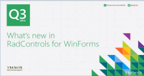
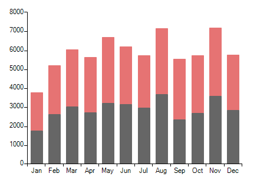

# ChartView 

## 

| RELATED VIDEOS |  |
| ------ | ------ |
|[What is new in Q3 2012 Telerik UI for WinForms](http://tv.telerik.com/watch/radcontrols-for-winforms/what-is-new-in-q3-2012-radcontrols-for-winforms)This webinar examines the new features found in Telerik UI for WinForms. Included in the Q3 2012 release is RadPivotGrid (Beta), Coded UI Testing Support, touch, legend and financial charts for RadChartView, Visual Studio 2012 compliance and much much more. See what's new in the design-time capabilities of RadChartView. (19:12 - 24:12)||
|[Getting Started with RadChartView for WinForms](http://tv.telerik.com/watch/radcontrols-for-winforms/getting-started-with-radchartview-for-winforms)Telerik ChartView control facilitates data visualization, achieving stunning visual effects. This chart component sets no limits on your data visualization needs. It can easily turn into Bar, Pie, Line, Area, Polar, Radar and Scatter with only a few clicks at design time. The input data is contained in a set of series classes. Each series have a collection of data points, that is, a data source which it displays according to the series’ type.||

__1. Overview__

RadChartView is a versatile charting component that offers drawing capabilities, user interaction and real-time updates.
          Its intuitive object model and public API allow complex charts to be easily setup either in design-time or through code.
          The control is completely data aware and may work in bound or unbound mode, depending on the requirements. Chart types
          (or series) are organized in hierarchies, depending on the coordinate system, used to plot data points – for example
          we have CartesianArea (using Cartesian coordinate system) and PieArea (using radial coordinate system).
        

>note The following references are required in order to use RadChartView:
>
*  __Telerik.WinControls.ChartView.dll__ 
*  __Telerik.WinControls.dll__ 
*  __TelerikCommon.dll__ >

__2. Architecture__

A charting component in general is used to visualize (or plot) some data in a human-readable way
          through different representations like lines, areas, bars pies, etc. Each series has a collection
          of data points – the data equivalent of a 2D point – and knows how to visualize them. Different
          series types may process certain types of data points – for example categorical series may
          contain categorical data points. Data points may be added directly to series or a data
          binding mechanism may be used to create the appropriate data points from the raw data.
        

RadChartView works with three area types - Cartesian, Polar and Pie

__2.1. CartesianArea__

As the name hints, this concrete chart uses the Cartesian coordinate system to plot the data points
          in its chart series. The X and Y axes define how each point’s coordinates in the plot area are calculated.
        

__2.1.1.  Axes__

Available are the following axes:
        

__2.1.1.1. Categorical__ - Arranges the plotted data points in categories where
          the key of each category is the point’s value (if available) for that axis or its index within the points
          collection. The point’s coordinate, specified by this axis is discrete and is calculated depending on the
          size of the category slot where the point resides.
        

__2.1.1.2. Date-time Categorical__ - Special categorical axis that expects each data point
          to provide a System.DateTime structure as its value for this axis. The points are grouped by a user-defined
          date-time component (Year, Month, Day, etc.) and then the groups are sorted chronologically.
        

__2.1.1.3. Linear__ - Calculates the coordinate of each data point, depending on the actual
          numerical value this point provides for the axis. Exposes Minimum and Maximum properties to allow for explicit
          definition of the range of values visible on this axis. If these properties are not specified, the axis will
          automatically calculate the range, depending on the minimum and maximum data point values.
        

__2.1.1.4. Logarithmic__ - Special linear axis that will transform each data point value
          using the logarithm function. Allows numerical data with huge delta between the minimum and the maximum to be
          visualized in a readable way.
        

__2.1.1.5. Date-time Continuous__ - Special axis that expects each data point to provide
          a System.DateTime structure as its value for this axis. May be thought of as a timeline where the coordinate
          of each data point is calculated depending on the position of its associated DateTime on the timeline.
          The base unit (or the timeline step) of the axis is calculated depending on the smallest difference between any two dates.
        

__2.1.1.6. Polar Axis__ - Special axis which is a fixed line in a system of polar coordinates
          from which the polar angle, θ, is measured anticlockwise. You may read more about it in Polar Axis topic. 

__2.1.1.7. Radial Axis__ - Special axis used by the PolarArea Radar Series.

* __Categorical__ - positions catgories/labels around the circumference of the circle.
            

__2.1.2.  Series__ - The currently implemented chart series are categorical – they accept CategoricalDataPoint
          and expect a categorical axis to be specified in order to be properly visualized. Following is a list with all the available series:
        

__2.1.2.1. Area__ - Data points and the corresponding coordinate axis enclose an area that may be optionally stroked and/or filled.
        

* __Stack100__ - It shows the combined contribution of values as percentages where
              the combined total for each category is 100 percent. It's good to use it when the relationship between values in a category is more
              significant than the amounts.
            

__2.1.2.2. SplineArea__ - An area, which points are connected with smooth rather than straight segments.
        

* __Stack100__ - It shows the combined contribution of values as percentages where
              the combined total for each category is 100 percent. It's good to use it when the relationship between values in a category is more
              significant than the amounts.
            

__2.1.2.3. Bar__ - Data points are represented by a box where the height (width) of the box is
          the distance between the point’s numerical value and the categorical axis that plots the point. Bars may be either “horizontal”
          or “vertical” depending on whether the categorical axis is specified as an “X-axis” or as a “Y-axis”.
        

* __Stack100__ - It shows the combined contribution of values as percentages where
              the combined total for each category is 100 percent. It's good to use it when the relationship between values in a category is more
              significant than the amounts.
            

__2.1.2.4. Line__ - Data points are connected with straight line segments.
        

* __Stack100__ - It shows the combined contribution of values as percentages where
              the combined total for each category is 100 percent. It's good to use it when the relationship between values in a category is more
              significant than the amounts.
            

__2.1.2.5. Spline__ - Data points are connected with smooth rather than straight line segments.
        

__2.1.2.6. Scatter Point__ - Data points are simply plotted in the chart plot area with nothing connecting them.
          Each scatter data point has X and Y values which make the position of the data point in the data source and its location on the plot
          area unrelated. For example the third data point in the data source may appear before the first data point when plotted. There are
          also scatter line and scatter area series which behave in the exact same way with the only (visual)difference that the points define
          a line and area respectively.
        

__2.1.2.7. Combined series__ - Each of the above series of same type may be combined in either stacks or clusters.
          Combinations are formed when more than one data point from different series falls within a same category. The “Cluster” combine mode
          will position such points next to each other while the “Stack” one will arrange such points in a stack-like structure. When stacks are formed,
          the numerical axis (if present) will consider each stack as a single entity and its sum will be the actual value used rather than each point’s one.
          For more information - refer to Chart Series. 

__2.1.3. Chart Grid__ - The chart may be optionally decorated with grid-like visuals which support horizontal and
          vertical lines, associated with axis ticks and horizontal and vertical stripes – the area between two adjacent ticks. Such visuals are
          available for both Cartesian and Polar coordinates via Cartesian Grid and Polar Grid respectively.
        

__2.1.3.1  Cartesian Grid__ - You may refer to __Create Chart With Static Data__
          for more information on how to toggle GridLines and Stripes inside Cartesian Grid.
        

__2.1.3.2  Polar Grid__ - You may refer to __Radar Series__ for more information
          on how to toggle GridLines and Stripes inside Polar Grid.
        

__2.2. Pie area__ - This concrete chart control visualizes its data points using radial coordinate system. Each point is
          represented as an arc segment where the arc’s length is actually the percentage this point’s value is from the total sum.
        

__2.3. Polar area__ - RadPolarChart inherits from RadChart and has a PolarAxis and a RadialAxis. It accepts only PolarSeries
          objects and plots data points in the polar coordinate system.
        

__2.4. Controllers__ - Both chart types (pie and cartesian) have a controllers collection that accepts ChartViewController objects.
          Each object represents a special interaction behavior such as __Scroll and Zoom__ or __TrackBall__.
        
