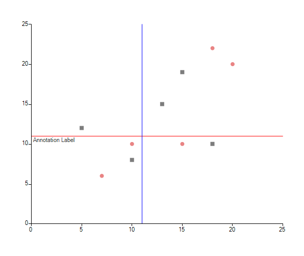
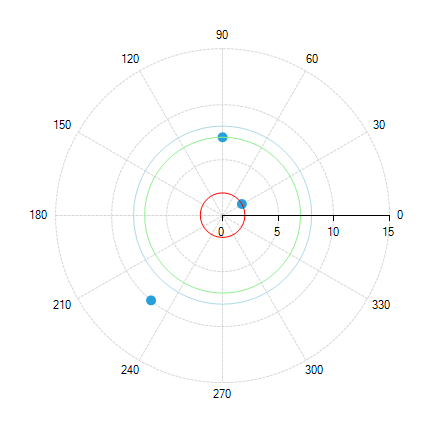

# Grid line


Grid line annotations are lines or circles that cross the chart grid at location on the axis, specified by their __Value__ property.
      

Common properties to the three types of annotations include:
      

* __BorderDashStyle__ - defines the dash style of the border of the annotation
          

* __BorderColor__ - sets the color of the border of the annotation
          

* __BorderWidth__ - specifies the width of the border of the annotation
          

## Cartesian grid line annotation

In the case of the Cartesian chart, the grid line represents a vertical or horizontal line that crosses the entire plot area.
        

Here is what __CartesianGridLineAnnotation__ looks like:



{{source=..\SamplesCS\ChartView\Annotations\GridLine.cs region=CartesianGridLine}} 
{{source=..\SamplesVB\ChartView\Annotations\GridLine.vb region=CartesianGridLine}} 

````C#
CartesianGridLineAnnotation annotation1 = new CartesianGridLineAnnotation();
annotation1.Axis = this.radChartView1.Axes[1] as CartesianAxis;
annotation1.Value = 5.8;
annotation1.BorderColor = Color.Red;
annotation1.BorderDashStyle = DashStyle.Solid;
annotation1.BorderWidth = 1;
this.radChartView1.Annotations.Add(annotation1);
CartesianGridLineAnnotation annotation2 = new CartesianGridLineAnnotation();
annotation2.Axis = this.radChartView1.Axes[0] as CartesianAxis;
annotation2.Value = 2.9;
annotation2.BorderColor = Color.Blue;
annotation2.BorderDashStyle = DashStyle.Solid;
annotation2.BorderWidth = 1;
this.radChartView1.Annotations.Add(annotation2);

````
````VB.NET
Dim annotation1 As New CartesianGridLineAnnotation()
annotation1.Axis = TryCast(Me.radChartView1.Axes(1), CartesianAxis)
annotation1.Value = 5.8
annotation1.BorderColor = Color.Red
annotation1.BorderDashStyle = DashStyle.Solid
annotation1.BorderWidth = 1
Me.radChartView1.Annotations.Add(annotation1)
Dim annotation2 As New CartesianGridLineAnnotation()
annotation2.Axis = TryCast(Me.radChartView1.Axes(0), CartesianAxis)
annotation2.Value = 2.9
annotation2.BorderColor = Color.Blue
annotation2.BorderDashStyle = DashStyle.Solid
annotation2.BorderWidth = 1
Me.radChartView1.Annotations.Add(annotation2)

````

{{endregion}} 

 
Properties:
        

* __Axis__ - the Cartesian grid line annotation needs to be associated with horizontal or vertical axis explicitly
            

* __Value__ (of type object) - the place on the associated axis where the annotation crosses it. When the associated axis is numerical (linear or logarithmic) a numeric value is expected and when it is a categorical - a category

* __Label__ - this property allows you to display text near the annotation and indicate what it is for. 
            

## Polar axis grid line annotation

Polar axis grid lines represent concentric circles that cross the Polar axis at the corresponding __Value__.
        

Here is what __PolarAxisGridLineAnnotation__ looks like:

 


{{source=..\SamplesCS\ChartView\Annotations\GridLine.cs region=PolarGridLine}} 
{{source=..\SamplesVB\ChartView\Annotations\GridLine.vb region=PolarGridLine}} 

````C#
PolarAxisGridLineAnnotation annotation1 = new PolarAxisGridLineAnnotation();
annotation1.Value = 2;
annotation1.BorderColor = Color.Red;
annotation1.BorderDashStyle = DashStyle.Solid;
annotation1.BorderWidth = 1;
this.radChartView1.Annotations.Add(annotation1);
PolarAxisGridLineAnnotation annotation2 = new PolarAxisGridLineAnnotation();
annotation2.Value = 7;
annotation2.BorderColor = Color.LightGreen;
annotation2.BorderDashStyle = DashStyle.Solid;
annotation2.BorderWidth = 1;
this.radChartView1.Annotations.Add(annotation2);
PolarAxisGridLineAnnotation annotation3 = new PolarAxisGridLineAnnotation();
annotation3.Value = 8;
annotation3.BorderColor = Color.LightBlue;
annotation3.BorderDashStyle = DashStyle.Solid;
annotation3.BorderWidth = 1;
this.radChartView1.Annotations.Add(annotation3);

````
````VB.NET
Dim annotation1 As New PolarAxisGridLineAnnotation()
annotation1.Value = 2
annotation1.BorderColor = Color.Red
annotation1.BorderDashStyle = DashStyle.Solid
annotation1.BorderWidth = 1
Me.radChartView1.Annotations.Add(annotation1)
Dim annotation2 As New PolarAxisGridLineAnnotation()
annotation2.Value = 7
annotation2.BorderColor = Color.LightGreen
annotation2.BorderDashStyle = DashStyle.Solid
annotation2.BorderWidth = 1
Me.radChartView1.Annotations.Add(annotation2)
Dim annotation3 As New PolarAxisGridLineAnnotation()
annotation3.Value = 8
annotation3.BorderColor = Color.LightBlue
annotation3.BorderDashStyle = DashStyle.Solid
annotation3.BorderWidth = 1
Me.radChartView1.Annotations.Add(annotation3)

````

{{endregion}}  

Property: 

* __Value__ (of type double) - specifies the location on the Polar axis (the radius), where the grid line will cross
            

## Radial axis grid line annotation

Radial axis grid lines basically represent the radius of the polar chart.
        

Here is what __RadialAxisGridLineAnnotation__ looks like:


{{source=..\SamplesCS\ChartView\Annotations\GridLine.cs region=RadialGridLine}} 
{{source=..\SamplesVB\ChartView\Annotations\GridLine.vb region=RadialGridLine}} 

````C#
RadialAxisGridLineAnnotation annotation1 = new RadialAxisGridLineAnnotation();            
annotation1.Value = 30;
annotation1.BorderColor = Color.Red;
annotation1.BorderDashStyle = DashStyle.Solid;
annotation1.BorderWidth = 2;
this.radChartView1.Annotations.Add(annotation1);
RadialAxisGridLineAnnotation annotation2 = new RadialAxisGridLineAnnotation();
annotation2.Value = 75;
annotation2.BorderColor = Color.LightGreen;
annotation2.BorderDashStyle = DashStyle.Solid;
annotation2.BorderWidth = 2;
this.radChartView1.Annotations.Add(annotation2);
RadialAxisGridLineAnnotation annotation3 = new RadialAxisGridLineAnnotation();
annotation3.Value = 135;
annotation3.BorderColor = Color.LightBlue;
annotation3.BorderDashStyle = DashStyle.Solid;
annotation3.BorderWidth = 2;
this.radChartView1.Annotations.Add(annotation3);

````
````VB.NET
Dim annotation1 As New RadialAxisGridLineAnnotation()
annotation1.Value = 30
annotation1.BorderColor = Color.Red
annotation1.BorderDashStyle = DashStyle.Solid
annotation1.BorderWidth = 2
Me.radChartView1.Annotations.Add(annotation1)
Dim annotation2 As New RadialAxisGridLineAnnotation()
annotation2.Value = 75
annotation2.BorderColor = Color.LightGreen
annotation2.BorderDashStyle = DashStyle.Solid
annotation2.BorderWidth = 2
Me.radChartView1.Annotations.Add(annotation2)
Dim annotation3 As New RadialAxisGridLineAnnotation()
annotation3.Value = 135
annotation3.BorderColor = Color.LightBlue
annotation3.BorderDashStyle = DashStyle.Solid
annotation3.BorderWidth = 2
Me.radChartView1.Annotations.Add(annotation3)

````

{{endregion}} 
 

Property:
        

* __Value__ (of type object) - specifies the location on the Radial axis, where the grid line will cross. When the Radial axis is __NumericRadialAxis__ a numeric value is expected and when it is a __CategoricalRadialAxis__ - a category
            
