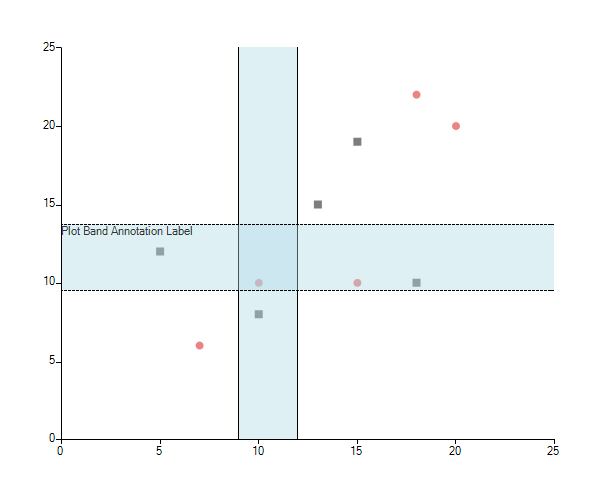
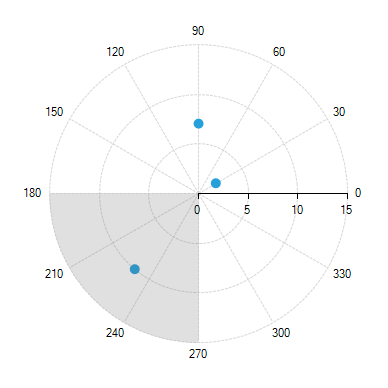
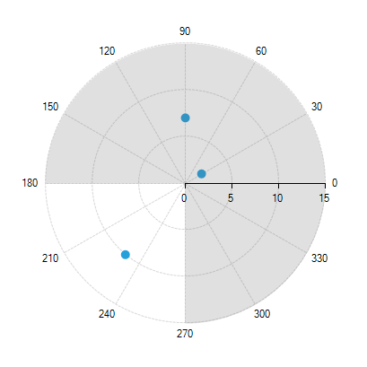

# Plot band


Plot Band Annotation is a stripe, crossing its corresponding axis, specified by the __From__ and __To__ properties.
      

Common properties to the three types of annotations include:
      

* __BackColor__ - sets the back color of the annotation
          

* __BorderDashStyle__ - defines the dash style of the border of the annotation
          

* __BorderColor__ - sets the color of the border of the annotation
          

* __BorderWidth__ - specifies the width of the border of the annotation
          

## Cartesian plot band annotation

Cartesian plot band annotation is either a horizontal or a vertical stripe that crosses from start to end the vertical or the horizontal axis respectively.
      

Here is what __CartesianPlotBandAnnotation__ looks like:



{{source=..\SamplesCS\ChartView\Annotations\PlotBand.cs region=CartesianPlotBand}} 
{{source=..\SamplesVB\ChartView\Annotations\PlotBand.vb region=CartesianPlotBand}} 

````C#
CartesianPlotBandAnnotation annotation1 = new CartesianPlotBandAnnotation();
annotation1.Axis = this.radChartView1.Axes[0] as CartesianAxis;
annotation1.From = 0.5;
annotation1.To = 1.5;
annotation1.BackColor = Color.FromArgb(100, Color.LightBlue);
annotation1.BorderColor = Color.Black;
annotation1.BorderWidth = 1;
this.radChartView1.Annotations.Add(annotation1);
CartesianPlotBandAnnotation annotation2 = new CartesianPlotBandAnnotation();
annotation2.Axis = this.radChartView1.Axes[1] as CartesianAxis;
annotation2.From = 4.5;
annotation2.To = 5.5;
annotation2.BackColor = Color.FromArgb(100, Color.LightBlue);
annotation2.BorderColor = Color.Black;
annotation2.BorderWidth = 1;
this.radChartView1.Annotations.Add(annotation2);

````
````VB.NET
Dim annotation1 As New CartesianPlotBandAnnotation()
annotation1.Axis = TryCast(Me.radChartView1.Axes(0), CartesianAxis)
annotation1.From = 0.5
annotation1.[To] = 1.5
annotation1.BackColor = Color.FromArgb(100, Color.LightBlue)
annotation1.BorderColor = Color.Black
annotation1.BorderWidth = 1
Me.radChartView1.Annotations.Add(annotation1)
Dim annotation2 As New CartesianPlotBandAnnotation()
annotation2.Axis = TryCast(Me.radChartView1.Axes(1), CartesianAxis)
annotation2.From = 4.5
annotation2.[To] = 5.5
annotation2.BackColor = Color.FromArgb(100, Color.LightBlue)
annotation2.BorderColor = Color.Black
annotation2.BorderWidth = 1
Me.radChartView1.Annotations.Add(annotation2)

````

{{endregion}} 
 

Properties:
        

* __Axis__ - the Cartesian plotBand annotation needs to be associated with horizontal or vertical axis explicitly
            

* __From__ (of type object) - the starting point for the plot band. When the associated axis is numerical (Linear or Logarithmic) a numeric value is expected and when it is a  __CategoricalAxis__ - a category
            

* __To__ (of type object) - the ending point for the plot band. When the associated axis is numerical (Linear or Logarithmic) a numeric value is expected and when it is a __CategoricalAxis__ - a category

* __Label__ - this property allows you to display text near the annotation and indicate what it is for. 
            

## Polar axis plotBand annotation

The Polar axis plot band annotation resembles a donut.
      

Here is what __PolarAxisPlotBandAnnotation__ looks like:


{{source=..\SamplesCS\ChartView\Annotations\PlotBand.cs region=PolarPlotBand}} 
{{source=..\SamplesVB\ChartView\Annotations\PlotBand.vb region=PolarPlotBand}} 

````C#
PolarAxisPlotBandAnnotation annotation1 = new PolarAxisPlotBandAnnotation();
annotation1.From = 6;
annotation1.To = 8;
annotation1.BackColor = Color.FromArgb(100, Color.LightBlue);
annotation1.BorderColor = Color.Black;
annotation1.BorderWidth = 1;
annotation1.BorderDashStyle = DashStyle.Solid;
this.radChartView1.Annotations.Add(annotation1);

````
````VB.NET
Dim annotation1 As New PolarAxisPlotBandAnnotation()
annotation1.From = 6
annotation1.[To] = 8
annotation1.BackColor = Color.FromArgb(100, Color.LightBlue)
annotation1.BorderColor = Color.Black
annotation1.BorderWidth = 1
annotation1.BorderDashStyle = DashStyle.Solid
Me.radChartView1.Annotations.Add(annotation1)

````

{{endregion}} 


Properties:
        

* __From__ (of type double) - the starting point for the plot band
            

* __To__ (of type double) - the ending point for the plot band
            

## Radial axis plot band annotation

Radial axis plot band annotations represent visually a sector of the circle (pie slice).
      

A plot band starting from *180* degrees and ending in *270* degrees will look like this:



{{source=..\SamplesCS\ChartView\Annotations\PlotBand.cs region=RadialPlotBand1}} 
{{source=..\SamplesVB\ChartView\Annotations\PlotBand.vb region=RadialPlotBand1}} 

````C#
RadialAxisPlotBandAnnotation annotation1 = new RadialAxisPlotBandAnnotation();
annotation1.From = 180;
annotation1.To = 270;
this.radChartView1.Annotations.Add(annotation1);

````
````VB.NET
Dim annotation1 As New RadialAxisPlotBandAnnotation()
annotation1.From = 180
annotation1.[To] = 270
Me.radChartView1.Annotations.Add(annotation1)

````

{{endregion}} 


If you wonder how to annotate the bigger segment from the image above, then you should use the __From__ and __To__ values.



{{source=..\SamplesCS\ChartView\Annotations\PlotBand.cs region=RadialPlotBand2}} 
{{source=..\SamplesVB\ChartView\Annotations\PlotBand.vb region=RadialPlotBand2}} 

````C#
RadialAxisPlotBandAnnotation annotation1 = new RadialAxisPlotBandAnnotation();
annotation1.From = 270;
annotation1.To = 180;
this.radChartView1.Annotations.Add(annotation1);

````
````VB.NET
Dim annotation1 As New RadialAxisPlotBandAnnotation()
annotation1.From = 270
annotation1.[To] = 180
Me.radChartView1.Annotations.Add(annotation1)

````

{{endregion}} 

Properties:
        

* __From__ (of type object) - the starting point for the plot band. When the Radial axis is __NumericRadialAxis__ a numeric value is expected and when it is a __CategoricalRadialAxis__ - a category
            

* __To__ (of type object) - the ending point for the plot band. When the Radial axis is __NumericRadialAxis__ a numeric value is expected and when it is a __CategoricalRadialAxis__ - a category
            
