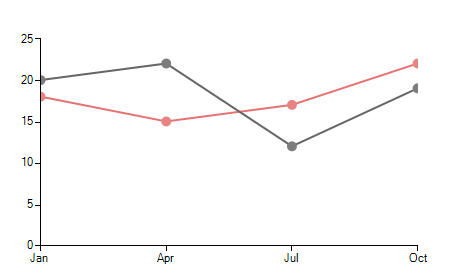
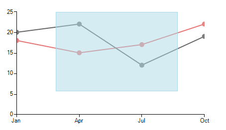
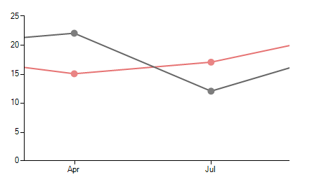

# Lasso Selection

__RadChartView__ provides lasso zoom (zoom to selection) functionality by selecting a rectangle on the surface of the control 
      and then zoom in automatically based on the selected *Cartesian area*. 

## 

First let’s start by adding some data points to the __RadChartView__ and __LassoZoomController__:
        

#### __[C#] __

{{source=..\SamplesCS\ChartView\Features\LassoSelection.cs region=AddController}}
	        
	        public LassoSelection()
	        {
	            InitializeComponent();
	            
	            LineSeries lineSeries = new LineSeries();
	            lineSeries.DataPoints.Add(new CategoricalDataPoint(20, "Jan"));
	            lineSeries.DataPoints.Add(new CategoricalDataPoint(22, "Apr"));
	            lineSeries.DataPoints.Add(new CategoricalDataPoint(12, "Jul"));
	            lineSeries.DataPoints.Add(new CategoricalDataPoint(19, "Oct"));
	            lineSeries.PointSize = new SizeF(10,10);
	            radChartView1.Series.Add(lineSeries);
	            
	            LineSeries lineSeries2 = new LineSeries();
	            lineSeries2.DataPoints.Add(new CategoricalDataPoint(18, "Jan"));
	            lineSeries2.DataPoints.Add(new CategoricalDataPoint(15, "Apr"));
	            lineSeries2.DataPoints.Add(new CategoricalDataPoint(17, "Jul"));
	            lineSeries2.DataPoints.Add(new CategoricalDataPoint(22, "Oct"));
	            lineSeries2.PointSize = new SizeF(10,10);            
	            radChartView1.Series.Add(lineSeries2);
	            
	            LassoZoomController lassoZoomController = new LassoZoomController();
	            radChartView1.Controllers.Add(lassoZoomController);
	        }
	        
	{{endregion}}

#### __[VB.NET] __

{{source=..\SamplesVB\ChartView\Features\LassoSelection.vb region=AddController}}
	    Public Sub New()
	
	        InitializeComponent()
	
	        Dim lineSeries As New LineSeries()
	        lineSeries.DataPoints.Add(New CategoricalDataPoint(20, "Jan"))
	        lineSeries.DataPoints.Add(New CategoricalDataPoint(22, "Apr"))
	        lineSeries.DataPoints.Add(New CategoricalDataPoint(12, "Jul"))
	        lineSeries.DataPoints.Add(New CategoricalDataPoint(19, "Oct"))
	        lineSeries.PointSize = New SizeF(10, 10)
	        RadChartView1.Series.Add(lineSeries)
	
	        Dim lineSeries2 As New LineSeries()
	        lineSeries2.DataPoints.Add(New CategoricalDataPoint(18, "Jan"))
	        lineSeries2.DataPoints.Add(New CategoricalDataPoint(15, "Apr"))
	        lineSeries2.DataPoints.Add(New CategoricalDataPoint(17, "Jul"))
	        lineSeries2.DataPoints.Add(New CategoricalDataPoint(22, "Oct"))
	        lineSeries2.PointSize = New SizeF(10, 10)
	        RadChartView1.Series.Add(lineSeries2)
	
	        Dim lassoZoomController As New LassoZoomController()
	        RadChartView1.Controllers.Add(lassoZoomController)
	    End Sub
	    '#End Region
	
	    '#Region "ZoomFirst"
	    Private Sub LassoSelection_Load(sender As Object, e As EventArgs) Handles MyBase.Load
	        Dim lassoZoomController As LassoZoomController = TryCast(RadChartView1.Controllers(1), LassoZoomController)
	        If lassoZoomController IsNot Nothing Then
	            lassoZoomController.ZoomAndPan(0, 50)
	        End If
	    End Sub
	    '#End Region
	End Class

Now, let’s select some area:

And the chart will automatically zoom to the selected area:

__LassoZoomController__ supports zoom and pan functionality programmatically via the *ZoomAndPan*  method, 
        which allows specifying the exact *from* and *to* percentage. The following code will zoom the first half of the chart:
        

#### __[C#] __

{{source=..\SamplesCS\ChartView\Features\LassoSelection.cs region=ZoomFirst}}
	        
	        private void LassoSelection_Load(object sender, EventArgs e)
	        {
	            LassoZoomController lassoZoomController = radChartView1.Controllers[1] as LassoZoomController;
	            if (lassoZoomController != null)
	            {
	                lassoZoomController.ZoomAndPan(0, 50);
	            }
	        }
	
	{{endregion}}

#### __[VB.NET] __

{{source=..\SamplesVB\ChartView\Features\LassoSelection.vb region=ZoomFirst}}
	    Private Sub LassoSelection_Load(sender As Object, e As EventArgs) Handles MyBase.Load
	        Dim lassoZoomController As LassoZoomController = TryCast(RadChartView1.Controllers(1), LassoZoomController)
	        If lassoZoomController IsNot Nothing Then
	            lassoZoomController.ZoomAndPan(0, 50)
	        End If
	    End Sub
	    '#End Region
	End Class

Using this approach you can zoom any area in the chart using the 0-100 percentage scale.
