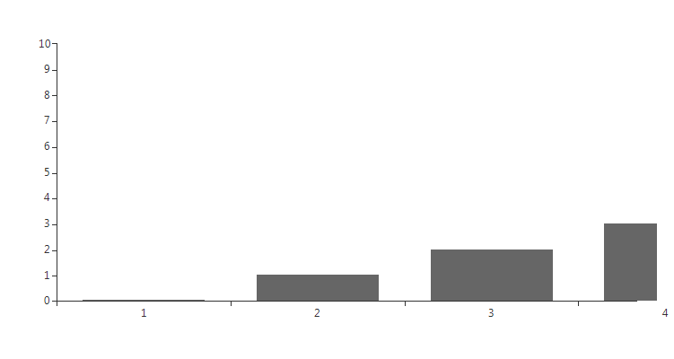
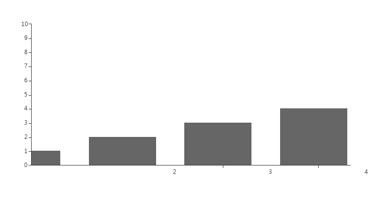

# Scroll and Zoom


## 

RadChartView provides zoom and scroll interactivity with the __ChartPanZoomController__ class. It is very simple to use and allows users to zoom in the chart plot area when are there is a dense area of data points that can not be seen clearly at the normal chart scale. The scroll functionality allows moving the visible area of the chart. In order to utilize this behavior users simply have to add it to the chart's __Controllers__ collection and specify the zoom mode. For example: 

{{source=..\SamplesCS\ChartView\Features\ScrollAndZoom.cs region=controller}} 
{{source=..\SamplesVB\ChartView\Features\ScrollAndZoom.vb region=controller}} 

````C#
ChartPanZoomController panZoomController = new ChartPanZoomController();
panZoomController.PanZoomMode = ChartPanZoomMode.Horizontal;
radChartView1.Controllers.Add(panZoomController);

````
````VB.NET
Dim panZoomController As New ChartPanZoomController()
panZoomController.PanZoomMode = ChartPanZoomMode.Horizontal
RadChartView1.Controllers.Add(panZoomController)

````

{{endregion}}  

>note When adding a new __ChartPanZoomController__ all other pan and zoom controllers are removed if such exists.
>


The ChartPanAndZoomController will be added automatically if the __ShowPanZoom__ property of RadChartView control is set to *true*. In this case the PanZoomMode is Horizontal (by default): 

{{source=..\SamplesCS\ChartView\Features\ScrollAndZoom.cs region=showPanZoom}} 
{{source=..\SamplesVB\ChartView\Features\ScrollAndZoom.vb region=showPanZoom}} 

````C#
radChartView1.ShowPanZoom = true;

````
````VB.NET
RadChartView1.ShowPanZoom = True

````

{{endregion}} 


The __PanZoomMode__ property allow developers to restrict zooming. Setting either of these properties to the __Both__ value removes any restrictions and the chart can be zoomed in both the horizontal and vertical axes. The last two values are __Horizontal__ and __Vertical__ which restrict the behavior horizontally and vertically respectively. You can now get/set the zoom and pan values of the RadChartView using the __Zoom__ and __Pan__ methods. Note that the offset should be provided in negative absolute values e.g Pan(-300,0) will offset the chart horizontally at 300px. You may use it to simultaneously  set zoom for the both axes by separating the values with comma. For example a Zoom(3 , 1) setting specifies that the data will be zoomed 3 times according to the XAxis and won't be zoomed by YAxis.
        

Initial chart:


Zooming: 

{{source=..\SamplesCS\ChartView\Features\ScrollAndZoom.cs region=Zoom}} 
{{source=..\SamplesVB\ChartView\Features\ScrollAndZoom.vb region=Zoom}} 

````C#
radChartView1.Zoom(3, 1);

````
````VB.NET
RadChartView1.Zoom(3, 1)

````

{{endregion}} 




Panning with 300 pixels: 

{{source=..\SamplesCS\ChartView\Features\ScrollAndZoom.cs region=pan}} 
{{source=..\SamplesVB\ChartView\Features\ScrollAndZoom.vb region=pan}} 

````C#
radChartView1.Pan(-300, 0);

````
````VB.NET
RadChartView1.Pan(-300, 0)

````

{{endregion}} 




The zoom factor can be controlled using __Ctrl+MouseWheel__ for zoom in and zoom out functionality. Left Button MouseDown+Move for pan/scroll functionality.
        
