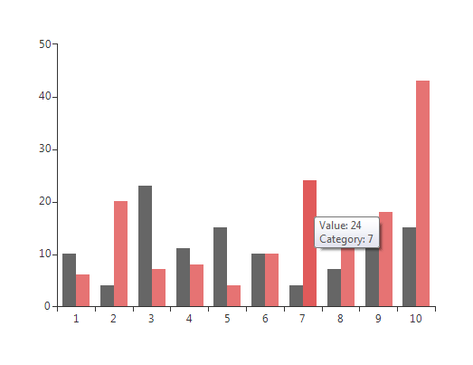

# Tooltip


## 

RadChartView provides a tooltip interactivity  with the __ChartTooltipController__ class and can be used to visualize arbitrary information related to a data point. If the user hovers directly over a data point, the tooltip will display information for this particular data point, otherwise it will display information for the closest data point to the hold location.In order to utilize this behavior users simply have to add it to the chart's __Controllers__ collection. For example: 

{{source=..\SamplesCS\ChartView\Features\ChartTooltip.cs region=controller}} 
{{source=..\SamplesVB\ChartView\Features\ChartTooltip.vb region=controller}} 

````C#
radChartView1.Controllers.Add(new ChartTooltipController());

````
````VB.NET
radChartView1.Controllers.Add(New ChartTooltipController())

````

{{endregion}} 


The ChartTooltipController will be added automatically if the __ShowToolTip__ property of RadChartView control is set to *true*: 

{{source=..\SamplesCS\ChartView\Features\ChartTooltip.cs region=showToolTip}} 
{{source=..\SamplesVB\ChartView\Features\ChartTooltip.vb region=showToolTip}} 

````C#
radChartView1.ShowToolTip = true;

````
````VB.NET
radChartView1.ShowToolTip = True

````

{{endregion}} 


A sample is shown below: 

{{source=..\SamplesCS\ChartView\Features\ChartTooltip.cs region=example}} 
{{source=..\SamplesVB\ChartView\Features\ChartTooltip.vb region=example}} 

````C#
radChartView1.AreaType = ChartAreaType.Cartesian;
BarSeries barSeries1 = new BarSeries();
barSeries1.DataPoints.Add(new CategoricalDataPoint(10, "1"));
barSeries1.DataPoints.Add(new CategoricalDataPoint(4, "2"));
barSeries1.DataPoints.Add(new CategoricalDataPoint(23, "3"));
barSeries1.DataPoints.Add(new CategoricalDataPoint(11, "4"));
barSeries1.DataPoints.Add(new CategoricalDataPoint(15, "5"));
barSeries1.DataPoints.Add(new CategoricalDataPoint(10, "6"));
barSeries1.DataPoints.Add(new CategoricalDataPoint(4, "7"));
barSeries1.DataPoints.Add(new CategoricalDataPoint(7, "8"));
barSeries1.DataPoints.Add(new CategoricalDataPoint(11, "9"));
barSeries1.DataPoints.Add(new CategoricalDataPoint(15, "10"));
radChartView1.Series.Add(barSeries1);
BarSeries barSeries2 = new BarSeries();
barSeries2.DataPoints.Add(new CategoricalDataPoint(6, "1"));
barSeries2.DataPoints.Add(new CategoricalDataPoint(20, "2"));
barSeries2.DataPoints.Add(new CategoricalDataPoint(7, "3"));
barSeries2.DataPoints.Add(new CategoricalDataPoint(8, "4"));
barSeries2.DataPoints.Add(new CategoricalDataPoint(4, "5"));
barSeries2.DataPoints.Add(new CategoricalDataPoint(10, "6"));
barSeries2.DataPoints.Add(new CategoricalDataPoint(24, "7"));
barSeries2.DataPoints.Add(new CategoricalDataPoint(17, "8"));
barSeries2.DataPoints.Add(new CategoricalDataPoint(18, "9"));
barSeries2.DataPoints.Add(new CategoricalDataPoint(43, "10"));
radChartView1.Series.Add(barSeries2);
radChartView1.ShowToolTip = true;

````
````VB.NET
radChartView1.AreaType = ChartAreaType.Cartesian
Dim barSeries1 As New BarSeries
barSeries1.DataPoints.Add(New CategoricalDataPoint(10, "1"))
barSeries1.DataPoints.Add(New CategoricalDataPoint(4, "2"))
barSeries1.DataPoints.Add(New CategoricalDataPoint(23, "3"))
barSeries1.DataPoints.Add(New CategoricalDataPoint(11, "4"))
barSeries1.DataPoints.Add(New CategoricalDataPoint(15, "5"))
barSeries1.DataPoints.Add(New CategoricalDataPoint(10, "6"))
barSeries1.DataPoints.Add(New CategoricalDataPoint(4, "7"))
barSeries1.DataPoints.Add(New CategoricalDataPoint(7, "8"))
barSeries1.DataPoints.Add(New CategoricalDataPoint(11, "9"))
barSeries1.DataPoints.Add(New CategoricalDataPoint(15, "10"))
radChartView1.Series.Add(barSeries1)
Dim barSeries2 As New BarSeries()
barSeries2.DataPoints.Add(New CategoricalDataPoint(6, "1"))
barSeries2.DataPoints.Add(New CategoricalDataPoint(20, "2"))
barSeries2.DataPoints.Add(New CategoricalDataPoint(7, "3"))
barSeries2.DataPoints.Add(New CategoricalDataPoint(8, "4"))
barSeries2.DataPoints.Add(New CategoricalDataPoint(4, "5"))
barSeries2.DataPoints.Add(New CategoricalDataPoint(10, "6"))
barSeries2.DataPoints.Add(New CategoricalDataPoint(24, "7"))
barSeries2.DataPoints.Add(New CategoricalDataPoint(17, "8"))
barSeries2.DataPoints.Add(New CategoricalDataPoint(18, "9"))
barSeries2.DataPoints.Add(New CategoricalDataPoint(43, "10"))
radChartView1.Series.Add(barSeries2)
radChartView1.ShowToolTip = True

````

{{endregion}} 



