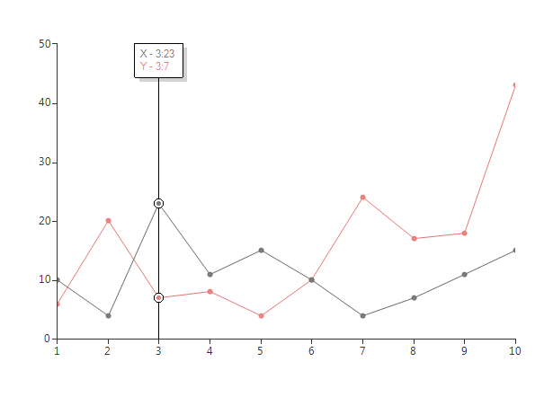

# Trackball


## 

Along with tooltip and pan/zoom controllers, RadChartView provides a trackball behavior through the __ChartTrackballController__ class. This controller can display a vertical line across the chart plot area and also to display little visual indicators (circles by default) at points where the trackball line crosses the visualization of a series object. For example when the trackball line crosses a line series line segment, a small circle is drawn highlighting the value of the series at this point. The last capability of the trackball behavior is to display a small popup, similar to the tooltip, in order to provide more detailed information about the closest points to the track ball line's cross section.
        

In order to utilize this behavior users simply have to add it to the chart's __Controllers__ collection. For example: 

{{source=..\SamplesCS\ChartView\Features\Trackball.cs region=controller}} 
{{source=..\SamplesVB\ChartView\Features\Trackball.vb region=controller}} 

````C#
            radChartView1.Controllers.Add(new ChartTrackballController());
````
````VB.NET
        RadChartView1.Controllers.Add(New ChartTrackballController())
        '
````

{{endregion}} 
 

The ChartTrackballController will be added automatically if the __ShowTrackBall__ property of RadChartView control is set to *true*: 

{{source=..\SamplesCS\ChartView\Features\Trackball.cs region=showTrackBall}} 
{{source=..\SamplesVB\ChartView\Features\Trackball.vb region=showTrackBall}} 

````C#
            radChartView1.ShowTrackBall = true;
````
````VB.NET
        RadChartView1.ShowTrackBall = True
        '
````

{{endregion}} 
 

A sample is shown below: 

{{source=..\SamplesCS\ChartView\Features\Trackball.cs region=example}} 
{{source=..\SamplesVB\ChartView\Features\Trackball.vb region=example}} 

````C#
            radChartView1.AreaType = ChartAreaType.Cartesian;
            LineSeries lineSeries1 = new LineSeries();
            lineSeries1.Name = "X";

            lineSeries1.DataPoints.Add(new CategoricalDataPoint(10, "1"));
            lineSeries1.DataPoints.Add(new CategoricalDataPoint(4, "2"));
            lineSeries1.DataPoints.Add(new CategoricalDataPoint(23, "3"));
            lineSeries1.DataPoints.Add(new CategoricalDataPoint(11, "4"));
            lineSeries1.DataPoints.Add(new CategoricalDataPoint(15, "5"));
            lineSeries1.DataPoints.Add(new CategoricalDataPoint(10, "6"));
            lineSeries1.DataPoints.Add(new CategoricalDataPoint(4, "7"));
            lineSeries1.DataPoints.Add(new CategoricalDataPoint(7, "8"));
            lineSeries1.DataPoints.Add(new CategoricalDataPoint(11, "9"));
            lineSeries1.DataPoints.Add(new CategoricalDataPoint(15, "10"));
            radChartView1.Series.Add(lineSeries1);

            LineSeries lineSeries2 = new LineSeries();
            lineSeries2.Name = "Y";

            lineSeries2.DataPoints.Add(new CategoricalDataPoint(6, "1"));
            lineSeries2.DataPoints.Add(new CategoricalDataPoint(20, "2"));
            lineSeries2.DataPoints.Add(new CategoricalDataPoint(7, "3"));
            lineSeries2.DataPoints.Add(new CategoricalDataPoint(8, "4"));
            lineSeries2.DataPoints.Add(new CategoricalDataPoint(4, "5"));
            lineSeries2.DataPoints.Add(new CategoricalDataPoint(10, "6"));
            lineSeries2.DataPoints.Add(new CategoricalDataPoint(24, "7"));
            lineSeries2.DataPoints.Add(new CategoricalDataPoint(17, "8"));
            lineSeries2.DataPoints.Add(new CategoricalDataPoint(18, "9"));
            lineSeries2.DataPoints.Add(new CategoricalDataPoint(43, "10"));
            radChartView1.Series.Add(lineSeries2);

            radChartView1.ShowTrackBall = true;
````
````VB.NET
        RadChartView1.AreaType = ChartAreaType.Cartesian
        Dim lineSeries1 As New LineSeries
        lineSeries1.Name = "X"

        lineSeries1.DataPoints.Add(New CategoricalDataPoint(10, "1"))
        lineSeries1.DataPoints.Add(New CategoricalDataPoint(4, "2"))
        lineSeries1.DataPoints.Add(New CategoricalDataPoint(23, "3"))
        lineSeries1.DataPoints.Add(New CategoricalDataPoint(11, "4"))
        lineSeries1.DataPoints.Add(New CategoricalDataPoint(15, "5"))
        lineSeries1.DataPoints.Add(New CategoricalDataPoint(10, "6"))
        lineSeries1.DataPoints.Add(New CategoricalDataPoint(4, "7"))
        lineSeries1.DataPoints.Add(New CategoricalDataPoint(7, "8"))
        lineSeries1.DataPoints.Add(New CategoricalDataPoint(11, "9"))
        lineSeries1.DataPoints.Add(New CategoricalDataPoint(15, "10"))
        RadChartView1.Series.Add(lineSeries1)

        Dim lineSeries2 As New LineSeries
        lineSeries1.Name = "Y"

        lineSeries2.DataPoints.Add(New CategoricalDataPoint(6, "1"))
        lineSeries2.DataPoints.Add(New CategoricalDataPoint(20, "2"))
        lineSeries2.DataPoints.Add(New CategoricalDataPoint(7, "3"))
        lineSeries2.DataPoints.Add(New CategoricalDataPoint(8, "4"))
        lineSeries2.DataPoints.Add(New CategoricalDataPoint(4, "5"))
        lineSeries2.DataPoints.Add(New CategoricalDataPoint(10, "6"))
        lineSeries2.DataPoints.Add(New CategoricalDataPoint(24, "7"))
        lineSeries2.DataPoints.Add(New CategoricalDataPoint(17, "8"))
        lineSeries2.DataPoints.Add(New CategoricalDataPoint(18, "9"))
        lineSeries2.DataPoints.Add(New CategoricalDataPoint(43, "10"))
        RadChartView1.Series.Add(lineSeries2)

        RadChartView1.ShowTrackBall = True
        '
````

{{endregion}} 



