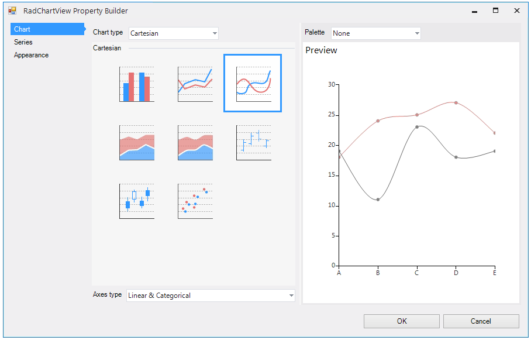
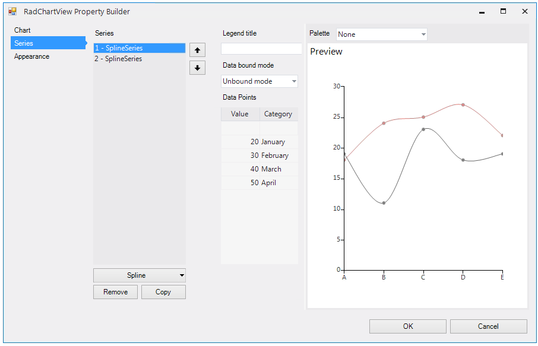
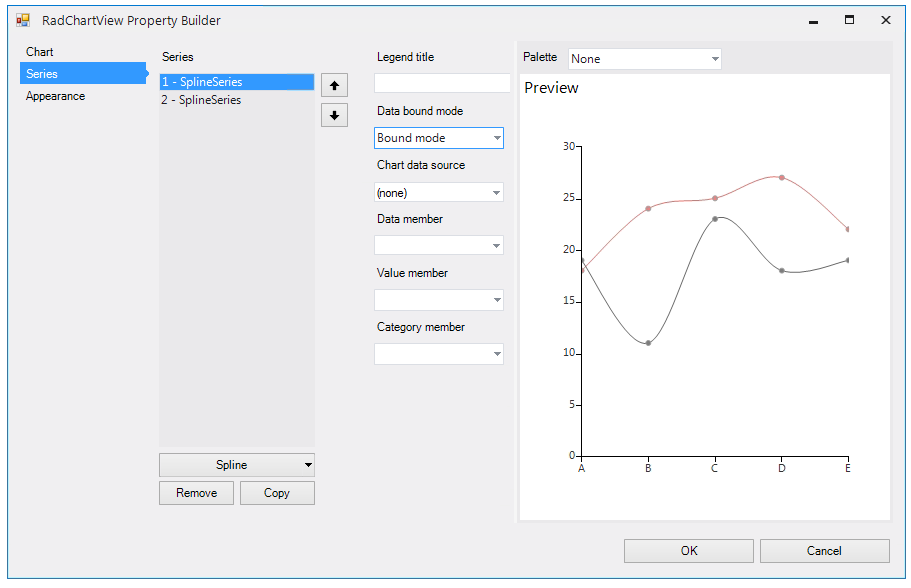
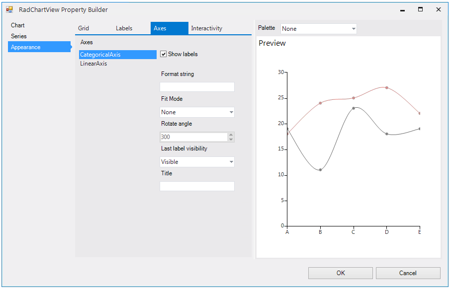

# Property Builder

## 

The Property builder is divided into three sections: Chart, Series and Appearance.
        

The first section allows you to choose the type of chart you will be creating, the type of axes for the chart and the palette.
        

The second section is labeled __Series__. Here is where you can add, remove and setup series. 
          You can add new series through the split button below the list with currently added series. You can also remove or copy a series. 
          The latter would make a copy of the series along with all the data points. Here you can also specify the text that will appear in
          the legend should you decide to show one.
        

There are two ways you can provide data to RadChartView. The first is “Unbound mode” and allows you to enter the data manually through the grid view.
          You can enter data quickly by using the Enter or Tab keys. When you enter data in a cell you can press either key and the focus will be transferred to 
          the next cell or if you are on the last cell, data will be committed and the focus will go to the first cell in the add new row.
        

The second mode is “Bound mode” where you provide data to RadChartView from some data source. After changing the Data bound mode the 
          UI will change accordingly allowing you to choose a data source and set up __DataMember__. The number and names 
          of the drop downs change in accordance to the type of the series currently selected.
        

The third section allows you to setup different options like grid, axes labels, series labels and the interactive features 
          of RadChartView like the pan and zoom, trackball, title and legend.
        
