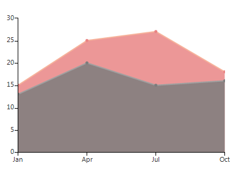
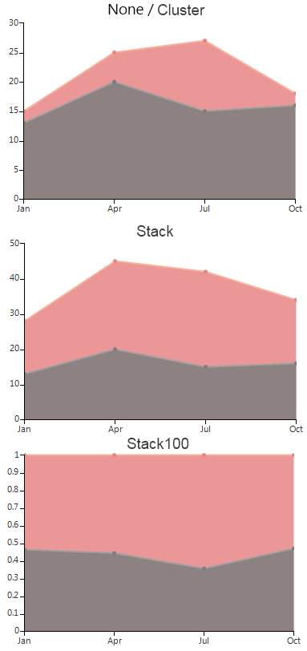

# Area

As a derivative of __Categorical__ series, __AreaSeries__ plot their data points using category-value couples. Once positioned on a plane the points are connected to form a line. Further, the area enclosed by this line and the categorical axis is filled. Below is a sample snippet that demonstrates how to set up two __AreaSeries__:

#### Initial Setup

{{source=..\SamplesCS\ChartView\Series\AreaSeriesForm.cs region=area}} 
{{source=..\SamplesVB\ChartView\Series\AreaSeriesForm.vb region=area}} 

````C#
AreaSeries areaSeries = new AreaSeries();
areaSeries.DataPoints.Add(new CategoricalDataPoint(13, "Jan"));
areaSeries.DataPoints.Add(new CategoricalDataPoint(20, "Apr"));
areaSeries.DataPoints.Add(new CategoricalDataPoint(15, "Jul"));
areaSeries.DataPoints.Add(new CategoricalDataPoint(16, "Oct"));
this.radChartView1.Series.Add(areaSeries);
AreaSeries areaSeries2 = new AreaSeries(); 
areaSeries2.DataPoints.Add(new CategoricalDataPoint(15, "Jan"));
areaSeries2.DataPoints.Add(new CategoricalDataPoint(25, "Apr"));
areaSeries2.DataPoints.Add(new CategoricalDataPoint(27, "Jul"));
areaSeries2.DataPoints.Add(new CategoricalDataPoint(18, "Oct"));
this.radChartView1.Series.Add(areaSeries2);

````
````VB.NET
Dim series As New AreaSeries()
series.DataPoints.Add(New CategoricalDataPoint(13, "Jan"))
series.DataPoints.Add(New CategoricalDataPoint(20, "Apr"))
series.DataPoints.Add(New CategoricalDataPoint(15, "Jul"))
series.DataPoints.Add(New CategoricalDataPoint(16, "Oct"))
Me.RadChartView1.Series.Add(series)
Dim series2 As New AreaSeries()
series2.DataPoints.Add(New CategoricalDataPoint(15, "Jan"))
series2.DataPoints.Add(New CategoricalDataPoint(25, "Apr"))
series2.DataPoints.Add(New CategoricalDataPoint(27, "Jul"))
series2.DataPoints.Add(New CategoricalDataPoint(18, "Oct"))
Me.RadChartView1.Series.Add(series2)

````

{{endregion}} 

>caption Fig.1 Initial Setup


The essential properties of AreaSeries coincide with these of LineSeries:

* __BorderWidth__: The property determines the thickness of the lines;

* __PointSize__: The property denotes the size of the points;

* __Spline__: Boolean property, which indicates whether the series will draw straight lines or smooth curves;

* __SplineTension__: The property sets the tension of the spline. The property will have effect only if the __Spline__ is set to *true*;

* __CombineMode__: A common property for all categorical series, which introduces a mechanism for combining data points that reside in different series, but have the same category. The combine mode can be *None*, *Cluster*,  *Stack* and *Stack100*. In the case of *AreaSeries*, *None* and *Cluster* mean that the series will be plotted independently of each other, so that they are overlapping. *Stack* plots the points on top of each other and *Stack100* presents the values of one series as a percentage of the other series. The combine mode is best described by a picture: 

>caption Fig.2 Combine Mode


# See Also

* [Series Types]()
* [Populating with Data]()