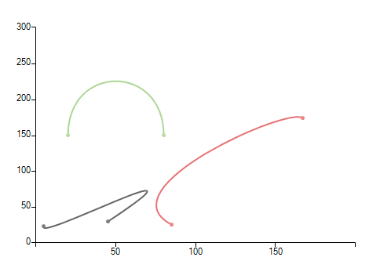

# Bezier


The Bezier chart displays a series of points on a curved line.  Two "control points" determine the position and amount of curvature in the line between end points.


## 
 
{{source=..\SamplesCS\ChartView\Series\BezierSeriesForm.cs region=Bezier}} 
{{source=..\SamplesVB\ChartView\Series\BezierSeriesForm.vb region=Bezier}} 

````C#
BezierSeries bezier = new BezierSeries();   
bezier.DataPoints.Add(new BezierDataPoint(45, 30, 0, 0, 120, 140)); 
bezier.DataPoints.Add(new BezierDataPoint(5, 23, 0, 0, 95, 110)); 
this.radChartView1.Series.Add(bezier);  
BezierSeries bezier2 = new BezierSeries();   
bezier2.DataPoints.Add(new BezierDataPoint(167, 173, 20, 15, 158, 190));  
bezier2.DataPoints.Add(new BezierDataPoint(85, 25, 42, 75, 85, 97)); 
this.radChartView1.Series.Add(bezier2);  
BezierSeries bezier3 = new BezierSeries();  
bezier3.DataPoints.Add(new BezierDataPoint(20, 150, 0, 0, 20, 250));  
bezier3.DataPoints.Add(new BezierDataPoint(80, 150, 80, 250, 0, 0));           
this.radChartView1.Series.Add(bezier3);

````
````VB.NET
Dim bezier As New BezierSeries()
bezier.DataPoints.Add(New BezierDataPoint(45, 30, 0, 0, 120, 140))
bezier.DataPoints.Add(New BezierDataPoint(5, 23, 0, 0, 95, 110))
Me.RadChartView1.Series.Add(bezier)
Dim bezier2 As New BezierSeries()
bezier2.DataPoints.Add(New BezierDataPoint(167, 173, 20, 15, 158, 190))
bezier2.DataPoints.Add(New BezierDataPoint(85, 25, 42, 75, 85, 97))
Me.RadChartView1.Series.Add(bezier2)
Dim bezier3 As New BezierSeries()
bezier3.DataPoints.Add(New BezierDataPoint(20, 150, 0, 0, 20, 250))
bezier3.DataPoints.Add(New BezierDataPoint(80, 150, 80, 250, 0, 0))
Me.RadChartView1.Series.Add(bezier3)

````

{{endregion}} 
 
Here are some of the important properties of __BezierSeries__:
        

* __ControlPoint1XMember__ - if a DataSource is set, the property determines the name of the field that holds the X coordinate of ControlPoint1.
            

* __ControlPoint1YMember__ - if a DataSource is set, the property determines the name of the field that holds the Y coordinate of ControlPoint1.
            

* __ControlPoint2XMember__ - if a DataSource is set, the property determines the name of the field that holds the X coordinate of ControlPoint2.
            

* __ControlPoint2YMember__ - if a DataSource is set, the property determines the name of the field that holds the Y coordinate of ControlPoint2.
            

* __XValueMember__ - if a DataSource is set, the property determines the name of the field that holds the XValue.
            

* __YValueMember__ - if a DataSource is set, the property determines the name of the field that holds the YValue.
            
