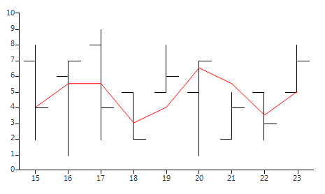
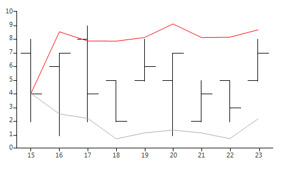

# Indicators

RadChartView offers more than 20 of the most frequently used technical indicators out of the box. The indicators compilation contains representatives of the moving average, momentum, volatility, and band categories. In their essence, indicators are line series that calculate each of their values using predefined interpretations of the incoming data. The simplest example would be the Moving Average, aka. Simple Moving Average, indicator, which averages the data for a certain number of past days. Each indicator type introduces a specific set of properties that allows you to change the parameters of the built-in formula. This article demonstrates how to setup two of the most popular indicators - Moving Average (MA) and Bollinger Bands. 

Let's start with creating some meaningful data that will be used by both indicators 

#### Initial Setup

{{source=..\SamplesCS\ChartView\Series\Indicators\IndicatorsOverviewForm.cs region=IndicatorsCommonData}} 
{{source=..\SamplesVB\ChartView\Series\Indicators\IndicatorsOverviewForm.vb region=IndicatorsCommonData}} 

````C#
//Create data
BindingList<OhlcObject> dataSource = new BindingList<OhlcObject>();
dataSource.Add(new OhlcObject(7, 8, 2, 4, DateTime.Now));
dataSource.Add(new OhlcObject(6, 7, 1, 7, DateTime.Now.AddDays(1)));
dataSource.Add(new OhlcObject(8, 9, 2, 4, DateTime.Now.AddDays(2)));
dataSource.Add(new OhlcObject(5, 5, 2, 2, DateTime.Now.AddDays(3)));
dataSource.Add(new OhlcObject(5, 8, 5, 6, DateTime.Now.AddDays(4)));
dataSource.Add(new OhlcObject(5, 7, 1, 7, DateTime.Now.AddDays(5)));
dataSource.Add(new OhlcObject(2, 5, 2, 4, DateTime.Now.AddDays(6)));
dataSource.Add(new OhlcObject(5, 5, 2, 3, DateTime.Now.AddDays(7)));
dataSource.Add(new OhlcObject(5, 8, 5, 7, DateTime.Now.AddDays(8)));

````
````VB.NET
'Create data
Dim dataSource As New BindingList(Of OhlcObject)()
dataSource.Add(New OhlcObject(7, 8, 2, 4, DateTime.Now))
dataSource.Add(New OhlcObject(6, 7, 1, 7, DateTime.Now.AddDays(1)))
dataSource.Add(New OhlcObject(8, 9, 2, 4, DateTime.Now.AddDays(2)))
dataSource.Add(New OhlcObject(5, 5, 2, 2, DateTime.Now.AddDays(3)))
dataSource.Add(New OhlcObject(5, 8, 5, 6, DateTime.Now.AddDays(4)))
dataSource.Add(New OhlcObject(5, 7, 1, 7, DateTime.Now.AddDays(5)))
dataSource.Add(New OhlcObject(2, 5, 2, 4, DateTime.Now.AddDays(6)))
dataSource.Add(New OhlcObject(5, 5, 2, 3, DateTime.Now.AddDays(7)))
dataSource.Add(New OhlcObject(5, 8, 5, 7, DateTime.Now.AddDays(8)))

````

{{endregion}} 

 
## Moving Average Indicator

Each value of MA is the average of past __n__ days, where __n__ is a parameter defined by the __Period__ property. 

#### Average Indicator

{{source=..\SamplesCS\ChartView\Series\Indicators\IndicatorsOverviewForm.cs region=ma}} 
{{source=..\SamplesVB\ChartView\Series\Indicators\IndicatorsOverviewForm.vb region=ma}} 

````C#
//Create and add Moving Average indicator
MovingAverageIndicator maIndicator = new MovingAverageIndicator();
maIndicator.ValueMember = "Close";
maIndicator.CategoryMember = "Date";
maIndicator.DataSource = dataSource;
maIndicator.Period = 2;
maIndicator.BorderColor = Color.Red;
maIndicator.PointSize = SizeF.Empty;
this.radChartView1.Series.Add(maIndicator);
//Create and add Ohlc series
OhlcSeries series = new OhlcSeries();
series.OpenValueMember = "Open";
series.CloseValueMember = "Close";
series.HighValueMember = "High";
series.LowValueMember = "Low";
series.CategoryMember = "Date";
series.DataSource = dataSource;
series.BorderColor = Color.Black;
this.radChartView1.Series.Add(series);

````
````VB.NET
'Create and add Moving Average indicator
Dim maIndicator As New MovingAverageIndicator()
maIndicator.ValueMember = "Close"
maIndicator.CategoryMember = "Date"
maIndicator.DataSource = dataSource
maIndicator.Period = 2
maIndicator.BorderColor = Color.Red
maIndicator.PointSize = SizeF.Empty
Me.RadChartView1.Series.Add(maIndicator)
'Create and add Ohlc series
Dim series As New OhlcSeries()
series.OpenValueMember = "Open"
series.CloseValueMember = "Close"
series.HighValueMember = "High"
series.LowValueMember = "Low"
series.CategoryMember = "Date"
series.DataSource = dataSource
series.BorderColor = Color.Black
Me.RadChartView1.Series.Add(series)

````

{{endregion}}

>caption Figure 1: Average Indicator


## Bollinger Bands Indicator

The indicator consists of two bands that aim to provide a relative definition of high and low. The indicator uses a simple __Moving Average__ as a starting point and forms its two bands using the following formulas:

* __Upper band__: N-period MA + (N-period standard deviation * K)

* __Lower band__: N-period MA – (N-period standard deviation * K)

* __N__ is defined by the Period property. A typical value for N is 20.

* __K__ is defined by the StandardDeviations property. A typical value for K is 2. 

#### Bollinger Indicator

{{source=..\SamplesCS\ChartView\Series\Indicators\IndicatorsOverviewForm.cs region=Bands}} 
{{source=..\SamplesVB\ChartView\Series\Indicators\IndicatorsOverviewForm.vb region=Bands}} 

````C#
//Create and add Bollinger Bands indicator
BollingerBandsIndicator bollIndicator = new BollingerBandsIndicator();
bollIndicator.ValueMember = "Close";
bollIndicator.CategoryMember = "Date";
bollIndicator.DataSource = dataSource;
bollIndicator.StandardDeviations = 2;
bollIndicator.Period = 5;
bollIndicator.InnerIndicator.BorderColor = Color.DarkGray;
bollIndicator.BorderColor = Color.Red;
bollIndicator.PointSize = SizeF.Empty;
this.radChartView1.Series.Add(bollIndicator);
//Create and add Ohlc series
OhlcSeries ohlcSeries = new OhlcSeries();
ohlcSeries.OpenValueMember = "Open";
ohlcSeries.CloseValueMember = "Close";
ohlcSeries.HighValueMember = "High";
ohlcSeries.LowValueMember = "Low";
ohlcSeries.CategoryMember = "Date";
ohlcSeries.DataSource = dataSource;
ohlcSeries.BorderColor = Color.Black;
this.radChartView1.Series.Add(ohlcSeries);

````
````VB.NET
'Create and add Bollinger Bands indicator
Dim bollIndicator As New BollingerBandsIndicator()
bollIndicator.ValueMember = "Close"
bollIndicator.CategoryMember = "Date"
bollIndicator.DataSource = dataSource
bollIndicator.StandardDeviations = 2
bollIndicator.Period = 5
bollIndicator.InnerIndicator.BorderColor = Color.DarkGray
bollIndicator.BorderColor = Color.Red
bollIndicator.PointSize = SizeF.Empty
Me.RadChartView1.Series.Add(bollIndicator)
'Create and add Ohlc series
Dim ohlcSeries As New OhlcSeries()
ohlcSeries.OpenValueMember = "Open"
ohlcSeries.CloseValueMember = "Close"
ohlcSeries.HighValueMember = "High"
ohlcSeries.LowValueMember = "Low"
ohlcSeries.CategoryMember = "Date"
ohlcSeries.DataSource = dataSource
ohlcSeries.BorderColor = Color.Black
Me.RadChartView1.Series.Add(ohlcSeries)

````

{{endregion}} 

>caption Figure 2: Bollinger Indicator


# See Also

* [Series Types]()
* [Populating with Data]()