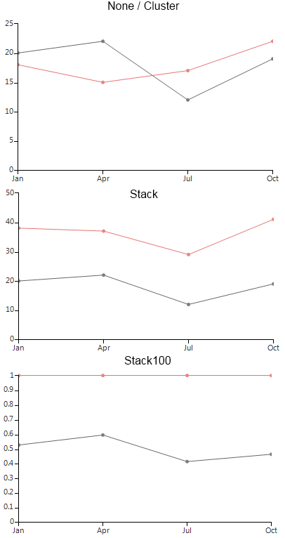

# Line


## 

__LineSeries__ plot their Categorical data points on Cartesian Area using one categorical and one numerical axis. Points are connected with either straight lines or large smooth curves (Spline). Here is how to set up two line series: 

{{source=..\SamplesCS\ChartView\Series\LineSeriesForm.cs region=line}} 
{{source=..\SamplesVB\ChartView\Series\LineSeriesForm.vb region=line}} 

````C#
LineSeries lineSeries = new LineSeries();
lineSeries.DataPoints.Add(new CategoricalDataPoint(20, "Jan"));
lineSeries.DataPoints.Add(new CategoricalDataPoint(22, "Apr"));
lineSeries.DataPoints.Add(new CategoricalDataPoint(12, "Jul"));
lineSeries.DataPoints.Add(new CategoricalDataPoint(19, "Oct"));
this.radChartView1.Series.Add(lineSeries);
LineSeries lineSeries2 = new LineSeries();
lineSeries2.DataPoints.Add(new CategoricalDataPoint(18, "Jan"));
lineSeries2.DataPoints.Add(new CategoricalDataPoint(15, "Apr"));
lineSeries2.DataPoints.Add(new CategoricalDataPoint(17, "Jul"));
lineSeries2.DataPoints.Add(new CategoricalDataPoint(22, "Oct"));
this.radChartView1.Series.Add(lineSeries2);

````
````VB.NET
Dim lineSeries As New LineSeries()
lineSeries.DataPoints.Add(New CategoricalDataPoint(20, "Jan"))
lineSeries.DataPoints.Add(New CategoricalDataPoint(22, "Apr"))
lineSeries.DataPoints.Add(New CategoricalDataPoint(12, "Jul"))
lineSeries.DataPoints.Add(New CategoricalDataPoint(19, "Oct"))
Me.RadChartView1.Series.Add(lineSeries)
Dim lineSeries2 As New LineSeries()
lineSeries2.DataPoints.Add(New CategoricalDataPoint(18, "Jan"))
lineSeries2.DataPoints.Add(New CategoricalDataPoint(15, "Apr"))
lineSeries2.DataPoints.Add(New CategoricalDataPoint(17, "Jul"))
lineSeries2.DataPoints.Add(New CategoricalDataPoint(22, "Oct"))
Me.RadChartView1.Series.Add(lineSeries2)

````

{{endregion}} 


The essential properties of __LineSeries__ are:

* __BorderWidth__ – the property determines the thickness of the lines;
              

* __PointSize__ – the property denotes the size of the points;
              

* __ShowLabels__ – the property determines whether the labels above each point will be visible;
              

* __Spline__ – Boolean property, which indicates whether the series will draw straight lines or smooth curves;
              

* __SplineTension__ – the property sets the tension of the spline. The property will have effect only if the __Spline__ is set to *true*;
              

* CombineMode – a common property for all categorical series, which introduces a mechanism for combining data points that reside in different series but have the same category. The combine mode can be __None__, __Cluster__, __Stack__ and __Stack100__. In the case of Line series, __None__ and __Cluster__ mean that the series will be plotted independently of each other, so that they are overlapping. __Stack__ plots the points on top of each other and __Stack100__ presents the values of one series as a percentage of the other series. The combine mode is best described by a picture:

