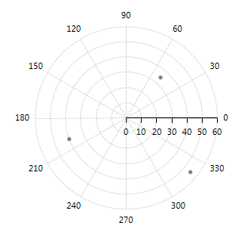
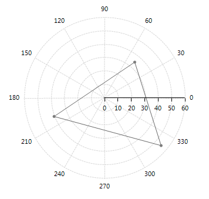
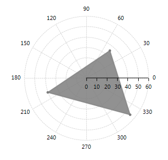

# Polar
 
## 

__Polar series__ consists of a group of classes that plot data in radial plot area in polar coordinates. Valid only in the context of Polar AreaType, __Polar series__ have three implementations – __PolarLineSeries__, __PolarAreaSeries__ and __PolarPointSeries__. When working in unbound mode, the polar series are filled with PolarDataPoint objects which define __Angle__ and __Value__ properties which unambiguously determine a point's location in the polar coordinate system defined by the polar and numeric radial axes. Below is an example of RadPolarChart with different Polar series: 

{{source=..\SamplesCS\ChartView\Series\PolarSeriesForm.cs region=polarPointSeries}} 
{{source=..\SamplesVB\ChartView\Series\PolarSeriesForm.vb region=polarPointSeries}} 

````C#
            
this.radChartView1.AreaType = ChartAreaType.Polar;
PolarPointSeries polarPointSeries = new PolarPointSeries();
            
PolarDataPoint dataPoint = new PolarDataPoint();
dataPoint.Value = 40;
dataPoint.Angle = 200;
polarPointSeries.DataPoints.Add(dataPoint);
            
dataPoint = new PolarDataPoint();
dataPoint.Value = 35;
dataPoint.Angle = 50;
polarPointSeries.DataPoints.Add(dataPoint);
            
dataPoint = new PolarDataPoint();
dataPoint.Value = 55;
dataPoint.Angle = 320;
polarPointSeries.DataPoints.Add(dataPoint);
            
this.radChartView1.Series.Add(polarPointSeries);

````
````VB.NET
Me.RadChartView1.AreaType = ChartAreaType.Polar
Dim polarPointSeries As New PolarPointSeries()
Dim dataPoint As New PolarDataPoint()
dataPoint.Value = 40
dataPoint.Angle = 200
polarPointSeries.DataPoints.Add(dataPoint)
dataPoint = New PolarDataPoint()
dataPoint.Value = 35
dataPoint.Angle = 50
polarPointSeries.DataPoints.Add(dataPoint)
dataPoint = New PolarDataPoint()
dataPoint.Value = 55
dataPoint.Angle = 320
polarPointSeries.DataPoints.Add(dataPoint)
Me.RadChartView1.Series.Add(polarPointSeries)

````

{{endregion}} 


 


{{source=..\SamplesCS\ChartView\Series\PolarSeriesForm.cs region=polarLineSeries}} 
{{source=..\SamplesVB\ChartView\Series\PolarSeriesForm.vb region=polarLineSeries}} 

````C#
this.radChartView1.AreaType = ChartAreaType.Polar;
PolarLineSeries polarLineSeries = new PolarLineSeries();
            
PolarDataPoint point = new PolarDataPoint();
point.Value = 35;
point.Angle = 50;
polarLineSeries.DataPoints.Add(point);
            
point = new PolarDataPoint();
point.Value = 40;
point.Angle = 200;
polarLineSeries.DataPoints.Add(point);
            
point = new PolarDataPoint();
point.Value = 55;
point.Angle = 320;
polarLineSeries.DataPoints.Add(point);
this.radChartView1.Series.Add(polarLineSeries);

````
````VB.NET
Me.RadChartView1.AreaType = ChartAreaType.Polar
Dim polarLineSeries As New PolarLineSeries()
Dim point As New PolarDataPoint()
point.Value = 35
point.Angle = 50
polarLineSeries.DataPoints.Add(point)
point = New PolarDataPoint()
point.Value = 40
point.Angle = 200
polarLineSeries.DataPoints.Add(point)
point = New PolarDataPoint()
point.Value = 55
point.Angle = 320
polarLineSeries.DataPoints.Add(point)
Me.RadChartView1.Series.Add(polarLineSeries)

````

{{endregion}} 


 
 
{{source=..\SamplesCS\ChartView\Series\PolarSeriesForm.cs region=polarAreaSeries}} 
{{source=..\SamplesVB\ChartView\Series\PolarSeriesForm.vb region=polarAreaSeries}} 

````C#
            
this.radChartView1.AreaType = ChartAreaType.Polar;
PolarAreaSeries polarAreaSeries = new PolarAreaSeries();
PolarDataPoint polarPoint = new PolarDataPoint();
polarPoint.Value = 35;
polarPoint.Angle = 50;
polarAreaSeries.DataPoints.Add(polarPoint);
polarPoint = new PolarDataPoint();
polarPoint.Value = 40;
polarPoint.Angle = 200;
polarAreaSeries.DataPoints.Add(polarPoint);
polarPoint = new PolarDataPoint();
polarPoint.Value = 55;
polarPoint.Angle = 320;
polarAreaSeries.DataPoints.Add(polarPoint);
        
this.radChartView1.Series.Add(polarAreaSeries);

````
````VB.NET
Me.RadChartView1.AreaType = ChartAreaType.Polar
Dim polarAreaSeries As New PolarAreaSeries()
Dim polarPoint As New PolarDataPoint()
polarPoint.Value = 35
polarPoint.Angle = 50
polarAreaSeries.DataPoints.Add(polarPoint)
polarPoint = New PolarDataPoint()
polarPoint.Value = 25
polarPoint.Angle = 130
polarAreaSeries.DataPoints.Add(polarPoint)
polarPoint = New PolarDataPoint()
polarPoint.Value = 40
polarPoint.Angle = 200
polarAreaSeries.DataPoints.Add(polarPoint)
polarPoint = New PolarDataPoint()
polarPoint.Value = 55
polarPoint.Angle = 320
polarAreaSeries.DataPoints.Add(polarPoint)
Me.RadChartView1.Series.Add(polarAreaSeries)

````

{{endregion}} 




Here are some of the important properties all __PolarSeries__ share:

* __AngleMember__ – the property indicates the name of the property in the datasource that holds data about the angular coordinate;
              

* __ValueMember__ – the property determines the name of the property in the datasource that contains information about radial coordinate (the radius);
              

* __PointSize__ – the property determines the size of the drawn points in all three polar series;
              

* __BorderWidth__ – the property indicates the width of the lines in PolarLineSeries and PolarAreaSeries.
              
