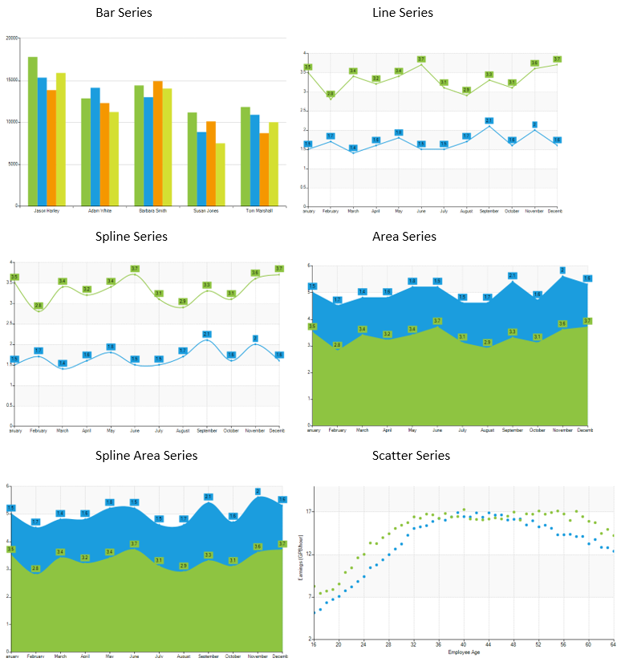

# Series Types

## 

Chart series have two primary functions: (1) they contain a collection of specific data points representing the actual data, and (2) they visualize the data using an internal predefined model determined by the series type. RadChartView supports a number of series types – Bar, Line (Spline), Area (Spline Area), Scatter, Stock, Pie, Donut, Polar, Radar – and each of them can be used only with a certain area type - Categorical, Pie or Polar. The following schema shows the set of series supported by each area type:
        

* __Cartesian Area__ – supports Bar, Line, Area, Ohlc, Candlestick and Scatter series This area sets a standard Cartesian coordinate system where the position of each point on the plane is identified through a pair of values. Series supported in RadChartView’s Cartesian area can be classified in two groups – scatter and categorical. While the former positions its point using two numerical values and, therefore, requires two numerical axes, the latter uses one numerical and one categorical value to plot its data points. The Categorical series you will be able to use with RadChartView are Bar, Line (Spline), Area (Spline Area), Ohlc, Candlestick. Currently the control supports only Scatter point series.
            

* __Pie Area__ – supports Pie, Donut series Unlike all other areas, Pie area does not use axes. It displays each data point as slices with arc size directly proportional to the magnitude of the raw data point’s value. The supported series types are Pie and Donut.
            

* __Polar Area__ – supports Polar (Point, Line, Area) and Radar (Point, Line, Area) series This area setups a polar coordinate system, where each value is positioned using a value-angle couple. Additionally, the Polar area renders Radar series, which splits the polar area into equal-size category sectors.
            

Each series type contains a __DataPoints__ collection that contains specific data points. For example, __Bar__, __Line__ and __Area__ series work with __CategoricalDataPoints__. __Scatter__ and __Pie__ series, however, operate only with __ScatterDataPoints__ and __PieDataPoints__ respectively. Each series type visualizes the data in the best way to present the information stored in its data points. The screenshots below illustrate how each series type is rendered: 

Chart series support both bound and unbound mode. All series contain the following two binding properties - __DataSource__ and __ValueMember__. Once a __DataSource__ is assigned, the __ValueMember__ property is used to resolve the property of the data records visualized by the data points. Different series types introduce additional data binding properties, related to the specific of the contained data. These are __CategoricalMember__, __AngleMember__, __XValueMember__, __YValueMember__. In unbound mode, categorical series can be populated with data manually using the __DataPoints__ collection.
        

A common scenario for RadChartView is to contain several series instances, which could be of different types. For example, you can easily combine derivatives of __CategoricalSeries__ class.
        

The chart series also have a mechanism for combining data points that reside in different series but have the same category. This mechanism is controlled via the __CombineMode__ property. The combine mode can be None, Cluster and Stack.

        

* __None__ means that the series will be plotted independently of each other.

            

* __Cluster__ will display data points in the same category huddled close together.

            

* __Stack__ on the other hand will plot the points on top of each other.

            

* __Stack100__ presents the values of one series as a percentage of the other series
            
