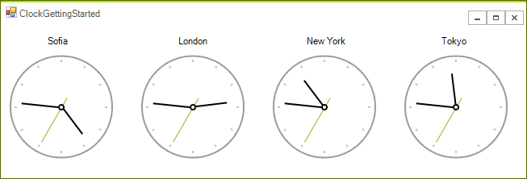

# Getting Started

* To add a __RadClock__ to your form, drag a __RadClock__ from the toolbox onto the surface of the form designer.

* To programmatically add a __RadClock__ to a form, create a new instance of a __RadClock__, and add it to the form __Controls__ collection.

#### Adding a RadClock at runtime 

{{source=..\SamplesCS\Clock\ClockGettingStarted.cs region=CreatingControl}} 
{{source=..\SamplesVB\Clock\ClockGettingStarted.vb region=CreatingControl}} 

````C#
RadClock clock = new RadClock();
this.Controls.Add(clock);

````
````VB.NET
Dim clock As New RadClock()
Me.Controls.Add(clock)

````

{{endregion}} 


The control has three important properties:

* __Value__ - used to get or set the value of the control
            

* __ShowSystemTime__ - indicated whether the control will display the system time
            

* __Offset__ - allows you to set time offset - useful to display different time zones
            

Now let's create a simple application. 
1\. Add four __RadClocks__ to your __RadForm__ and on the top of each, place a label. 
2\. Set the labels text to - *Sofia*, *London*, *New York* and *Tokyo*. 
3\. In the code behind, set the __ShowSystemTime__ property of the first clock (assuming that your system time show the time in Sofia). 
4\. For the rest of the clocks, set their __Offset__ properties to: *-2*, *-6*, *+7*:
        
{{source=..\SamplesCS\Clock\ClockGettingStarted.cs region=gettingStarted}} 
{{source=..\SamplesVB\Clock\ClockGettingStarted.vb region=gettingStarted}} 

````C#
sofiaClock.ShowSystemTime = true;
londonClock.Offset = new TimeSpan(-2, 0, 0);
newYorkClock.Offset = new TimeSpan(-6, 0, 0);
tokyoClock.Offset = new TimeSpan(7, 0, 0);

````
````VB.NET
sofiaClock.ShowSystemTime = True
londonClock.Offset = New TimeSpan(-2, 0, 0)
newYorkClock.Offset = New TimeSpan(7, 0, 0)
tokyoClock.Offset = New TimeSpan(-6, 0, 0)

````

{{endregion}} 


Here is the result:




| RELATED VIDEOS |  |
| ------ | ------ |
|[Getting Started with RadTimePicker and RadClock for WinForms](http://tv.telerik.com/watch/winforms/getting-started-with-radtimepicker-for-winforms)<br>In this video, we are going to demonstrate the new RadTimePicker and RadClock controls as well as several properties you should be aware of.||

# See Also

* [Properties]()
