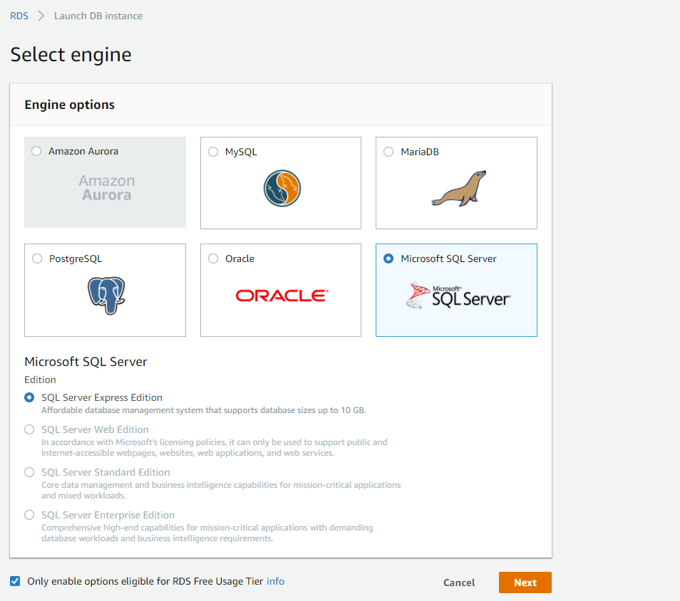
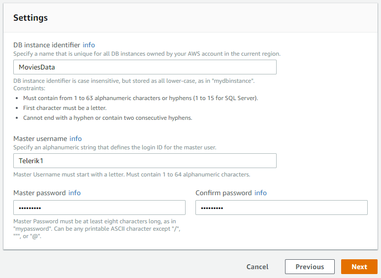
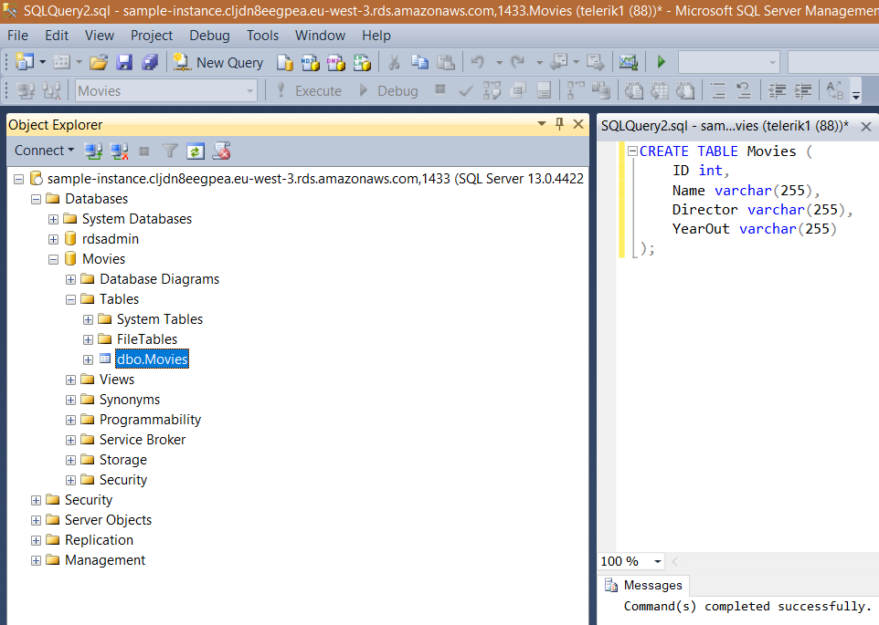
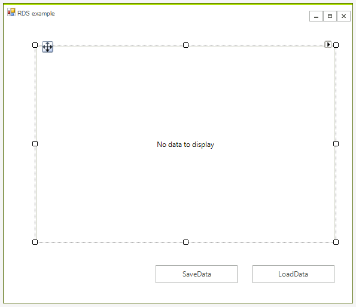

# Relational Database Service (RDS)

# Overview

This article will show you to create a Winforms application and access data stored in the cloud. 

It shows how you can connect to the AWS RDS instance from a blank Winforms project as well. 

## Step 1: Setup a Database

Go to the AWS console and click the RDS link and then click the __Get Started Now__. 


This will lead you to the Selected Engine page. Select *SQL server Express Edition* and click Next. 



On the next screen choose any options you want. For this example we are using the free tier options. Make sure that **Publicly Accessible** option is set to *Yes*.  At the bottom of the page choose database name and specify the user name an password.



Click next and choose any options. Then Click __Launch DB Instance__ and wait until the database is created. Detailed information is available [here](https://docs.aws.amazon.com/AmazonRDS/latest/UserGuide/CHAP_GettingStarted.CreatingConnecting.SQLServer.html).


At this point you are ready to connect to the instance using Microsoft SQL Server Management Studio. Detailed information is available [here](https://docs.aws.amazon.com/AmazonRDS/latest/UserGuide/USER_ConnectToMicrosoftSQLServerInstance.html). 

Once you are connected create a new Database and a new table called *Movies* in it.




## Step 2: Create a WinForms project.

First create the WinForms project, to do that create a blank Telerik UI for WinForms and add a grid and two buttons to it. The application design should look like this:



## Step 3: Install the NuGet package

In Visual Studio open the NuGet package manager and install the RDS module:


In addition you need to add the following to your App.config file:

````XML

<?xml version="1.0" encoding="utf-8" ?>
<configuration>
  <appSettings>
    <add key="AWSProfileName" value="Telerik"/>
    <add key="AWSRegion" value="eu-west-3" />
  </appSettings>
</configuration>

````

>note If you do not have a AWS account in Visual Studio please check [Getting Started]()

## Step 4: 


