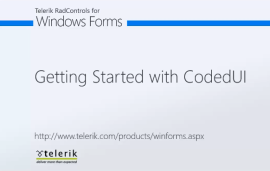
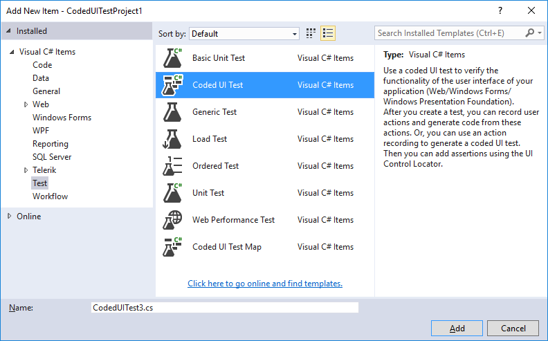
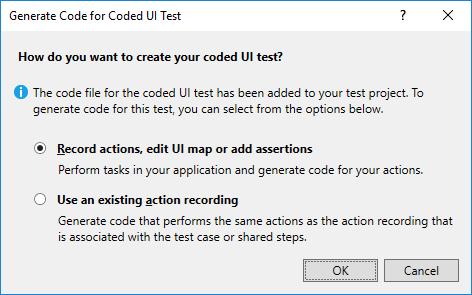
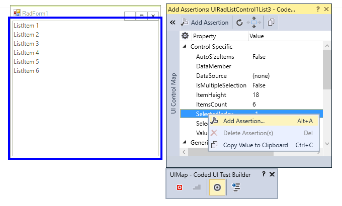
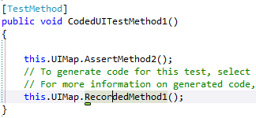
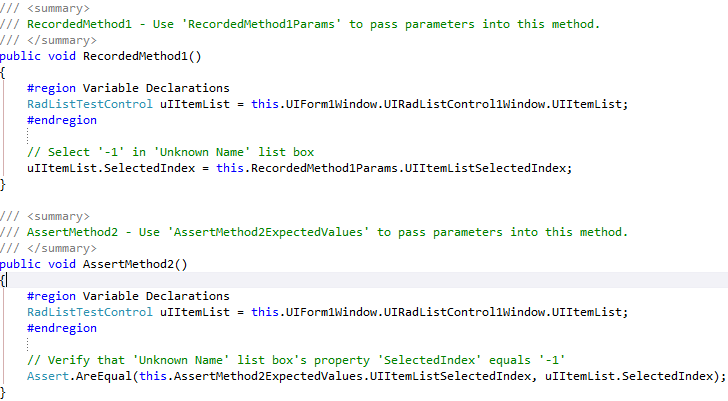

# Getting Started

## 

| RELATED VIDEOS |  |
| ------ | ------ |
|[What is new in Q3 2012 Telerik UI for WinForms](http://tv.telerik.com/watch/radcontrols-for-winforms/what-is-new-in-q3-2012-radcontrols-for-winforms)This webinar examines the new features found in Telerik UI for WinForms. Included in the Q3 2012 release is RadPivotGrid (Beta),
                Coded UI Testing Support, touch, legend and financial charts for RadChartView, Visual Studio 2012 compliance and much much more.
                Get started with Coded UI Test and Telerik UI for WinForms now! (25:02 - 31:32)||
|[
                    Getting Started with Coded UI for WinForms
                  ](http://tv.telerik.com/watch/radcontrols-for-winforms/getting-started-with-coded-ui-for-winforms)Telerik UI for WinForms Q3 2012 introduces full support for Coded UI Tests implementing all four Coded UI Test levels.
                These enhancements are available not only in Visual Studio 2010, but also in the new Visual Studio 2012. Today, we will take
                a look at Getting started with CodedUI testing using Telerik UI for WinForms.||

This article will demonstrate how to create a simple test with RadListControl and CodedUI
        

1. Open the test menu by clicking the Visual Studio __Test > New Test menu__

1. Choose "Coded UI Test" and click OK.
            

1. Select the first option -- "Record actions, edit UI map or add assertions"
            

1. Then, start an application created with Telerik UI for WinForms - in our case this is a form with RadListControl.
            

1. Once the test has been recorded, choose "Generate Code" from the Record window and then add an Assertion from Coded UI Spy
              to check the __SelectedIndex__ property value.
            

1. In the generated code you can see the recorded actions aggregated into corresponding properties sets:
            

1. You can run the test from Visual Studio nenu __Test->Run->Run Test__.
            
