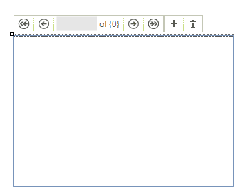

# Getting Started

This tutorial demonstrates how bind __RadDataEntry__ to business object and to a collection of objects.

## Binding RadDataEntry to a single object

1\. Place a __RadDataEntry__ control on a form. 


2\. For the purpose of this tutorial, we will create a new class Employee with a couple of exposed properties
            

{{source=..\SamplesCS\DataEntryAndBindingNavigator\RadDataEntryGettingStarted.cs region=empl1}} 
{{source=..\SamplesVB\DataEntryAndBindingNavigator\RadDataEntryGettingStarted.vb region=empl1}} 

````C#
private class Employee
{
    public string FirstName
    {
        get;
        set;
    }
    public string LastName
    {
        get;
        set;
    }
    public string Occupation
    {
        get;
        set;
    }
    public DateTime StartingDate
    {
        get;
        set;
    }
    public bool IsMarried
    {
        get;
        set;
    }
    public int Salary
    {
        get;
        set;
    }
    public Gender Gender
    {
        get;
        set;
    }
}
private enum Gender
{
    Female,
    Male
}

````
````VB.NET
Private Class Employee
    Public Property FirstName() As String
        Get
            Return m_FirstName
        End Get
        Set(value As String)
            m_FirstName = Value
        End Set
    End Property
    Private m_FirstName As String
    Public Property LastName() As String
        Get
            Return m_LastName
        End Get
        Set(value As String)
            m_LastName = Value
        End Set
    End Property
    Private m_LastName As String
    Public Property Occupation() As String
        Get
            Return m_Occupation
        End Get
        Set(value As String)
            m_Occupation = Value
        End Set
    End Property
    Private m_Occupation As String
    Public Property StartingDate() As DateTime
        Get
            Return m_StartingDate
        End Get
        Set(value As DateTime)
            m_StartingDate = Value
        End Set
    End Property
    Private m_StartingDate As DateTime
    Public Property IsMarried() As Boolean
        Get
            Return m_IsMarried
        End Get
        Set(value As Boolean)
            m_IsMarried = Value
        End Set
    End Property
    Private m_IsMarried As Boolean
    Public Property Salary() As Integer
        Get
            Return m_Salary
        End Get
        Set(value As Integer)
            m_Salary = Value
        End Set
    End Property
    Private m_Salary As Integer
    Public Property Gender() As Gender
        Get
            Return m_Gender
        End Get
        Set(value As Gender)
            m_Gender = Value
        End Set
    End Property
    Private m_Gender As Gender
End Class
Private Enum Gender
    Female
    Male
End Enum

````

{{endregion}} 


3\. Once the class Employee is defined, you may use it for creating an object of this type and bind it to the <b>RadDataEntry</b> control: 
	
{{source=..\SamplesCS\DataEntryAndBindingNavigator\RadDataEntryGettingStarted.cs region=bind1}} 
{{source=..\SamplesVB\DataEntryAndBindingNavigator\RadDataEntryGettingStarted.vb region=bind1}} 

````C#
this.radDataEntry1.DataSource = new Employee() 
{ 
    FirstName = "Sarah",
    LastName = "Blake",
    Occupation = "Supplied Manager", 
    StartingDate = new DateTime(2005, 04, 12),
    IsMarried = true, 
    Salary = 3500, Gender = Gender.Female 
};

````
````VB.NET
Me.radDataEntry1.DataSource = New Employee() With { _
  .FirstName = "Sarah", _
  .LastName = "Blake", _
  .Occupation = "Supplied Manager", _
  .StartingDate = New DateTime(2005, 4, 12), _
  .IsMarried = True, _
  .Salary = 3500, _
  .Gender = Gender.Female _
 }

````

{{endregion}} 

4\. Press <b>F5</b> to run the project and you should see the following:
 


>note  In case you want to be notified for changes made on the data item, the class Employee should implement [INotifyPropertyChanged ]( http://msdn.microsoft.com/en-us/library/system.componentmodel.inotifypropertychanged%28v=vs.110%29.aspx ) Interface and raise the  __PropertyChanged__  event every time a property value changes.
 
##  Binding RadDataEntry to collection from objects
      

The following tutorial will demonstrate how to bind __RadDataEntry__ to a collection of objects and navigate through it. In order to navigate through the collection we will use  [RadBindingNavigator](). __RadBindingNavigator__ is designed to use as data source a [ BindingSource ]( http://msdn.microsoft.com/en-us/library/system.windows.forms.bindingsource%28v=vs.110%29.aspx ) component. 
        

1\. Place __RadDataEntry__, __RadBindingNavigator__  and a BindingSource component on a form. Dock the navigator to *Top* and the data entry to *Fill*.
 


2\. Create List of business objects and set it as data source of BindingSource.
             
{{source=..\SamplesCS\DataEntryAndBindingNavigator\RadDataEntryGettingStarted2.cs region=bind2}} 
{{source=..\SamplesVB\DataEntryAndBindingNavigator\RadDataEntryGettingStarted2.vb region=bind2}} 

````C#
List<Employee> employees = new List<Employee>();
employees.Add(new Employee() { FirstName = "Sarah", LastName = "Blake", Occupation = "Supplied Manager", StartingDate = new DateTime(2005, 04, 12), IsMarried = true, Salary = 3500, Gender = Gender.Female });
employees.Add(new Employee() { FirstName = "Jane", LastName = "Simpson", Occupation = "Security", StartingDate = new DateTime(2008, 12, 03), IsMarried = true, Salary = 2000, Gender = Gender.Female });
employees.Add(new Employee() { FirstName = "John", LastName = "Peterson", Occupation = "Consultant", StartingDate = new DateTime(2005, 04, 12), IsMarried = false, Salary = 2600, Gender = Gender.Male });
employees.Add(new Employee() { FirstName = "Peter", LastName = "Bush", Occupation = "Cashier", StartingDate = new DateTime(2005, 04, 12), IsMarried = true, Salary = 2300, Gender = Gender.Male });
this.bindingSource1.DataSource = employees;

````
````VB.NET
Dim employees As New List(Of Employee)()
employees.Add(New Employee() With { _
 .FirstName = "Sarah", _
 .LastName = "Blake", _
 .Occupation = "Supplied Manager", _
 .StartingDate = New DateTime(2005, 4, 12), _
 .IsMarried = True, _
 .Salary = 3500, _
 .Gender = Gender.Female _
})
employees.Add(New Employee() With { _
 .FirstName = "Jane", _
 .LastName = "Simpson", _
 .Occupation = "Security", _
 .StartingDate = New DateTime(2008, 12, 3), _
 .IsMarried = True, _
 .Salary = 2000, _
 .Gender = Gender.Female _
})
employees.Add(New Employee() With { _
 .FirstName = "John", _
 .LastName = "Peterson", _
 .Occupation = "Consultant", _
 .StartingDate = New DateTime(2005, 4, 12), _
 .IsMarried = False, _
 .Salary = 2600, _
 .Gender = Gender.Male _
})
employees.Add(New Employee() With { _
  .FirstName = "Peter", _
  .LastName = "Bush", _
  .Occupation = "Cashier", _
  .StartingDate = New DateTime(2005, 4, 12), _
  .IsMarried = True, _
  .Salary = 2300, _
  .Gender = Gender.Male _
})
Me.bindingSource1.DataSource = employees

````

{{endregion}} 
 
3\. Set this __BindingSource__ to __RadBindingNavigator__ and __RadDataEntry__.
            

{{source=..\SamplesCS\DataEntryAndBindingNavigator\RadDataEntryGettingStarted2.cs region=bind3}} 
{{source=..\SamplesVB\DataEntryAndBindingNavigator\RadDataEntryGettingStarted2.vb region=bind3}} 

````C#
this.radDataEntry1.DataSource = this.bindingSource1;
this.radBindingNavigator1.BindingSource = this.bindingSource1;

````
````VB.NET
Me.radDataEntry1.DataSource = Me.bindingSource1
Me.radBindingNavigator1.BindingSource = Me.bindingSource1

````

{{endregion}} 


4\. Press __F5__ to run the project and you should see the following:
 

