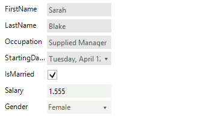

# Change auto generated editor

By default __RadDataEntry__ generates several different editors according to the data type of the property that it should edit. The following table demonstrates the default editors that __RadDataEntry__ can create.
 
|enum|RadDropDownList|
|----|----|
|DateTime|RadDateTimePicker|
|Boolean|RadCheckBox|
|Color|RadColorBox|
|Image|PictureBox|
|string|RadTextBox|

>note For any type that is not represented in this table  __RadDataEntry__  generates  __RadTextBox__ .
 

In the following example it will be demonstrated how to change default editor with the custom one.
        

1\. For the purpose of this tutorial, we will create a new class Employee with a couple of exposed properties. By binding __RadDataEntry__ to object from this type we will generate several items.
            

{{source=..\SamplesCS\DataEntryAndBindingNavigator\RadDataEntryGettingStarted.cs region=empl1}} 
{{source=..\SamplesVB\DataEntryAndBindingNavigator\RadDataEntryGettingStarted.vb region=empl1}} 

````C#
private class Employee
{
    public string FirstName
    {
        get;
        set;
    }
    public string LastName
    {
        get;
        set;
    }
    public string Occupation
    {
        get;
        set;
    }
    public DateTime StartingDate
    {
        get;
        set;
    }
    public bool IsMarried
    {
        get;
        set;
    }
    public int Salary
    {
        get;
        set;
    }
    public Gender Gender
    {
        get;
        set;
    }
}
private enum Gender
{
    Female,
    Male
}

````
````VB.NET
Private Class Employee
    Public Property FirstName() As String
        Get
            Return m_FirstName
        End Get
        Set(value As String)
            m_FirstName = Value
        End Set
    End Property
    Private m_FirstName As String
    Public Property LastName() As String
        Get
            Return m_LastName
        End Get
        Set(value As String)
            m_LastName = Value
        End Set
    End Property
    Private m_LastName As String
    Public Property Occupation() As String
        Get
            Return m_Occupation
        End Get
        Set(value As String)
            m_Occupation = Value
        End Set
    End Property
    Private m_Occupation As String
    Public Property StartingDate() As DateTime
        Get
            Return m_StartingDate
        End Get
        Set(value As DateTime)
            m_StartingDate = Value
        End Set
    End Property
    Private m_StartingDate As DateTime
    Public Property IsMarried() As Boolean
        Get
            Return m_IsMarried
        End Get
        Set(value As Boolean)
            m_IsMarried = Value
        End Set
    End Property
    Private m_IsMarried As Boolean
    Public Property Salary() As Integer
        Get
            Return m_Salary
        End Get
        Set(value As Integer)
            m_Salary = Value
        End Set
    End Property
    Private m_Salary As Integer
    Public Property Gender() As Gender
        Get
            Return m_Gender
        End Get
        Set(value As Gender)
            m_Gender = Value
        End Set
    End Property
    Private m_Gender As Gender
End Class
Private Enum Gender
    Female
    Male
End Enum

````

{{endregion}} 

{{source=..\SamplesCS\DataEntryAndBindingNavigator\RadDataEntryGettingStarted.cs region=bind1}} 
{{source=..\SamplesVB\DataEntryAndBindingNavigator\RadDataEntryGettingStarted.vb region=bind1}} 

````C#
this.radDataEntry1.DataSource = new Employee() 
{ 
    FirstName = "Sarah",
    LastName = "Blake",
    Occupation = "Supplied Manager", 
    StartingDate = new DateTime(2005, 04, 12),
    IsMarried = true, 
    Salary = 3500, Gender = Gender.Female 
};

````
````VB.NET
Me.radDataEntry1.DataSource = New Employee() With { _
  .FirstName = "Sarah", _
  .LastName = "Blake", _
  .Occupation = "Supplied Manager", _
  .StartingDate = New DateTime(2005, 4, 12), _
  .IsMarried = True, _
  .Salary = 3500, _
  .Gender = Gender.Female _
 }

````

{{endregion}} 


2\. To change the default __RadTextBox__ editor of the “Salary” property with __RadMaskedEditBox__ we will subscribe to *EditorInitializing* event of __RadDataEntry__.
           
{{source=..\SamplesCS\DataEntryAndBindingNavigator\RadDataEntryHowTo.cs region=EditorInitializing}} 
{{source=..\SamplesVB\DataEntryAndBindingNavigator\RadDataEntryHowTo.vb region=EditorInitializing}} 

````C#
void radDataEntry1_EditorInitializing(object sender, Telerik.WinControls.UI.EditorInitializingEventArgs e)
{
    if (e.Property.Name == "Salary")
    {
        RadMaskedEditBox radMaskedEditBox = new RadMaskedEditBox();
        radMaskedEditBox.MaskType = MaskType.Numeric;
        radMaskedEditBox.MaskedEditBoxElement.StretchVertically = true;
        e.Editor = radMaskedEditBox;
    }
}

````
````VB.NET
Private Sub radDataEntry1_EditorInitializing(sender As Object, e As Telerik.WinControls.UI.EditorInitializingEventArgs)
    If e.[Property].Name = "Salary" Then
        Dim radMaskedEditBox As New RadMaskedEditBox()
        radMaskedEditBox.MaskType = MaskType.Numeric
        radMaskedEditBox.MaskedEditBoxElement.StretchVertically = True
        e.Editor = radMaskedEditBox
    End If
End Sub

````

{{endregion}} 




3\. To achieve working binding for this new editor we should subscribe to the *BindingCreated* event where we will subscribe to the *Parse* event of the Binding object. You can read more about *Format* and *Parse* events of Binding object and why we should use them [here](http://msdn.microsoft.com/en-us/library/system.windows.forms.binding_events%28v=vs.110%29.aspx).
          

{{source=..\SamplesCS\DataEntryAndBindingNavigator\RadDataEntryHowTo.cs region=BindingCreated}} 
{{source=..\SamplesVB\DataEntryAndBindingNavigator\RadDataEntryHowTo.vb region=BindingCreated}} 

````C#
void radDataEntry1_BindingCreated(object sender, BindingCreatedEventArgs e)
{
    if (e.DataMember == "Salary")
    {
        e.Binding.Parse += new ConvertEventHandler(Binding_Parse);
    }
}
void Binding_Parse(object sender, ConvertEventArgs e)
{
    int salary = int.Parse(e.Value.ToString(), NumberStyles.Currency);
    e.Value = salary;
}

````
````VB.NET
Private Sub radDataEntry1_BindingCreated(sender As Object, e As BindingCreatedEventArgs)
    If e.DataMember = "Salary" Then
        AddHandler e.Binding.Parse, AddressOf Binding_Parse
    End If
End Sub
Private Sub Binding_Parse(sender As Object, e As ConvertEventArgs)
    Dim salary As Integer = Integer.Parse(e.Value.ToString(), NumberStyles.Currency)
    e.Value = salary
End Sub

````

{{endregion}} 

# See Also

 * [Structure]()
 * [Getting Started]()
 * [Properties, events and attributes]()
 * [Themes]()
 * [Change the editor to RadDropDownList]()

