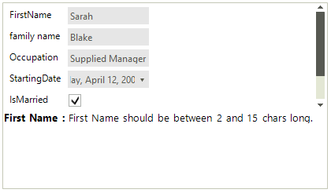
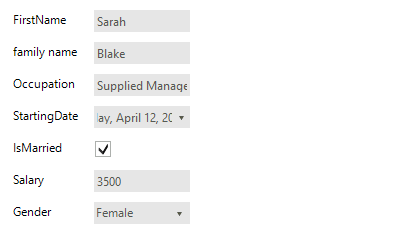
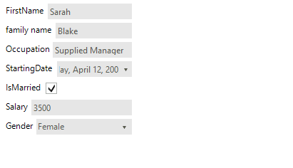

# Properties, events and attributes


## Properties:

The main purpose of __RadDataEntry__ is to generate editors according to the object properties and to create simple data bindings for them. For this reason, most of the control properties will take effect only if they are set __before setting the DataSource.__

* The most important property of __RadDataEntry__ is __DataSource__. Through this property user can set the business object or a collection of objects that should be editing. When this property is set __RadDataEntry__ generates editors for each public property which does not have its __Browsable__ attribute set to *false.* 

{{source=..\SamplesCS\DataEntryAndBindingNavigator\RadDataEntryGettingStarted.cs region=bind1}} 
{{source=..\SamplesVB\DataEntryAndBindingNavigator\RadDataEntryGettingStarted.vb region=bind1}} 

````C#
this.radDataEntry1.DataSource = new Employee() 
{ 
    FirstName = "Sarah",
    LastName = "Blake",
    Occupation = "Supplied Manager", 
    StartingDate = new DateTime(2005, 04, 12),
    IsMarried = true, 
    Salary = 3500, Gender = Gender.Female 
};

````
````VB.NET
Me.radDataEntry1.DataSource = New Employee() With { _
  .FirstName = "Sarah", _
  .LastName = "Blake", _
  .Occupation = "Supplied Manager", _
  .StartingDate = New DateTime(2005, 4, 12), _
  .IsMarried = True, _
  .Salary = 3500, _
  .Gender = Gender.Female _
 }

````

{{endregion}} 


* The __ColumnCount__ property controls the amount of columns that __RadDataEntry__ will use to arrange generated controls. Default value is 1 
 
{{source=..\SamplesCS\DataEntryAndBindingNavigator\RadDataEntryProgram.cs region=NumberOfColumns}} 
{{source=..\SamplesVB\DataEntryAndBindingNavigator\RadDataEntryProgram.vb region=NumberOfColumns}} 

````C#
this.radDataEntry1.ColumnCount = 2;

````
````VB.NET
Me.radDataEntry1.ColumnCount = 2

````

{{endregion}} 


* The __FitToParentWidth__ property controls whether the generated editors should fit their width to width of the __RadDataEntry__. Default Value is *false*. 

{{source=..\SamplesCS\DataEntryAndBindingNavigator\RadDataEntryProgram.cs region=FitToParentWidth}} 
{{source=..\SamplesVB\DataEntryAndBindingNavigator\RadDataEntryProgram.vb region=FitToParentWidth}} 

````C#
this.radDataEntry1.FitToParentWidth = true;

````
````VB.NET
Me.radDataEntry1.FitToParentWidth = True

````

{{endregion}} 


* The __ShowValidationPanel__ property controls the visibility of validation panel. Please note that this property will change the visibility of panel if only there are controls inside it. By default this panel is disabled.
            

{{source=..\SamplesCS\DataEntryAndBindingNavigator\RadDataEntryProgram.cs region=ShowValidationPanel}} 
{{source=..\SamplesVB\DataEntryAndBindingNavigator\RadDataEntryProgram.vb region=ShowValidationPanel}} 

````C#
this.radDataEntry1.ShowValidationPanel = true;
RadLabel label = new RadLabel();
label.Name = "First Name";
label.Text = "<html><size=10><b>First Name : </b>First Name should be between 2 and 15 chars long.";
label.Dock = DockStyle.Top;
label.AutoSize = false;
label.BackColor = Color.Transparent;
this.radDataEntry1.ValidationPanel.PanelContainer.Controls.Add(label);

````
````VB.NET
Me.radDataEntry1.ShowValidationPanel = True
Dim label As New RadLabel()
label.Name = "First Name"
label.Text = "<html><size=10><b>First Name : </b>First Name should be between 2 and 15 chars long."
label.Dock = DockStyle.Top
label.AutoSize = False
label.BackColor = Color.Transparent
Me.radDataEntry1.ValidationPanel.PanelContainer.Controls.Add(label)

````

{{endregion}} 




* The __FlowDirection__ controls the direction the editors will be generated when the __ColumnCount__ property has value bigger than 1. 

{{source=..\SamplesCS\DataEntryAndBindingNavigator\RadDataEntryProgram.cs region=FillingOrder1}} 
{{source=..\SamplesVB\DataEntryAndBindingNavigator\RadDataEntryProgram.vb region=FillingOrder1}} 

````C#
this.radDataEntry1.ColumnCount = 2;
this.radDataEntry1.FlowDirection = FlowDirection.TopDown;

````
````VB.NET
Me.radDataEntry1.ColumnCount = 2
Me.radDataEntry1.FlowDirection = FlowDirection.TopDown

````

{{endregion}} 


* The __ItemSpace__ property controls the space that between the generated items. Default value is 5 pixels.
           

{{source=..\SamplesCS\DataEntryAndBindingNavigator\RadDataEntryProgram.cs region=ItemSpace}} 
{{source=..\SamplesVB\DataEntryAndBindingNavigator\RadDataEntryProgram.vb region=ItemSpace}} 

````C#
this.radDataEntry1.ItemSpace = 10;

````
````VB.NET
Me.radDataEntry1.ItemSpace = 10

````

{{endregion}} 




* The __ItemDefaultSize__ property sets the size that generated items should have if __FitToParentWidth__ property has value *false*. When property the __FitToParentWidth__ has value *true* the width of items are calculated according the width of the __RadDataEntry__ control and the number of the columns. In this case the width defined with __ItemDefaultSize__ is ignored. 

{{source=..\SamplesCS\DataEntryAndBindingNavigator\RadDataEntryProgram.cs region=ItemDefaultSize}} 
{{source=..\SamplesVB\DataEntryAndBindingNavigator\RadDataEntryProgram.vb region=ItemDefaultSize}} 

````C#
this.radDataEntry1.ItemDefaultSize = new Size(300, 30);

````
````VB.NET
Me.radDataEntry1.ItemDefaultSize = New Size(300, 30)

````

{{endregion}} 


* In __RadDataEntry__ control there is logic that arranges the labels of the editors in one column according to the longest text. This logic can be controlled by the __AutoSizeLabels__ property. By default the property value is false and the labels width will equals the longest label width. If you set this property to true, the labels will be sized according to their content, as shown on the following figure: 

{{source=..\SamplesCS\DataEntryAndBindingNavigator\RadDataEntryProgram.cs region=ResizeLabels}} 
{{source=..\SamplesVB\DataEntryAndBindingNavigator\RadDataEntryProgram.vb region=ResizeLabels}} 

````C#
this.radDataEntry1.AutoSizeLabels = false;

````
````VB.NET
Me.radDataEntry1.AutoSizeLabels = False

````

{{endregion}} 




## Events:

There are several events that you will find useful in the context of __RadDataEntry__:
        

__EditorInitializing__ - Occurs when editor is being initialized. This event is cancelable. In this event you can change the default editors with custom ones.
        

__EditorInitialized__  - Occurs when the editor is Initialized.
        

__BindingCreating__ - Occurs when a binding object for an editor is about to be created. This event is cancelable.
        

__BindingCreated__ - Occurs when binding object is created.
        

__ItemInitializing__ – this event is firing when the panel that contains the label, editor and validation label is about to be Initialized. This event is cancelable.
        

__ItemInitialized__ - occurs the item is already Initialized.
        

__ItemValidating__ – this event is fired when any of the generated editors fires its Validating event.
        

__ItemValidated__ – this event is fired when any of the generated editors fires its Validated event.
        

## Attributes:

__RadDataEntry__ has support for several attributes that can be used to change the behavior of the control.
        

With the __Browsable__ attribute users can easily control which properties should be displayed 

{{source=..\SamplesCS\DataEntryAndBindingNavigator\RadDataEntryProgram.cs region=Browsable}} 
{{source=..\SamplesVB\DataEntryAndBindingNavigator\RadDataEntryProgram.vb region=Browsable}} 

````C#
[Browsable(false)]
public string PhoneNumber
{
    get;
    set;
}

````
````VB.NET
<Browsable(False)> _
Public Property PhoneNumber() As String
    Get
        Return m_PhoneNumber
    End Get
    Set(value As String)
        m_PhoneNumber = Value
    End Set
End Property
Private m_PhoneNumber As String

````

{{endregion}} 


The __DisplayName__ attribute defines what text should be displayed in the label that is associated with the editor. 

{{source=..\SamplesCS\DataEntryAndBindingNavigator\RadDataEntryProgram.cs region=DisplayName}} 
{{source=..\SamplesVB\DataEntryAndBindingNavigator\RadDataEntryProgram.vb region=DisplayName}} 

````C#
//[DisplayName("family name")]
public string LastName
{
    get;
    set;
}

````
````VB.NET
<DisplayName("family name")> _
Public Property LastName() As String
    Get
        Return m_LastName
    End Get
    Set(value As String)
        m_LastName = Value
    End Set
End Property
Private m_LastName As String

````

{{endregion}} 


With __RadRangeAttribute__ attribute users can define range that can be used into validation process. This attribute is provided in validation events. 

{{source=..\SamplesCS\DataEntryAndBindingNavigator\RadDataEntryProgram.cs region=RadRange}} 
{{source=..\SamplesVB\DataEntryAndBindingNavigator\RadDataEntryProgram.vb region=RadRange}} 

````C#
[RadRange(1500,2000)]
public int Salary
{
    get;
    set;
}

````
````VB.NET
<RadRange(1500, 2000)> _
Public Property Salary() As Integer
    Get
        Return m_Salary
    End Get
    Set(value As Integer)
        m_Salary = Value
    End Set
End Property
Private m_Salary As Integer

````

{{endregion}} 


