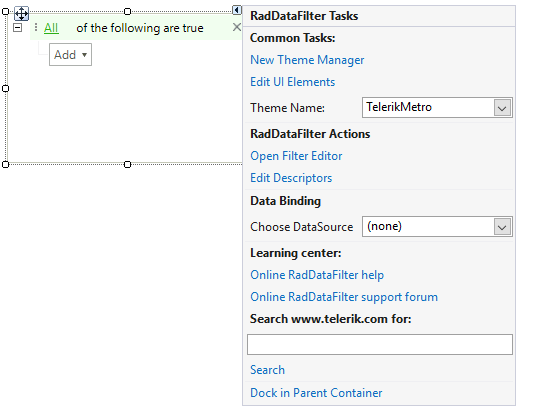
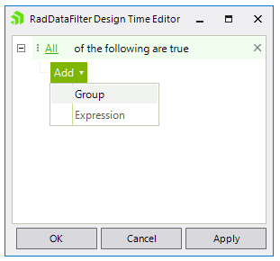
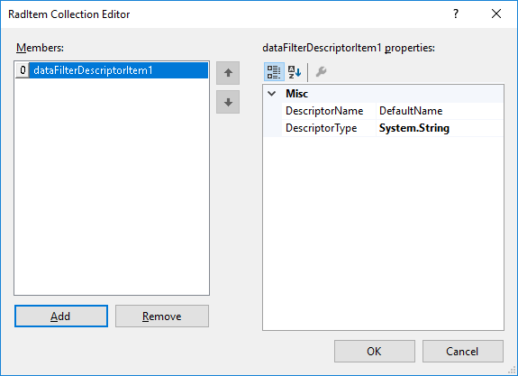
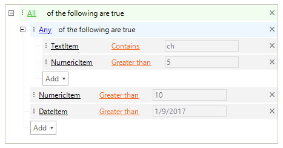

# Design Time 

To start using **RadDataFilter** just drag it from the toolbox and drop it at the form.
 
## Smart Tag

Select **RadDataFilter** and click the small arrow on the top right position in order to open the __Smart Tag__. The __Smart Tag__ for **RadDataFilter** lets you quickly access common tasks involved with building **RadDataFilter** elements and customizing appearance through themes.

>caption Figure 1: Smart Tag

* __New Theme Manager__: adds a new __RadThemeManager__ component to the form.
            
* __Edit UI Elements__: allows setting properties at multiple levels of the class hierarchy.
            
* __Theme Name__ – allows you to set the theme for the control.
 
* __Open Filter Editor__ – opens the *RadDataFilter Design Time Editor* which allows to add filter descriptors.

>caption Figure 2: RadDataFilter Design Time Editor

* __Edit Descriptors__ – opens the *RadItem Collection Editor* which allows you to add/remove/modify **DataFilterDescriptorItems** specifying the **DescriptorName** and **DescriptorType**.

* __Choose DataSource__ – sets the source collection. It accepts **DataTable**, **DataSet** and **BindingSource**.
           
* __Learning Center__: Navigate to the Telerik help, code library projects or support forum.

* __Search__: Search the Telerik site for a given string.    

## Adding DataFilterDescriptorItems

The *RadItem Collection Editor* can be shown either via the **Smart Tag** or by the **Descriptors** property in the *Properties* section in Visual Studio. Thus, you can add/remove/modify **DataFilterDescriptorItems**:

>caption Figure 3: Descriptors collection

 

>caption Figure 4: RadItem Collection Editor

 

After you already have some **DataFilterDescriptorItems**, you can add a *Group* or an *Expression* for composing the desired filters. The logical operation is controlled by the *Any* or *All* root node.

>caption Figure 5: Applied filters

 

>caption Figure 6: Logical operator

 

# See Also

* [Getting Started]()	
* [Structure]()	