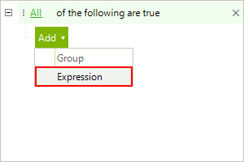
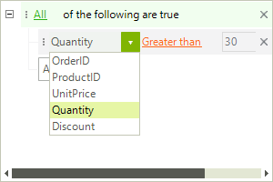

# End-user Functionality

__RadDataFilter__ allows you to create complex filter criteria within unlimited number of filter conditions combined by logical operators. The following article will show you how to create filter expressions. Start with the firs section which shows how you can add filter conditions. the second section explains how you can combine the conditions.

## Adding Expressions

To create a filter condition you need to define the __Column/Field__, the operator (__AND__ or __OR__) and the __Value__. For instance, __'Quantity > 200'__ is a simple filter condition, where the __Quantity__ is a column/field name, __'>'__ is the "greater than" operator and __'200'__ is the value. Here is how to create this condition using the RadDataFilter user interface. 

1. If no filtering has been applied, __RadDataFilter__ will contain the root operator only. 
    

2. To add your first filter criteria - click the Add button and select __Expression__. It will create a new row with several elements.

     

3. Once the expression item is added you need to set the column/field, the operator and the value.

     

The first DropDown contains all the data fields/columns of the data source, to which RadDataFilter is bound. They are automatically populated, so you do not need to do any code to get them. The second DropDown shows the available logical operators that could be applied against the type of the selected field. For example the text field will have the __Contains__ or __Starts With__ operators, while the DateTime field will have __Is Greater Than__ operators.

## Adding Groups

The groups are allowing you to define the relation between the conditions  or groups inside it. There are two possible values that can be used as a group operator - __All__ and __Any__. If the __All__ operator is used all the condition within the group must be fulfilled in order the entry to pass the filter condition. If the Any operator is used the entry must fulfill only one of the conditions.  

By default the control always has one root group that can contain expressions or other groups. 

The following example shows a single group with two filter expressions in it. If the firs OR the second condition are met the entry will fulfill the criteria. 
    

If you change the condition all the filter expressions must be fulfilled. Here is an example for this as well.
    

# See Also 
* [Getting Started]()

