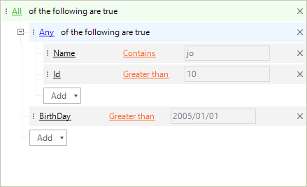

# Formatting Nodes

__RadDataFilter__ is a virtualized control reusing its visual elements. It exposes a __NodeFormatting__ event with which its nodes can be easily accessed and customized. The arguments of this event also return the associated data node providing information about the applied descriptor.

>note Please note that you should always provide an '*else*' clause for each '*if*' clause that you have in the implementation of the NodeFormatting event. Skipping this operation will lead to incorrect images applied to the inappropriate nodes.
>

## Formatting Group Nodes

Group nodes can be formatted to handle custom scenarios. The root node in the example below has its expander item hidden.

>caption Figure 1: Hidden Expander Item



#### Group Nodes

{{source=..\SamplesCS\DataFilter\DataFilterWorkingWithNodes.cs region=GroupNodes}} 
{{source=..\SamplesVB\DataFilter\DataFilterWorkingWithNodes.vb region=GroupNodes}}
````C#
private void radDataFilter1_NodeFormatting(object sender, TreeNodeFormattingEventArgs e)
{
    DataFilterGroupElement dataGroupFilterElement = e.NodeElement as DataFilterGroupElement;
    if (dataGroupFilterElement != null && dataGroupFilterElement.IsRootNode)
    {
        dataGroupFilterElement.ExpanderElement.Visibility = ElementVisibility.Collapsed;
    }
    else
    {
        e.NodeElement.ResetValue(LightVisualElement.VisibilityProperty, ValueResetFlags.Local);
    }
}

````
````VB.NET
Private Sub radDataFilter1_NodeFormatting(sender As Object, e As TreeNodeFormattingEventArgs)
    Dim dataGroupFilterElement As DataFilterGroupElement = TryCast(e.NodeElement, DataFilterGroupElement)
    If dataGroupFilterElement IsNot Nothing AndAlso dataGroupFilterElement.IsRootNode Then
        dataGroupFilterElement.ExpanderElement.Visibility = ElementVisibility.Collapsed
    Else
        e.NodeElement.ResetValue(LightVisualElement.VisibilityProperty, ValueResetFlags.Local)
    End If
End Sub

````


{{endregion}}

## Formatting Expression Nodes

The appearance of certain expression nodes can also be modified to change their visual appearance. 

>caption Figure 2: Changed Back Color


#### Expression Nodes

{{source=..\SamplesCS\DataFilter\DataFilterWorkingWithNodes.cs region=ExpressionNodes}} 
{{source=..\SamplesVB\DataFilter\DataFilterWorkingWithNodes.vb region=ExpressionNodes}}
````C#
private void radDataFilter1_NodeFormatting1(object sender, TreeNodeFormattingEventArgs e)
{
    DataFilterCriteriaElement dataExpressionFilterElement = e.NodeElement as DataFilterCriteriaElement;
    if (dataExpressionFilterElement != null && dataExpressionFilterElement.CriteriaNode.Descriptor.PropertyName == "Name")
    {
        dataExpressionFilterElement.ContentElement.BackColor = Color.LightBlue;
    }
    else
    {
        e.NodeElement.ResetValue(LightVisualElement.BackColorProperty, ValueResetFlags.Local);
    }
}

````
````VB.NET
Private Sub radDataFilter1_NodeFormatting1(sender As Object, e As TreeNodeFormattingEventArgs)
    Dim dataExpressionFilterElement As DataFilterCriteriaElement = TryCast(e.NodeElement, DataFilterCriteriaElement)
    If dataExpressionFilterElement IsNot Nothing AndAlso dataExpressionFilterElement.CriteriaNode.Descriptor.PropertyName = "Name" Then
        dataExpressionFilterElement.ContentElement.BackColor = Color.LightBlue
    Else
        e.NodeElement.ResetValue(LightVisualElement.BackColorProperty, ValueResetFlags.Local)
    End If
End Sub

````


{{endregion}}

## Formatting Button Node

The button responsible for adding a new expression can also be customized in a formatting event.  

>caption Figure 3: Add Button Text


#### Expression Nodes

{{source=..\SamplesCS\DataFilter\DataFilterWorkingWithNodes.cs region=AddButton}} 
{{source=..\SamplesVB\DataFilter\DataFilterWorkingWithNodes.vb region=AddButton}}
````C#
private void radDataFilter1_NodeFormatting2(object sender, TreeNodeFormattingEventArgs e)
{
    DataFilterAddNodeElement dataAddNodeElement = e.NodeElement as DataFilterAddNodeElement;
    if (dataAddNodeElement != null && dataAddNodeElement.DropDownButton.Text == "Add")
    {
        dataAddNodeElement.DropDownButton.Text = "Add Filter";
    }
    else
    {
        e.NodeElement.ResetValue(LightVisualElement.VisibilityProperty, ValueResetFlags.Local);
    }
}

````
````VB.NET
Private Sub radDataFilter1_NodeFormatting2(sender As Object, e As TreeNodeFormattingEventArgs)
    Dim dataAddNodeElement As DataFilterAddNodeElement = TryCast(e.NodeElement, DataFilterAddNodeElement)
    If dataAddNodeElement IsNot Nothing AndAlso dataAddNodeElement.DropDownButton.Text = "Add" Then
        dataAddNodeElement.DropDownButton.Text = "Add Filter"
    Else
        e.NodeElement.ResetValue(LightVisualElement.VisibilityProperty, ValueResetFlags.Local)
    End If
End Sub

````


{{endregion}}


# See Also

* [Getting Started ]()
* [Adding and Removing Filter Nodes]()
* [Finding Nodes]()
* [Unbound Mode]()	
* [Data Binding]()	
