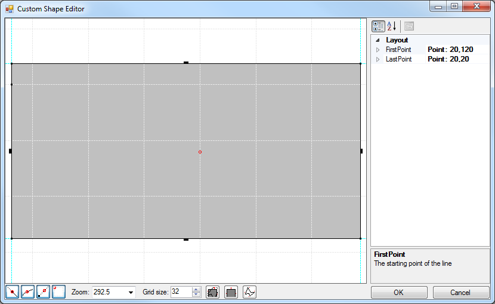

# Custom shapes


This tutorial will guide you through the task of creating a custom shape.

## Creating custom shapes programmatically

In order to create a custom shape, you need to define a custom shape class deriving from the __ElementShape__ class. Overriding its __CreatePath__ method you can define the desired shape. Afterwards, you need to apply your shape implementation to the RadDiagramShape.__ElementShape__ property: 

{{source=..\SamplesCS\Diagram\DiagramCustomShapes.cs region=MyShape}} 
{{source=..\SamplesVB\Diagram\DiagramCustomShapes.vb region=MyShape}} 

````C#
    
public class MyShape : ElementShape
{
    public override GraphicsPath CreatePath(System.Drawing.Rectangle bounds)
    {
        GraphicsPath path = new GraphicsPath();
        path.AddString("Custom", new System.Drawing.FontFamily("Arial"), 0, bounds.Width, Point.Empty, StringFormat.GenericTypographic);
        return path;
    }
}

````
````VB.NET
Public Class MyShape
Inherits ElementShape
    Public Overrides Function CreatePath(bounds As System.Drawing.Rectangle) As GraphicsPath
        Dim path As New GraphicsPath()
        path.AddString("Custom", New System.Drawing.FontFamily("Arial"), 0, bounds.Width, Point.Empty, StringFormat.GenericTypographic)
        Return path
    End Function
End Class

````

{{endregion}} 
 

{{source=..\SamplesCS\Diagram\DiagramCustomShapes.cs region=ApplyCustomShape}} 
{{source=..\SamplesVB\Diagram\DiagramCustomShapes.vb region=ApplyCustomShape}} 

````C#
            
RadDiagramShape shape1 = new RadDiagramShape()
{
    ShapeText = "",
    ElementShape = new MyShape(),
    InternalElementColor = System.Drawing.Color.LightBlue
};
shape1.Position = new Telerik.Windows.Diagrams.Core.Point(100, 80);
radDiagram1.AddShape(shape1);

````
````VB.NET
Dim shape1 As New RadDiagramShape() With { _
    .ShapeText = "", _
    .ElementShape = New MyShape(), _
    .InternalElementColor = System.Drawing.Color.LightBlue _
}
shape1.Position = New Telerik.Windows.Diagrams.Core.Point(100, 80)
'#Region ""
RadDiagram1.AddShape(shape1)
End Sub
'#Region "MyShape"
Public Class MyShape
Inherits ElementShape
Public Overrides Function CreatePath(bounds As System.Drawing.Rectangle) As GraphicsPath
    Dim path As New GraphicsPath()
    path.AddString("Custom", New System.Drawing.FontFamily("Arial"), 0, bounds.Width, Point.Empty, StringFormat.GenericTypographic)
    Return path
End Function
End Class

````

{{endregion}} 


## Creating custom shapes by the Custom Shape Editor

When you open the RadDiagram Property Builder from the Smart Tag and drag a shape from the toolbox you can customize the default shape  by editing the __ElementShape__ property and selecting the *Create new custom shape ...* option from the list:


This will display the [Custom Shape Editor]().
        

