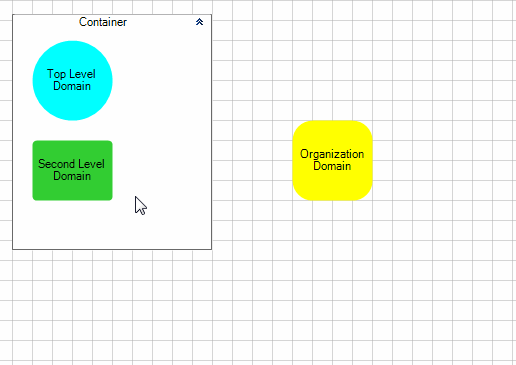
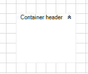
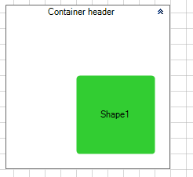
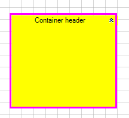

# ContainerShapes


This article will walk you through the functionality and the main features of the __RadDiagramContainerShape__.

## Overview

__RadDiagramContainerShape__ allows you to place multiple shapes into one container shape. 
          __RadDiagramContainerShapes__ are much like groups , a way to logically combine other shapes but add to this the
          capability to have a visual wrapper including a header. You can drag shapes in and out of a container shape at run-time and take advantage
          of its built-in auto-sizing logic that can extend the size of a container to wrap a shape. __RadDiagram__
          provides a visual feedback when a shape is being dragged over a  __RadDiagramContainerShape__ and even if part 
          of the shape is outside the bounds of the container, the framework internally handles the drop and expands the size of the container
          to place the shape inside the content area of the container.
        
>caption Fig.1 Illustration of the ContainerShape auto-sizing capabilities



A container can be connected and handled like other shapes.

>note  __RadDiagramContainerShape__ derives from the __RadDiagramShapeBase__ class 
            and that is why it exposes similar properties to those of the __RadDiagramShape__ . To get familiar with the __RadDiagramShape__ features and properties, please refer to the[Shapes]()article.
>


## Setting a header

__RadDiagramContainerShape__ header is controlled via the __Content__ property:#_[C#] ContainerShape's content_

	


{{source=..\SamplesCS\Diagram\DiagramItems.cs region=ContainersContent}} 
{{source=..\SamplesVB\Diagram\DiagramItems.vb region=ContainersContent}} 

````C#
            
            RadDiagramContainerShape container = new RadDiagramContainerShape();
            container.Content = "Container header";
            this.radDiagram1.Items.Add(container);
````
````VB.NET

        Dim container As New RadDiagramContainerShape()
        container.Content = "Container header"
        Me.RadDiagram1.Items.Add(container)

        '
````

{{endregion}} 


>caption Fig.2 ContainerShape's content



## Edit Mode

By default you can edit the header of the __RadDiagramContainerShape__ out-of-the-box by double-clicking on the container 
          or by hitting F2. If you'd like to disable the editing functionality, you can set the __IsEditable__ property to 
          *false* .

          You can manually put the __RadDiagramContainerShape__ in edit mode by setting its __IsInEditMode__ property to 
          *true*. This is the property that gets and sets the edit mode of the container.
        

## Populating with data

The main purpose of the __RadDiagramContainerShape__ is to allow you to drop shapes on it thus grouping them in one container. 
        This is why dragging and dropping shapes onto the container is the main approach for populating its __Items__ collection.

You can also populate it manually in code-behind:#_[C#] RadDiagramContainerShape.Items_

	


{{source=..\SamplesCS\Diagram\DiagramItems.cs region=ContainerItems}} 
{{source=..\SamplesVB\Diagram\DiagramItems.vb region=ContainerItems}} 

````C#
            
            RadDiagramShape shape = new RadDiagramShape()
            {
                Text = "Shape1",
                Shape = new RoundRectShape(4),
                BackColor = Color.LimeGreen
            };
            shape.Position = new Telerik.Windows.Diagrams.Core.Point(100, 100);
            this.radDiagram1.AddShape(shape);
            
            RadDiagramContainerShape containerShape = new RadDiagramContainerShape();
            containerShape.Content = "Container header";
            containerShape.Location = new Point(10,10);
            containerShape.DrawBorder = true;
            this.radDiagram1.Items.Add(containerShape);    
            containerShape.Items.Add(shape);
````
````VB.NET

        Dim shape As New RadDiagramShape() With { _
            .Text = "Shape1", _
            .Shape = New RoundRectShape(4), _
            .BackColor = Color.LimeGreen _
        }
        shape.Position = New Telerik.Windows.Diagrams.Core.Point(100, 100)
        Me.RadDiagram1.AddShape(shape)

        Dim containerShape As New RadDiagramContainerShape()
        containerShape.Content = "Container header"
        containerShape.Location = New Point(10, 10)
        containerShape.DrawBorder = True
        Me.RadDiagram1.Items.Add(containerShape)
        containerShape.Items.Add(shape)

        '
````

{{endregion}} 


>note Note that it is important to add the __RadDiagramShape__ to __RadDiagram__ before adding it 
            to the __RadDiagramContainerShape__ .
>

>caption Fig.3 RadDiagramContainerShape.Items



## Container Bounds

You can get the bounds of the __RadDiagramContainerShape__ through the __Bounds__ property,
          which is of type __Telerik.Windows.Diagrams.Core.Rect__ and it gets the width, height and location of the container’s bounds.

## Collapsible ContainerShapes

By default, __RadDiagramContainerShape__ is collapsible. It is controlled by the __IsCollapsible__ property.
        
>caption Fig.4 RadDiagramContainerShape.Items


Below you can find a list of all __RadDiagramContainerShape__ members that are related to the collapsible feature of the shape:

* __IsCollapsible__ - a property of type bool that controls the collapsible state of a __RadDiagramContainerShape__.
            

* __IsCollapsed__ - a property of type bool that controls whether a collapsible __RadDiagramContainerShape__ is currently collapsed.
            

* __IsCollapsedChanged__ - an event that is raised by a __RadDiagramContainerShape__ to inform that the collapsed state of the container is changed.
            

## Interaction

Below you can find a list of the interactions supported by the __RadDiagramContainerShape__:

* __Translation__ - you can translate the __RadDiagramContainerShape__ along with its children.
            

* __Resizing__ - you can resize only the __RadDiagramContainerShape__ without affecting its children size.
            

* __Cut and Copy__ - these clipboard operations work only on the __RadDiagramContainerShape__. 
              The shapes inside the container won't be cut or copied. You can find more information about the clipboard operations supported in the 
              __RadDiagram__ in the 
              [Clipboard operations]().
            

>note If you do wish to resize and cut or copy both the container and its children simultaneously, 
              you can do so by dragging a selection rectangle around the container (instead of just clicking-selecting the container). 
              This selection will contain both the container and the children thus allowing you to perform the aforementioned actions on all items at the same time.
>


## Customize the ContainerShape Appearance

You can easily customize the visual appearance of the __RadDiagramContainerShape__ by using the following properties:

* __BackColor__ - specifies the __RadDiagramContainerShape__ background color.
            

* __BorderBrush__ - gets or sets the brush that specifies the RadDiagramContainerShape border color.
            

* __BorderThickness__ - gets or sets the width of the RadDiagramContainerShape outline.
            #_[C#] RadDiagramContainerShape's appearance_

	


{{source=..\SamplesCS\Diagram\DiagramItems.cs region=ContainerAppearance}} 
{{source=..\SamplesVB\Diagram\DiagramItems.vb region=ContainerAppearance}} 

````C#
            
            container.BackColor = Color.Yellow;
            container.BorderThickness = new Padding(3);
            container.BorderBrush = new System.Drawing.SolidBrush(Color.Fuchsia);
````
````VB.NET

        container.BackColor = Color.Yellow
        container.BorderThickness = New System.Windows.Forms.Padding(3)
        container.BorderBrush = New System.Drawing.SolidBrush(Color.Fuchsia)

        '
````

{{endregion}} 


>caption Fig.5 RadDiagramContainerShape's appearance


