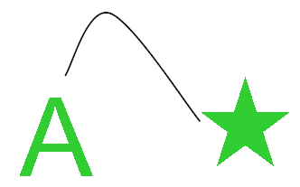
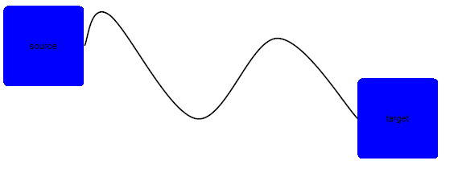

# Connections

This tutorial will walk you through the functionality and the main features of __RadDiagramConnection__.

## RadDiagramConnection

__RadDiagramConnection__ is basically an object that connects zero, one or two shapes:

You can use its extensive API to configure its source and target points or shapes. You can also control the connection path by
        using the __ConnectionPoints__ collection.

The __RadDiagramConnection__
        class exposes the following properties that allow you to control the start and end points of a connection:

* __StartPoint/EndPoint__ - these properties are of type Telerik.Windows.Diagrams.Core.*Point* and they set or get the start/end point of a connection.
            

* __Source/Target__ - these properties get or set the source/target __RadDiagramShape__ of a connection.
            

* __SourceConnectorPosition/TargetConnectorPosition__ - there are five predefined strings that you can use to define 
              where to position the connectors of the connection:           
            

* __Auto__ - use it if you want to automatically determine the start/end point of a connection. 
                  This option will allow the connection to dynamically determine which shape connector to be used as a start/end point. 
                  Based on the end point position, the __SourceConnectorPosition__ will be set to the nearest shape connector. 
                  Alternatively, the __TargetConnectorPosition__ will be set to the nearest shape connector, 
                  based on the start point position of the connection.
                

* __Left__ - use it to define the left connector of a shape as the source/target point of the connection
                

* __Top__ - use it to define the top connector of a shape as the source/target point of the connection
                

* __Right__ - use it to define the right connector of a shape as the source/target point of the connection
                

* __Bottom__ - use it to define the bottom connector of a shape as the source/target point of the connection
                

* __ConnectionPoints__ - if you want to change the route of the connection, you can add connection points 
              in code-behind through the RadDiagramConnection.__ConnectionPoints__ property. 
              You can populate the __ConnectionPoints__ collection with objects of type *Point*:
            

#### __[C#] __

{{source=..\SamplesCS\Diagram\DiagramItems.cs region=AddConnection}}
	            
	            RadDiagramConnection connection1 = new RadDiagramConnection() { Name = "connection1" };
	            
	            connection1.Source = shape1;
	            connection1.Target = starShape;
	            connection1.ConnectionPoints.Add(new Point(200, 30));
	            radDiagram1.Items.Add(connection1);
	
	{{endregion}}

#### __[VB.NET] __

{{source=..\SamplesVB\Diagram\DiagramItems.vb region=AddConnection}}
	        Dim connection1 As New RadDiagramConnection() With { _
	            .Name = "connection1" _
	        }
	
	        connection1.Source = shape1
	        connection1.Target = starShape
	        connection1.ConnectionPoints.Add(New Point(200, 30))
	
	        RadDiagram1.Items.Add(connection1)
	        '#End Region
	
	        '#Region "PolylineConnection"
	
	        Dim sourceShape As New RadDiagramShape() With { _
	            .ShapeText = "source", _
	            .ElementShape = New RoundRectShape(5), _
	            .InternalElementColor = Color.Red _
	        }
	
	        sourceShape.Position = New Telerik.Windows.Diagrams.Core.Point(150, 100)
	        RadDiagram1.Items.Add(sourceShape)
	
	        Dim targetShape As New RadDiagramShape() With { _
	            .ShapeText = "target", _
	            .ElementShape = New RoundRectShape(5), _
	            .InternalElementColor = Color.Red _
	        }
	
	        targetShape.Position = New Telerik.Windows.Diagrams.Core.Point(400, 300)
	        RadDiagram1.Items.Add(targetShape)
	
	        Dim polylineConnection As New RadDiagramConnection() With { _
	            .Name = "connection1" _
	        }
	
	        polylineConnection.Source = sourceShape
	        polylineConnection.Target = targetShape
	        polylineConnection.ConnectionType = Telerik.Windows.Diagrams.Core.ConnectionType.Polyline
	        RadDiagram1.Items.Add(polylineConnection)
	
	        '#End Region
	
	        '#Region "ConnectionPolylineWithPoints"
	
	        polylineConnection.ConnectionPoints.Add(New Point(300, 140))
	        polylineConnection.ConnectionPoints.Add(New Point(330, 280))
	
	        '#End Region
	
	        '#Region "BezierConnection"
	
	
	        Dim bezierConnection As New RadDiagramConnection() With { _
	            .Name = "connection1" _
	        }
	
	        bezierConnection.Source = sourceShape
	        bezierConnection.Target = targetShape
	        bezierConnection.BezierTension = 16
	        bezierConnection.ConnectionType = Telerik.Windows.Diagrams.Core.ConnectionType.Bezier
	        RadDiagram1.Items.Add(bezierConnection)
	
	        '#End Region
	
	        '#Region "SplineConnection"
	
	        Dim splineConnection As New RadDiagramConnection() With { _
	            .Name = "connection1" _
	        }
	
	        splineConnection.Source = sourceShape
	        splineConnection.Target = targetShape
	        splineConnection.ConnectionType = Telerik.Windows.Diagrams.Core.ConnectionType.Spline
	        splineConnection.ConnectionPoints.Add(New Point(140, 20))
	        splineConnection.ConnectionPoints.Add(New Point(250, 150))
	        splineConnection.ConnectionPoints.Add(New Point(350, 50))
	        RadDiagram1.Items.Add(splineConnection)
	
	        '#End Region
	
	    End Sub
	
	    '#Region "AShape"
	
	    Public Class AShape
	    Inherits ElementShape
	        Public Overrides Function CreatePath(bounds As Rectangle) As GraphicsPath
	            Dim path As New GraphicsPath()
	            path.AddString("A", New FontFamily("Arial"), 0, 122, Point.Empty, StringFormat.GenericTypographic)
	            Return path
	        End Function
	    End Class
	    '#End Region
	
	End Class

* __ConnectionType__ - controls the connection type. As an enumeration of type Telerik.Windows.Diagrams.Core.ConnectionType,
              it exposes the following members:
            

* __Polyline__ - this type allows you to define multiple points a connection has to pass through.
                  By default, such a connection have two points it has to pass through - its source connector (or StartPoint) and its target connector (or EndPoint).
                  This is why by default the Polyline __ConnectionType__ visualizes a straight connection.
                Sample of a straight Polyline connection between two shapes:

#### __[C#] __

{{source=..\SamplesCS\Diagram\DiagramItems.cs region=PolylineConnection}}
	            
	            RadDiagramShape sourceShape = new RadDiagramShape()
	            {
	                ShapeText = "source",
	                ElementShape = new RoundRectShape(5),
	                InternalElementColor = Color.Red
	            };
	            
	            sourceShape.Position = new Telerik.Windows.Diagrams.Core.Point(150, 100);
	            radDiagram1.Items.Add(sourceShape);
	            
	            RadDiagramShape targetShape = new RadDiagramShape()
	            {
	                ShapeText = "target",
	                ElementShape = new RoundRectShape(5),
	                InternalElementColor = Color.Red
	            };
	            
	            targetShape.Position = new Telerik.Windows.Diagrams.Core.Point(400, 300);
	            radDiagram1.Items.Add(targetShape);
	            
	            RadDiagramConnection polylineConnection = new RadDiagramConnection() { Name = "connection1" };
	            
	            polylineConnection.Source = sourceShape;
	            polylineConnection.Target = targetShape;
	            polylineConnection.ConnectionType = Telerik.Windows.Diagrams.Core.ConnectionType.Polyline;
	            radDiagram1.Items.Add(polylineConnection);
	        
	{{endregion}}

#### __[VB.NET] __

{{source=..\SamplesVB\Diagram\DiagramItems.vb region=PolylineConnection}}
	
	        Dim sourceShape As New RadDiagramShape() With { _
	            .ShapeText = "source", _
	            .ElementShape = New RoundRectShape(5), _
	            .InternalElementColor = Color.Red _
	        }
	
	        sourceShape.Position = New Telerik.Windows.Diagrams.Core.Point(150, 100)
	        RadDiagram1.Items.Add(sourceShape)
	
	        Dim targetShape As New RadDiagramShape() With { _
	            .ShapeText = "target", _
	            .ElementShape = New RoundRectShape(5), _
	            .InternalElementColor = Color.Red _
	        }
	
	        targetShape.Position = New Telerik.Windows.Diagrams.Core.Point(400, 300)
	        RadDiagram1.Items.Add(targetShape)
	
	        Dim polylineConnection As New RadDiagramConnection() With { _
	            .Name = "connection1" _
	        }
	
	        polylineConnection.Source = sourceShape
	        polylineConnection.Target = targetShape
	        polylineConnection.ConnectionType = Telerik.Windows.Diagrams.Core.ConnectionType.Polyline
	        RadDiagram1.Items.Add(polylineConnection)
	
	        '#End Region
	
	        '#Region "ConnectionPolylineWithPoints"
	
	        polylineConnection.ConnectionPoints.Add(New Point(300, 140))
	        polylineConnection.ConnectionPoints.Add(New Point(330, 280))
	
	        '#End Region
	
	        '#Region "BezierConnection"
	
	
	        Dim bezierConnection As New RadDiagramConnection() With { _
	            .Name = "connection1" _
	        }
	
	        bezierConnection.Source = sourceShape
	        bezierConnection.Target = targetShape
	        bezierConnection.BezierTension = 16
	        bezierConnection.ConnectionType = Telerik.Windows.Diagrams.Core.ConnectionType.Bezier
	        RadDiagram1.Items.Add(bezierConnection)
	
	        '#End Region
	
	        '#Region "SplineConnection"
	
	        Dim splineConnection As New RadDiagramConnection() With { _
	            .Name = "connection1" _
	        }
	
	        splineConnection.Source = sourceShape
	        splineConnection.Target = targetShape
	        splineConnection.ConnectionType = Telerik.Windows.Diagrams.Core.ConnectionType.Spline
	        splineConnection.ConnectionPoints.Add(New Point(140, 20))
	        splineConnection.ConnectionPoints.Add(New Point(250, 150))
	        splineConnection.ConnectionPoints.Add(New Point(350, 50))
	        RadDiagram1.Items.Add(splineConnection)
	
	        '#End Region
	
	    End Sub
	
	    '#Region "AShape"
	
	    Public Class AShape
	    Inherits ElementShape
	        Public Overrides Function CreatePath(bounds As Rectangle) As GraphicsPath
	            Dim path As New GraphicsPath()
	            path.AddString("A", New FontFamily("Arial"), 0, 122, Point.Empty, StringFormat.GenericTypographic)
	            Return path
	        End Function
	    End Class
	    '#End Region
	
	End Class

If you want to change the route of the connection, you can add connection points in code-behind through the 
                RadDiagramConnection.__ConnectionPoints__ property.
                You can populate the __ConnectionPoints__ collection with objects of type Point:

#### __[C#] __

{{source=..\SamplesCS\Diagram\DiagramItems.cs region=ConnectionPolylineWithPoints}}
	            
	            polylineConnection.ConnectionPoints.Add(new Point(300, 140));
	            polylineConnection.ConnectionPoints.Add(new Point(330, 280));
	            
	{{endregion}}

#### __[VB.NET] __

{{source=..\SamplesVB\Diagram\DiagramItems.vb region=ConnectionPolylineWithPoints}}
	
	        polylineConnection.ConnectionPoints.Add(New Point(300, 140))
	        polylineConnection.ConnectionPoints.Add(New Point(330, 280))
	
	        '#End Region
	
	        '#Region "BezierConnection"
	
	
	        Dim bezierConnection As New RadDiagramConnection() With { _
	            .Name = "connection1" _
	        }
	
	        bezierConnection.Source = sourceShape
	        bezierConnection.Target = targetShape
	        bezierConnection.BezierTension = 16
	        bezierConnection.ConnectionType = Telerik.Windows.Diagrams.Core.ConnectionType.Bezier
	        RadDiagram1.Items.Add(bezierConnection)
	
	        '#End Region
	
	        '#Region "SplineConnection"
	
	        Dim splineConnection As New RadDiagramConnection() With { _
	            .Name = "connection1" _
	        }
	
	        splineConnection.Source = sourceShape
	        splineConnection.Target = targetShape
	        splineConnection.ConnectionType = Telerik.Windows.Diagrams.Core.ConnectionType.Spline
	        splineConnection.ConnectionPoints.Add(New Point(140, 20))
	        splineConnection.ConnectionPoints.Add(New Point(250, 150))
	        splineConnection.ConnectionPoints.Add(New Point(350, 50))
	        RadDiagram1.Items.Add(splineConnection)
	
	        '#End Region
	
	    End Sub
	
	    '#Region "AShape"
	
	    Public Class AShape
	    Inherits ElementShape
	        Public Overrides Function CreatePath(bounds As Rectangle) As GraphicsPath
	            Dim path As New GraphicsPath()
	            path.AddString("A", New FontFamily("Arial"), 0, 122, Point.Empty, StringFormat.GenericTypographic)
	            Return path
	        End Function
	    End Class
	    '#End Region
	
	End Class

Sample of a curved Polyline connection:

* __Bezier__ - this connection type allows you to create a Bézier curve. 
                  The Bezier connection is a curve specified by four points: two end points (p1 and p2) - the source/start and target/end of the
                  connection and two handle points (h1 and h2) and a tension parameter. The curve begins at p1 and ends at p2 and it doesn't 
                  pass through the handle points, but the handle points act as magnets, pulling the curve in certain directions and influencing
                  the way the curve bends. The following illustration shows a Bézier RadDiagramConnection along with its endpoints and handle points.
                The RadDiagramConnection.__BezierTension__ parameter defines the curve that will
                be produced for a given set of end and handle points. The following illustration shows a Bezier connection:

#### __[C#] __

{{source=..\SamplesCS\Diagram\DiagramItems.cs region=BezierConnection}}
	            RadDiagramConnection bezierConnection = new RadDiagramConnection() { Name = "connection1" };
	            
	            bezierConnection.Source = sourceShape;
	            bezierConnection.Target = targetShape;
	            bezierConnection.BezierTension = 16;
	            bezierConnection.ConnectionType = Telerik.Windows.Diagrams.Core.ConnectionType.Bezier;
	            radDiagram1.Items.Add(bezierConnection);
	            
	{{endregion}}

#### __[VB.NET] __

{{source=..\SamplesVB\Diagram\DiagramItems.vb region=BezierConnection}}
	
	
	        Dim bezierConnection As New RadDiagramConnection() With { _
	            .Name = "connection1" _
	        }
	
	        bezierConnection.Source = sourceShape
	        bezierConnection.Target = targetShape
	        bezierConnection.BezierTension = 16
	        bezierConnection.ConnectionType = Telerik.Windows.Diagrams.Core.ConnectionType.Bezier
	        RadDiagram1.Items.Add(bezierConnection)
	
	        '#End Region
	
	        '#Region "SplineConnection"
	
	        Dim splineConnection As New RadDiagramConnection() With { _
	            .Name = "connection1" _
	        }
	
	        splineConnection.Source = sourceShape
	        splineConnection.Target = targetShape
	        splineConnection.ConnectionType = Telerik.Windows.Diagrams.Core.ConnectionType.Spline
	        splineConnection.ConnectionPoints.Add(New Point(140, 20))
	        splineConnection.ConnectionPoints.Add(New Point(250, 150))
	        splineConnection.ConnectionPoints.Add(New Point(350, 50))
	        RadDiagram1.Items.Add(splineConnection)
	
	        '#End Region
	
	    End Sub
	
	    '#Region "AShape"
	
	    Public Class AShape
	    Inherits ElementShape
	        Public Overrides Function CreatePath(bounds As Rectangle) As GraphicsPath
	            Dim path As New GraphicsPath()
	            path.AddString("A", New FontFamily("Arial"), 0, 122, Point.Empty, StringFormat.GenericTypographic)
	            Return path
	        End Function
	    End Class
	    '#End Region
	
	End Class

By default, when you create a Bezier connection and attach its endpoints to __RadDiagramShapes__, 
                the position of the handle points of the connection will be calculated based on the connector positions. 
                Both handle points will be added to the RadDiagramConnection.__ConnectionPoints__ collection.
                The following snapshot illustrates the default direction of the Bezier connection handles based on the position of the connector to which the connection is attached.The offset between a Bezier connection handle point and its corresponding endpoint is controlled thorough the
                __BezierAutoOffset__ DiagramConstants. Its default value is *30px*, 
                but you can change it to better fit your needs.When attaching a Bezier connection to a RadDiagramShape you need to consider if it is attached to a built-in
                connector or to a custom connector. If the connection is attached to a custom connector, then you will have to manually
                set the position of the Bezier handle points. You can change the position of the points after you access them from the RadDiagramConnection.
                __ConnectionPoints__ collection, but you will also have to set the RadDiagramConnection. __IsModified__
                  property to True to apply the changes. If you don't want to manually traverse the __ConnectionPoints__ 
                  collection and then set the __IsModified__ property, you can use the RadDiagramConnection. __SetBezierHandles(Point,Point)__
                  method. It facilitates the definition of custom coordinates for the two handle points of a Bezier connection.

* __Spline__ - this connection type represents a cardinal spline. The connection is specified by an array of points
                  - the connection passes smoothly through each point in the array; there are no sharp corners and no abrupt changes in the tightness of the
                  curve. The following illustration shows a set of points and a spline connection that passes through each point in the set.
                Sample of a Spline connection:

#### __[C#] __

{{source=..\SamplesCS\Diagram\DiagramItems.cs region=SplineConnection}}
	            
	            RadDiagramConnection splineConnection = new RadDiagramConnection() { Name = "connection1" };
	            
	            splineConnection.Source = sourceShape;
	            splineConnection.Target = targetShape;            
	            splineConnection.ConnectionType = Telerik.Windows.Diagrams.Core.ConnectionType.Spline;
	            splineConnection.ConnectionPoints.Add(new Point(140, 20));
	            splineConnection.ConnectionPoints.Add(new Point(250, 150));
	            splineConnection.ConnectionPoints.Add(new Point(350, 50));    
	            radDiagram1.Items.Add(splineConnection);
	            
	{{endregion}}

#### __[VB.NET] __

{{source=..\SamplesVB\Diagram\DiagramItems.vb region=SplineConnection}}
	
	        Dim splineConnection As New RadDiagramConnection() With { _
	            .Name = "connection1" _
	        }
	
	        splineConnection.Source = sourceShape
	        splineConnection.Target = targetShape
	        splineConnection.ConnectionType = Telerik.Windows.Diagrams.Core.ConnectionType.Spline
	        splineConnection.ConnectionPoints.Add(New Point(140, 20))
	        splineConnection.ConnectionPoints.Add(New Point(250, 150))
	        splineConnection.ConnectionPoints.Add(New Point(350, 50))
	        RadDiagram1.Items.Add(splineConnection)
	
	        '#End Region
	
	    End Sub
	
	    '#Region "AShape"
	
	    Public Class AShape
	    Inherits ElementShape
	        Public Overrides Function CreatePath(bounds As Rectangle) As GraphicsPath
	            Dim path As New GraphicsPath()
	            path.AddString("A", New FontFamily("Arial"), 0, 122, Point.Empty, StringFormat.GenericTypographic)
	            Return path
	        End Function
	    End Class
	    '#End Region
	
	End Class

