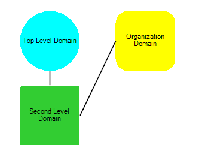

# Populating with data

This article will demonstrate how to define shapes and connections programmatically and how to load predefined layout by XML.

## Adding items in code behind

Below you can find a code snippet which creates three shapes and connections between them:

#### __[C#] __

{{source=..\SamplesCS\Diagram\DiagramPopulatingWithData.cs region=PopulateData}}
	            
	            RadDiagramShape shape1 = new RadDiagramShape()
	            {
	                ShapeText = "Second Level Domain",
	                ElementShape = new RoundRectShape(4),
	                InternalElementColor = Color.LimeGreen
	            };
	            shape1.Position = new Telerik.Windows.Diagrams.Core.Point(100, 100);
	            radDiagram1.Items.Add(shape1);
	            
	            RadDiagramShape shape2 = new RadDiagramShape()
	            {
	                ShapeText = "Top Level Domain",
	                ElementShape = new RoundRectShape(50),
	                InternalElementColor = Color.Cyan
	            };
	            shape2.Position = new Telerik.Windows.Diagrams.Core.Point(400, 100);
	            radDiagram1.Items.Add(shape2);
	            
	            RadDiagramShape shape3 = new RadDiagramShape()
	            {
	                ShapeText = "Organization Domain",
	                ElementShape = new RoundRectShape(20),
	                InternalElementColor = Color.Yellow
	            };
	            shape3.Position = new Telerik.Windows.Diagrams.Core.Point(400, 400);
	            radDiagram1.Items.Add(shape3);
	            
	            RadDiagramConnection connection1 = new RadDiagramConnection()
	            { Name = "connection1" };
	            connection1.Source = shape1;
	            connection1.Target = shape2;
	            radDiagram1.Items.Add(connection1);
	            
	            RadDiagramConnection connection2 = new RadDiagramConnection()
	            {
	                Name = "connection2"
	            };
	            connection2.Source = shape1;
	            connection2.Target = shape3;
	            radDiagram1.Items.Add(connection2);
	        
	{{endregion}}

#### __[VB.NET] __

{{source=..\SamplesVB\Diagram\DiagramPopulatingWithData.vb region=PopulateData}}
	
	        Dim shape1 As New RadDiagramShape() With { _
	            .ShapeText = "Second Level Domain", _
	            .ElementShape = New RoundRectShape(4), _
	            .InternalElementColor = Color.LimeGreen _
	        }
	        shape1.Position = New Telerik.Windows.Diagrams.Core.Point(100, 100)
	        RadDiagram1.Items.Add(shape1)
	
	        Dim shape2 As New RadDiagramShape() With { _
	            .ShapeText = "Top Level Domain", _
	            .ElementShape = New RoundRectShape(50), _
	            .InternalElementColor = Color.Cyan _
	        }
	        shape2.Position = New Telerik.Windows.Diagrams.Core.Point(400, 100)
	        RadDiagram1.Items.Add(shape2)
	
	        Dim shape3 As New RadDiagramShape() With { _
	            .ShapeText = "Organization Domain", _
	            .ElementShape = New RoundRectShape(20), _
	            .InternalElementColor = Color.Yellow _
	        }
	        shape3.Position = New Telerik.Windows.Diagrams.Core.Point(400, 400)
	        RadDiagram1.Items.Add(shape3)
	
	        Dim connection1 As New RadDiagramConnection() With { _
	            .Name = "connection1" _
	        }
	        connection1.Source = shape1
	        connection1.Target = shape2
	        RadDiagram1.Items.Add(connection1)
	
	        Dim connection2 As New RadDiagramConnection() With { _
	            .Name = "connection2" _
	        }
	        connection2.Source = shape1
	        connection2.Target = shape3
	        RadDiagram1.Items.Add(connection2)
	
	{{endregion}}

## Load items from XML

You can load items in __RadDiagram__ from XML. Here is a sample code snippet:
        

#### __[C#] __

{{source=..\SamplesCS\Diagram\DiagramPopulatingWithData.cs region=LoadFromXML}}
	            OpenFileDialog openFileDialog1 = new OpenFileDialog();
	            
	            openFileDialog1.InitialDirectory = "c:\\";
	            openFileDialog1.Filter = "xml files (*.xml)|*.xml|All files (*.*)|*.*";            
	            openFileDialog1.RestoreDirectory = true;
	            
	            if (openFileDialog1.ShowDialog() == DialogResult.OK)
	            {
	                string filename = openFileDialog1.FileName;
	            
	                string filelines = File.ReadAllText(filename);
	                try
	                {
	                    radDiagram1.DiagramElement.Items.Clear();
	                    radDiagram1.DiagramElement.Load(filelines);
	                }
	                catch(Exception ex)
	                {
	                    MessageBox.Show("Unable to load " + filename + "\nError: " + ex.Message);
	                }
	            }
	{{endregion}}

#### __[VB.NET] __

{{source=..\SamplesVB\Diagram\DiagramPopulatingWithData.vb region=LoadFromXML}}
	        Dim openFileDialog1 As New OpenFileDialog()
	
	        openFileDialog1.InitialDirectory = "c:\"
	        openFileDialog1.Filter = "xml files (*.xml)|*.xml|All files (*.*)|*.*"
	        openFileDialog1.RestoreDirectory = True
	
	        If openFileDialog1.ShowDialog() = DialogResult.OK Then
	            Dim filename As String = openFileDialog1.FileName
	
	            Dim filelines As String = File.ReadAllText(filename)
	            Try
	                RadDiagram1.DiagramElement.Items.Clear()
	                RadDiagram1.DiagramElement.Load(filelines)
	            Catch ex As Exception
	                MessageBox.Show((Convert.ToString("Unable to load ") & filename) + vbLf & "Error: " + ex.Message)
	            End Try
	        End If
	{{endregion}}

Here is a sample xml file for storing two shapes and a connection between them:
        

#### __[XML] __

