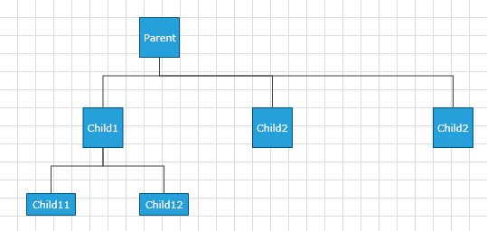
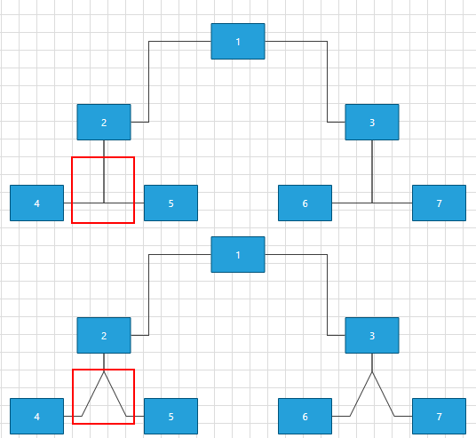
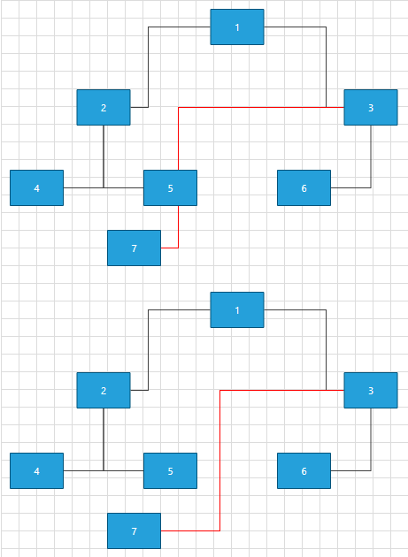
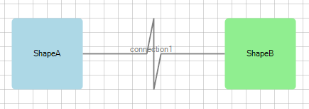

# Routing


Routing is a mechanism using algorithms to make sure that the connections don't cross each other while building links/paths between the shapes.

## Default Routing

Routing in __RadDiagram__ is only available if the RadDiagram.__RouteConnections__ property is set to *true*. Please note that its default value is False and you need to explicitly declare you want to enable the routing features.
>caption Fig.1 Routing


The routing algorithm can be parametrized using the DiagramConstants.__RoutingGridSize__ constant that has a default value of 40 units. This value indicates the size of the cells of the underlying grid used by the algorithm:
        

* A bigger value will decrease the time to compute the optimal path and will diminish the possible wiggling of the connection path due to obstacles (other shapes). On the other hand, a bigger value will not necessarily lead to an optimal solution in certain circumstances. That is, if your diagram involves a lot of shapes and a high complexity a bigger __RoutingGridSize__ will not find a path through the maze of shapes.

* A smaller value will increase the time tom compute the optimal path and increase the set of possible solutions for the path constraints. On the other hand, a small value leads usually to a lot of stairs/wiggling in the connection's path.

## OrgTreeRouter

The __OrgTreeRouter__ is a __LayoutType__ - based router that performs a hierarchical routing between parent and child shape. When a shape is being dragged, it removes only the crossings between the connection and its source and target shapes. It should be used when following conditions are satisfied:
        

* The __IsConnectorsManipulationEnabled__  is set to *false*.

* The __LayoutType__ is among the following 5 - *TipOverTree*, *TreeDown*, *TreeUp*, *TreeLeft*, *TreeRight*.

In order to use the __OrgTreeRouter__, you have to instantiate an __OrgTreeRouter__ object and set it as current __Router__ of the __RadDiagram__ via the __RoutingService__: 

{{source=..\SamplesCS\Diagram\DiagramRouting.cs region=OrgTreeRouter}} 
{{source=..\SamplesVB\Diagram\DiagramRouting.vb region=OrgTreeRouter}} 

````C#
            
Telerik.Windows.Diagrams.Core.OrgTreeRouter router = new Telerik.Windows.Diagrams.Core.OrgTreeRouter()
{
    TreeLayoutType = Telerik.Windows.Diagrams.Core.TreeLayoutType.TreeDown,
    ConnectionOuterSpacing = 20,
};
this.radDiagram1.RoutingService.Router = router;

````
````VB.NET
Dim router As New Telerik.Windows.Diagrams.Core.OrgTreeRouter() With { _
    .TreeLayoutType = Telerik.Windows.Diagrams.Core.TreeLayoutType.TreeDown, _
    .ConnectionOuterSpacing = 20 _
}
Me.RadDiagram1.RoutingService.Router = router

````

{{endregion}} 


The __TreeLayoutType__ points to the type of Layout you wish to use. The routing logic is based on this __LayoutType__. The __ConnectionOuterSpacing__ is the minimum margin between the Parent/Child Shape and the connection.
        

Below you can see these shapes after *TreeDown* Layout operation performed on the __RadDiagram__.
>caption Fig.2



## OrgTreeRouter: TipOverTreeRouter

When the __TreeLayoutType__ is set to *TipOverTree*, the __OrgTreeRouter__ uses a special kind of router - the __TipOverTreeRouter__. It produces best visual results when a custom connectors are added in the bottom-left part of the shapes.

Here is a sample code snippet demonstrating how to create and configure __TreeLayoutSettings__ and create and assign a __Router__ to be the default one. 

{{source=..\SamplesCS\Diagram\DiagramRouting.cs region=TipOverTreeRouter}} 
{{source=..\SamplesVB\Diagram\DiagramRouting.vb region=TipOverTreeRouter}} 

````C#
            
Telerik.Windows.Diagrams.Core.TreeLayoutSettings settings = new Telerik.Windows.Diagrams.Core.TreeLayoutSettings()
{
    TreeLayoutType = Telerik.Windows.Diagrams.Core.TreeLayoutType.TipOverTree,
    UnderneathVerticalSeparation = 50,
    VerticalDistance = 50,
    UnderneathHorizontalOffset = 50,
    UnderneathVerticalTopOffset = 50
};
settings.Roots.Add(this.radDiagram1.Shapes[0]);
Telerik.Windows.Diagrams.Core.OrgTreeRouter router = new Telerik.Windows.Diagrams.Core.OrgTreeRouter()
{
    TreeLayoutType = Telerik.Windows.Diagrams.Core.TreeLayoutType.TipOverTree,
    ConnectionOuterSpacing = 10
};
this.radDiagram1.RoutingService.Router = router;
this.radDiagram1.SetLayout(Telerik.Windows.Diagrams.Core.LayoutType.Tree, settings);

````
````VB.NET
Dim settings As New Telerik.Windows.Diagrams.Core.TreeLayoutSettings() With { _
    .TreeLayoutType = Telerik.Windows.Diagrams.Core.TreeLayoutType.TipOverTree, _
    .UnderneathVerticalSeparation = 50, _
    .VerticalDistance = 50, _
    .UnderneathHorizontalOffset = 50, _
    .UnderneathVerticalTopOffset = 50 _
}
settings.Roots.Add(Me.RadDiagram1.Shapes(0))
Dim router As New Telerik.Windows.Diagrams.Core.OrgTreeRouter() With { _
    .TreeLayoutType = Telerik.Windows.Diagrams.Core.TreeLayoutType.TipOverTree, _
    .ConnectionOuterSpacing = 10 _
}
Me.RadDiagram1.RoutingService.Router = router
Me.RadDiagram1.SetLayout(Telerik.Windows.Diagrams.Core.LayoutType.Tree, settings)

````

{{endregion}} 


The following screenshot illustrates the result:
>caption Fig.3 TipOverTreeRouter


## AStarRouter

As the name suggests, this is a connection router that uses a version of the A* search algorithm to find the best route between two points. There are several ways to parameterize the algorithm:

* __Using Diagram Constants__

* __DiagramConstants.RoutingGridSize__ - of type double and gets or sets the routing grid size.
                
>caption Fig.4 RoutingGridSize



* __DiagramConstants.RouterInflationValue__ - of type double and gets or sets the size of the restricted area around the shapes.
                

* __Using properties of the router__

* __AvoidShapes__ - boolean property controlling the logic that makes the connections go around the shapes. This property is *false* by default.
                
>caption Fig.5 AvoidShapes



* __WallOptimization__- boolean property controlling router optimization logic. If you set this property to *true* the router will try to optimize some of the steps so that there are the least corners.
                

* __Using virtual methods__ - if the customization provided by these properties does not cover your requirements, you can create your custom router deriving from ours. This will allow you to customize the algorithm by overriding the following methods:

* __GetSiblingNodes__ - this method receives the current state and the end target and should return the next possible nodes
                

>note The order in which the steps are returned is important - if you have two steps with the same price we'll choose the first one.
>


* __CalculateWallPenalty__ - this method calculates the penalty for the node that we give it. By default if the node is inside a shape we return the penaltyBaseValue which is the heuristic distance to the endpoint.
                

* __CalculateBendAlteration__ - this method calculates the bend alteration. By default the result value can be positive - a penalty for changing the direction or negative - a bonus for keeping the direction.
                

>note If the source and target positions of your connections are Auto this router will adjust them so that the path is minimal.
>


## InflatedRectRouter

The __InflatedRectRouter__ is a simple connection router whose goal is to create a route with least bends. This router doesn't try go around shapes except the start and end shape.

## Custom Router

In the following section we will create a custom Router. This way we will be able to set the routing points of our Polyline Connections.

Let's first create some items: 

{{source=..\SamplesCS\Diagram\DiagramRouting.cs region=PopulateItems}} 
{{source=..\SamplesVB\Diagram\DiagramRouting.vb region=PopulateItems}} 

````C#
            
RadDiagramShape shapeA = new RadDiagramShape()
{
    Text = "ShapeA",
    ElementShape = new RoundRectShape(4),
    BackColor = Color.CadetBlue
};
shapeA.Position = new Telerik.Windows.Diagrams.Core.Point(100, 100);
this.radDiagram1.Items.Add(shapeA);
            
RadDiagramShape shapeB = new RadDiagramShape()
{
    Text = "ShapeB",
    ElementShape = new RoundRectShape(4),
    BackColor = Color.CadetBlue
};
shapeB.Position = new Telerik.Windows.Diagrams.Core.Point(300, 100);
this.radDiagram1.Items.Add(shapeB);
            
RadDiagramConnection connection = new RadDiagramConnection()
{
    Source = shapeA,
    Target = shapeB
};
this.radDiagram1.Items.Add(connection);

````
````VB.NET
Dim shapeA As New RadDiagramShape() With { _
    .Text = "ShapeA", _
    .ElementShape = New RoundRectShape(4), _
    .BackColor = Color.CadetBlue _
}
shapeA.Position = New Telerik.Windows.Diagrams.Core.Point(100, 100)
Me.RadDiagram1.Items.Add(shapeA)
Dim shapeB As New RadDiagramShape() With { _
    .Text = "ShapeB", _
    .ElementShape = New RoundRectShape(4), _
    .BackColor = Color.CadetBlue _
}
shapeB.Position = New Telerik.Windows.Diagrams.Core.Point(300, 100)
Me.RadDiagram1.Items.Add(shapeB)
Dim connection As New RadDiagramConnection() With { _
    .Source = shapeA, _
    .Target = shapeB _
}
Me.RadDiagram1.Items.Add(connection)

````

{{endregion}} 
 
Now we have to create class that implements the __IRouter__ interface and override the GetRoutePoints() method: 

{{source=..\SamplesCS\Diagram\DiagramRouting.cs region=CustomRouter}} 
{{source=..\SamplesVB\Diagram\DiagramRouting.vb region=CustomRouter}} 

````C#
        
public class CustomRouter : Telerik.Windows.Diagrams.Core.IRouter
{
    public System.Collections.Generic.IList<Telerik.Windows.Diagrams.Core.Point> GetRoutePoints(Telerik.Windows.Diagrams.Core.IConnection connection, bool showLastLine)
    {
        List<Telerik.Windows.Diagrams.Core.Point> pointList = new List<Telerik.Windows.Diagrams.Core.Point>();
        Telerik.Windows.Diagrams.Core.Point start = connection.StartPoint;
        Telerik.Windows.Diagrams.Core.Point end = connection.EndPoint;
        
        pointList.Add(new Telerik.Windows.Diagrams.Core.Point(start.X + (end.X - start.X) * 0.45, start.Y));
        pointList.Add(new Telerik.Windows.Diagrams.Core.Point((start.X + end.X) / 2, (start.Y + end.Y) / 2 - 50));
        pointList.Add(new Telerik.Windows.Diagrams.Core.Point((start.X + end.X) / 2, (start.Y + end.Y) / 2 + 50));
        pointList.Add(new Telerik.Windows.Diagrams.Core.Point(start.X + (end.X - start.X) * 0.55, end.Y));
    
        return pointList;
    }
}

````
````VB.NET
Public Class CustomRouter
Implements Telerik.Windows.Diagrams.Core.IRouter
    Public Function GetRoutePoints1(connection As Telerik.Windows.Diagrams.Core.IConnection, showLastLine As Boolean) As IList(Of Telerik.Windows.Diagrams.Core.Point) Implements Telerik.Windows.Diagrams.Core.IRouter.GetRoutePoints
        Dim pointList As New List(Of Telerik.Windows.Diagrams.Core.Point)()
        Dim start As Telerik.Windows.Diagrams.Core.Point = connection.StartPoint
        Dim [end] As Telerik.Windows.Diagrams.Core.Point = connection.EndPoint
        pointList.Add(New Telerik.Windows.Diagrams.Core.Point(start.X + ([end].X - start.X) * 0.45, start.Y))
        pointList.Add(New Telerik.Windows.Diagrams.Core.Point((start.X + [end].X) / 2, (start.Y + [end].Y) / 2 - 50))
        pointList.Add(New Telerik.Windows.Diagrams.Core.Point((start.X + [end].X) / 2, (start.Y + [end].Y) / 2 + 50))
        pointList.Add(New Telerik.Windows.Diagrams.Core.Point(start.X + ([end].X - start.X) * 0.55, [end].Y))
        Return pointList
    End Function
End Class

````

{{endregion}} 
 
Please note that we only have to add in the list the route points, no need to add the start and the end point of the connection.   
        

The final step is to make our router the current one of the __RadDiagram__. This is done via Diagram's Routing Service: 

{{source=..\SamplesCS\Diagram\DiagramRouting.cs region=SetCustomRouter}} 
{{source=..\SamplesVB\Diagram\DiagramRouting.vb region=SetCustomRouter}} 

````C#
            
this.radDiagram1.RouteConnections = true;
this.radDiagram1.RoutingService.Router = new CustomRouter();

````
````VB.NET
Me.RadDiagram1.RouteConnections = True
Me.RadDiagram1.RoutingService.Router = New CustomRouter()

````

{{endregion}} 


>caption Fig.6 Custom Router


