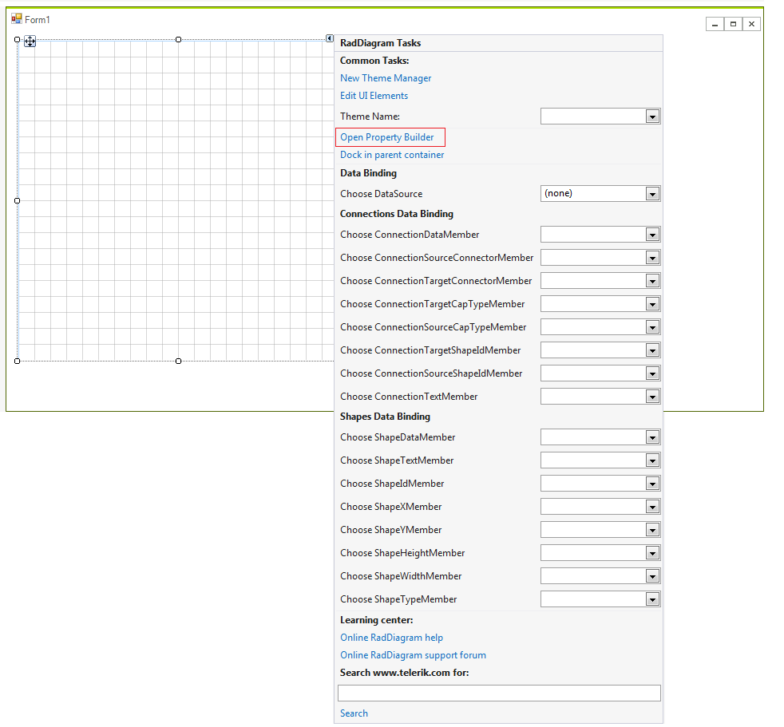
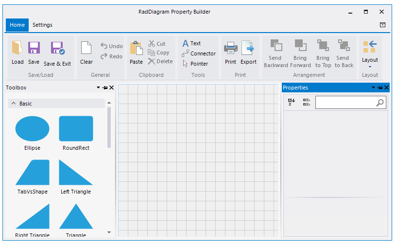
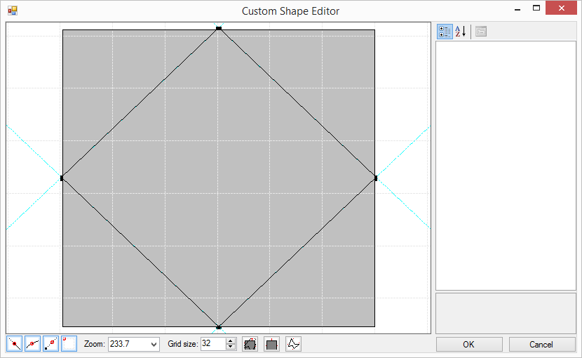

# Getting Started

Telerik __RadDiagram__ are powerful diagramming framework that can bring to life your rich data-visualization scenarios. In order to use the Telerik Diagramming Framework in your projects you have to add references to the following assemblies:
   

* Telerik.WinControls.RadDiagram

* Telerik.WinControls

* Telerik.WinControls.UI

* TelerikCommon

This tutorial will walk you through the main concepts and tools of __RadDiagram__ while helping you to create the flow diagram of an "if-else" operator.

## Graph Object Model

The graph object model is the main concept behind the diagramming framework. It contains the following three main objects:

* __graph__ - this is the structure that contains the __RadDiagramShapes__ and __RadDiagramConnections__. In the Telerik Diagramming Framework the graph is represented by the __RadDiagram__ class.
            

* __shape__ - the shape describes a node of a Graph that in the Telerik Diagramming Framework is represented by the __RadDiagramShape__ class.
            

* __connection__ - the connection describes the edges of the graph and it is basically an object that connects zero, one or two shapes. In the Telerik Diagramming Framework the connection is represented by the __RadDiagramConnection__ class.
            

>note The __RadDiagram__ items are represented by the __RadDiagramItem__ class. Therefore both __RadDiagramConnection__ and __RadDiagramShape__ classes derive from the __RadDiagramItem__ class.
 
In order to populate __RadDiagram__ with __RadDiagramItems__ you can add __RadDiagramShapes__ and __RadDiagramConnections__ by using the Property Builder.

The Property Builder allows you to drag a shapes from the [RadDiagramToolbox]() and drop it onto the __RadDiagram__ surface. Afterwards, you can connect several shapes by using the connectors. The [RadDiagramRibbonBar]() gives you a set of options to customize the diagram and save the changes as well.
      

In order to create a diagram describing the flow of an "if-else" operator, you will need 4 shapes - two will represent the statements, one will describe the condition and one will represent the final result of the operator.

>note The __RadDiagramShape__ exposes a __ElementShape__ property that allows you to create a custom geometry or use predefined shape geometry.
 

Finally, you can connect all shapes using __RadDiagramConnections__.
